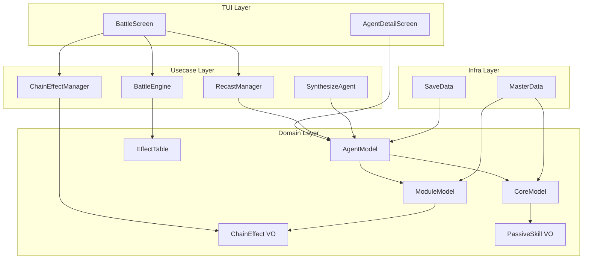
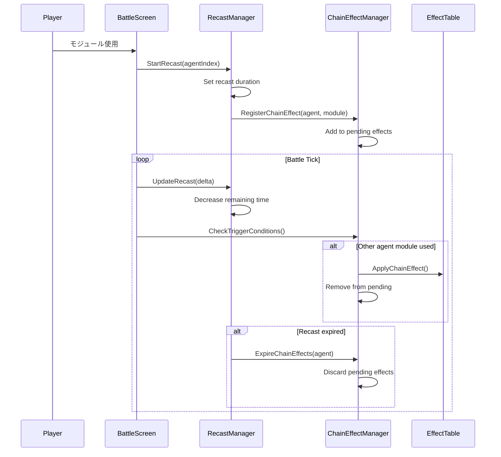
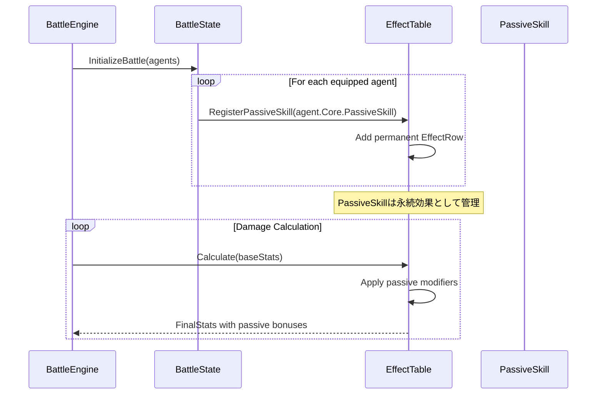
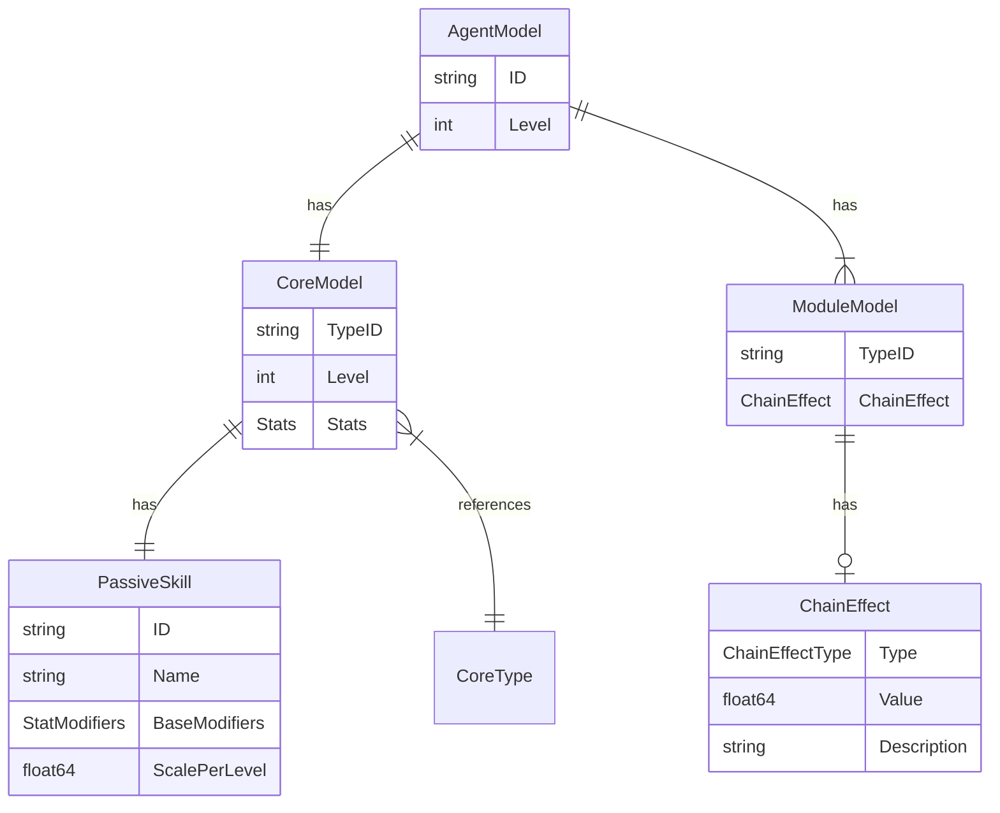

# Design Document: Agent Enhancement

## Overview

**Purpose**: 本機能はエージェントシステムとバトルシステムを拡張し、戦略的なゲームプレイを提供します。

**Users**: プレイヤーはコアのパッシブスキルとモジュールのチェイン効果を活用した戦術的なバトルを楽しめます。開発者は最適化されたデータモデルにより保守性の高いコードベースを維持できます。

**Impact**: 既存のエージェント・バトルシステムを拡張し、エージェントリキャスト機構、パッシブスキル反映、チェイン効果発動システムを追加します。データモデルのリファクタリングによりセーブデータとコード表現の一貫性を向上させます。

### Goals

- エージェント単位のリキャスト機構により戦略的なエージェント切り替えを促進
- コア特性ごとのパッシブスキルをバトル中のステータス計算に反映
- モジュールインスタンスごとのチェイン効果でコンボ戦術を実現
- コア・モジュールのデータモデル最適化による保守性向上

### Non-Goals

- 新規コア特性・モジュール種別の追加（既存マスタデータ構造の拡張のみ）
- パッシブスキルの動的レベルアップ機能
- チェイン効果のカスタマイズ・合成機能
- UI/UXの大幅な刷新（既存レイアウトへの情報追加のみ）

## Architecture

### Existing Architecture Analysis

現在のシステムは5層レイヤードアーキテクチャを採用しています：

**現在のパターンと制約**:
- `domain`層: `CoreModel`、`ModuleModel`、`AgentModel`、`EffectTable`がエンティティとして定義済み
- `usecase/combat`層: `BattleEngine`がバトルロジックを担当、モジュール単位のクールダウン管理
- `usecase/rewarding`層: `ModuleDropInfo`がモジュールドロップ処理を担当
- `infra/savedata`層: `CoreInstanceSave`、`AgentInstanceSave`でID化最適化済み
- `infra/masterdata`層: JSONマスタデータからのドメイン変換

**既存の統合ポイント**:
- `BattleScreen`が`ModuleSlot`でモジュール単位のクールダウンを管理
- `EffectTable`がバフ・デバフを時限管理（パッシブスキル追加に拡張可能）
- `BattleEngine.ApplyModuleEffect`がモジュール効果適用の中核

**対応するアプローチ**:
- 既存の`EffectTable`構造を活用してパッシブスキル効果を管理
- `ModuleSlot`をエージェント単位のリキャスト状態管理に拡張
- `ModuleModel`にチェイン効果情報を追加

### Architecture Pattern & Boundary Map



**Architecture Integration**:
- **Selected pattern**: 既存の5層レイヤードアーキテクチャを維持・拡張
- **Domain/feature boundaries**: リキャスト管理とチェイン効果管理を`usecase/combat`層に集約
- **Existing patterns preserved**: EffectTableによる効果管理、ModuleSlotによるクールダウン管理
- **New components rationale**: `RecastManager`と`ChainEffectManager`を追加し、複雑なバトルロジックを分離
- **Steering compliance**: 型変換のapp層集約、定数のconfig集約を維持

### Technology Stack

| Layer | Choice / Version | Role in Feature | Notes |
|-------|------------------|-----------------|-------|
| Backend | Go 1.25+ | ドメインロジック、バトルシステム | 既存スタック維持 |
| Data | JSON | マスタデータ（cores.json, modules.json）、セーブデータ | chain_effect, passive_skill フィールド追加 |
| TUI | bubbletea / lipgloss | バトルUI、エージェント詳細画面 | 既存パターン維持 |

## System Flows

### Agent Recast Flow



**Key Decisions**:
- モジュール使用時にエージェント全体がリキャスト状態になる（モジュール単位ではなく）
- チェイン効果はリキャスト期間中のみ有効、期間終了時に破棄
- 他エージェントのモジュール使用がチェイン効果の発動条件

### Passive Skill Registration Flow



## Requirements Traceability

| Requirement | Summary | Components | Interfaces | Flows |
|-------------|---------|------------|------------|-------|
| 1.1-1.5 | エージェントリキャスト | RecastManager, BattleScreen | RecastManager.StartRecast, IsAgentReady | Agent Recast Flow |
| 2.1-2.6 | パッシブスキルシステム | CoreModel, PassiveSkill, EffectTable | PassiveSkill VO, EffectTable.AddRow | Passive Skill Registration Flow |
| 3.1-3.8 | チェイン効果システム | ModuleModel, ChainEffect, ChainEffectManager | ChainEffect VO, ChainEffectManager | Agent Recast Flow |
| 4.1-4.5 | コアデータモデル | CoreModel, CoreInstanceSave | ToDomainCore | - |
| 5.1-5.5 | モジュールデータモデル | ModuleModel, ModuleInstanceSave | ToDomainModule | - |
| 6.1-6.6 | バトル中パッシブ反映 | BattleEngine, EffectTable | RegisterPassiveSkills | Passive Skill Registration Flow |
| 7.1-7.6 | チェイン効果発動 | ChainEffectManager, BattleScreen | TriggerChainEffect | Agent Recast Flow |

## Components and Interfaces

| Component | Domain/Layer | Intent | Req Coverage | Key Dependencies | Contracts |
|-----------|--------------|--------|--------------|-----------------|-----------|
| ChainEffect | domain | チェイン効果の値オブジェクト | 3.1-3.4, 5.1-5.5 | - | State |
| PassiveSkill | domain | パッシブスキルの値オブジェクト（拡張） | 2.1-2.4 | - | State |
| ModuleModel | domain | モジュールエンティティ（拡張） | 3.1, 5.1-5.5 | ChainEffect (P0) | State |
| CoreModel | domain | コアエンティティ（リファクタ） | 4.1-4.5 | PassiveSkill (P0) | State |
| RecastManager | usecase/combat | エージェントリキャスト管理 | 1.1-1.5 | AgentModel (P0) | Service |
| ChainEffectManager | usecase/combat | チェイン効果発動管理 | 3.5-3.8, 7.1-7.6 | ChainEffect (P0), EffectTable (P0) | Service |
| BattleEngine | usecase/combat | バトルロジック（拡張） | 6.1-6.6 | EffectTable (P0), RecastManager (P1), ChainEffectManager (P1) | Service |
| ModuleInstanceSave | infra/savedata | モジュール永続化（新規） | 5.4-5.5 | - | State |
| BattleScreen | tui/screens | バトル画面（拡張） | 1.3, 7.4, 7.6 | RecastManager (P0), ChainEffectManager (P0) | UI |
| AgentManagementScreen | tui/screens | エージェント管理画面（拡張） | 2.5, 3.3 | AgentModel (P0) | UI |
| RecastProgressBar | tui/components | リキャスト進捗バー（新規） | 1.3 | - | UI |
| SkillEffectBadge | tui/components | スキルエフェクトバッジ（新規） | 3.3 | ChainEffect (P0) | UI |
| PassiveSkillNotification | tui/components | パッシブスキル通知（新規） | 6.4 | PassiveSkill (P0) | UI |

### Domain Layer

#### ChainEffect (Value Object)

| Field | Detail |
|-------|--------|
| Intent | モジュールインスタンスに紐づくチェイン効果を表現 |
| Requirements | 3.1, 3.2, 3.3, 3.4, 5.1 |

**Responsibilities & Constraints**
- チェイン効果の種別と効果量を保持
- イミュータブルな値オブジェクトとして設計
- モジュール取得時にランダム決定され、変更不可

**Dependencies**
- なし（純粋なVO）

**Contracts**: State

##### State Management

```go
// ChainEffectType はチェイン効果の種別を表す型
type ChainEffectType string

const (
    ChainEffectDamageBonus    ChainEffectType = "damage_bonus"    // 追加ダメージ
    ChainEffectHealBonus      ChainEffectType = "heal_bonus"      // 追加回復
    ChainEffectBuffExtend     ChainEffectType = "buff_extend"     // バフ延長
    ChainEffectDebuffExtend   ChainEffectType = "debuff_extend"   // デバフ延長
)

// ChainEffect はモジュールインスタンスに紐づくチェイン効果VO
type ChainEffect struct {
    Type        ChainEffectType  // 効果種別
    Value       float64          // 効果量（ダメージ/回復量、または延長秒数）
    Description string           // 効果説明
}
```

- Persistence: モジュールインスタンスの一部として永続化
- Consistency: モジュール生成時に決定、以降不変
- Concurrency: イミュータブルのため競合なし

**Implementation Notes**
- Integration: `ModuleModel`の`ChainEffect`フィールドとして埋め込み
- Validation: `Type`は定義済みの`ChainEffectType`のみ許可
- Risks: 効果バランス調整はマスタデータ側で管理

---

#### PassiveSkill (Value Object - 拡張)

| Field | Detail |
|-------|--------|
| Intent | コア特性に紐づくパッシブスキルを表現（効果量計算を追加） |
| Requirements | 2.1, 2.3, 2.4 |

**Responsibilities & Constraints**
- 既存の`ID`、`Name`、`Description`に加え、`Modifiers`を追加
- コアレベルに応じた効果量計算ロジックを提供
- EffectTableへの登録に必要な`StatModifiers`を生成

**Dependencies**
- Outbound: `StatModifiers` (domain) - 効果適用に使用 (P0)

**Contracts**: State

##### State Management

```go
// PassiveSkill はコア特性に紐づくパッシブスキルVO（拡張版）
type PassiveSkill struct {
    ID          string          // パッシブスキルの一意識別子
    Name        string          // 表示名
    Description string          // 効果説明
    BaseModifiers StatModifiers // レベル1時点の基礎効果
    ScalePerLevel float64       // レベルごとのスケール係数
}

// CalculateModifiers はコアレベルに応じた効果量を計算
func (p PassiveSkill) CalculateModifiers(coreLevel int) StatModifiers
```

- Persistence: マスタデータ（passive_skills.json）から読み込み
- Consistency: マスタデータ定義に従う、実行時変更なし

**Implementation Notes**
- Integration: 既存の`PassiveSkill`構造体を拡張
- Validation: `BaseModifiers`のゼロ値チェック

---

#### ModuleModel (Entity - 拡張)

| Field | Detail |
|-------|--------|
| Intent | チェイン効果を持つモジュールエンティティ |
| Requirements | 3.1, 5.1, 5.2, 5.5 |

**Responsibilities & Constraints**
- 既存フィールドに加え`ChainEffect`を追加
- インスタンスIDは削除し、`TypeID`で種別を識別
- 同一`TypeID`でも異なる`ChainEffect`を持つことを許容

**Dependencies**
- Inbound: `ChainEffect` (domain) - チェイン効果情報 (P0)

**Contracts**: State

##### State Management

```go
// ModuleModel はゲーム内のモジュールエンティティ（拡張版）
type ModuleModel struct {
    // TypeID はモジュール種別ID（マスタデータ参照用）
    TypeID string

    // Name はモジュールの表示名
    Name string

    // Category はモジュールのカテゴリ
    Category ModuleCategory

    // Level はモジュールのレベル
    Level int

    // Tags はモジュールのタグリスト
    Tags []string

    // BaseEffect はモジュールの基礎効果値
    BaseEffect float64

    // StatRef は効果計算時に参照するステータス
    StatRef string

    // Description はモジュールの効果説明
    Description string

    // ChainEffect はこのモジュールインスタンスのチェイン効果
    ChainEffect *ChainEffect
}
```

- Persistence: `TypeID`と`ChainEffect`のペアとして永続化
- Consistency: インスタンス固有データは`ChainEffect`のみ

**Implementation Notes**
- Integration: 既存の`ID`フィールドを`TypeID`にリネーム
- Validation: `ChainEffect`はnilを許容

---

#### CoreModel (Entity - リファクタリング)

| Field | Detail |
|-------|--------|
| Intent | typeIdとlevelで表現されるコアエンティティ |
| Requirements | 4.1, 4.2, 4.3, 4.5 |

**Responsibilities & Constraints**
- インスタンスIDを削除し、`TypeID`と`Level`の組で同一性を判定
- ステータスはロード時にマスタデータから再計算
- `PassiveSkill`は`CoreType`から導出

**Dependencies**
- Inbound: `PassiveSkill` (domain) - パッシブスキル情報 (P0)
- Inbound: `CoreType` (domain) - コア特性定義 (P0)

**Contracts**: State

##### State Management

```go
// CoreModel はゲーム内のコアエンティティ（リファクタ版）
type CoreModel struct {
    // TypeID はコア特性ID（マスタデータ参照用）
    TypeID string

    // Level はコアのレベル
    Level int

    // 以下はTypeIDとLevelから導出されるフィールド
    Name         string       // 表示名（Type.Name + " Lv." + Level）
    Type         CoreType     // コア特性（マスタデータから取得）
    Stats        Stats        // ステータス（計算結果）
    PassiveSkill PassiveSkill // パッシブスキル（Type.PassiveSkillIDから取得）
    AllowedTags  []string     // 許可タグ（Type.AllowedTagsのコピー）
}

// Equals はコアの同一性を判定（TypeIDとLevelの組み合わせ）
func (c *CoreModel) Equals(other *CoreModel) bool {
    return c.TypeID == other.TypeID && c.Level == other.Level
}
```

- Persistence: `TypeID`と`Level`のペアとして永続化
- Consistency: ステータス等はロード時に再計算

**Implementation Notes**
- Integration: 既存の`ID`フィールドを削除、`TypeID`を追加
- Validation: `Level >= 1`を保証
- Risks: 既存コード全体の`ID`参照修正が必要

---

### Usecase Layer

#### RecastManager

| Field | Detail |
|-------|--------|
| Intent | エージェント単位のリキャスト状態を管理 |
| Requirements | 1.1, 1.2, 1.4, 1.5 |

**Responsibilities & Constraints**
- エージェントごとのリキャスト残り時間を管理
- リキャスト中エージェントのモジュール使用可否を判定
- UIへのリキャスト状態通知

**Dependencies**
- Inbound: `BattleScreen` (tui) - リキャスト開始・更新呼び出し (P0)
- Outbound: `AgentModel` (domain) - エージェント識別 (P0)
- Outbound: `ChainEffectManager` (usecase) - リキャスト連動 (P1)

**Contracts**: Service

##### Service Interface

```go
// RecastState はエージェントのリキャスト状態
type RecastState struct {
    AgentIndex       int
    RemainingSeconds float64
    TotalSeconds     float64
}

// RecastManager はエージェントリキャストを管理
type RecastManager struct {
    recastStates map[int]*RecastState  // agentIndex -> state
}

// StartRecast はエージェントのリキャストを開始
func (m *RecastManager) StartRecast(agentIndex int, durationSeconds float64)

// UpdateRecast はリキャスト時間を更新（毎tick呼び出し）
func (m *RecastManager) UpdateRecast(deltaSeconds float64) []int  // 終了したagentIndexのリスト

// IsAgentReady はエージェントが使用可能かを返す
func (m *RecastManager) IsAgentReady(agentIndex int) bool

// GetRecastState はエージェントのリキャスト状態を返す
func (m *RecastManager) GetRecastState(agentIndex int) *RecastState

// GetAllRecastStates は全エージェントのリキャスト状態を返す
func (m *RecastManager) GetAllRecastStates() []*RecastState
```

- Preconditions: `agentIndex`は装備スロット範囲内
- Postconditions: `StartRecast`後、`IsAgentReady`は`false`を返す
- Invariants: リキャスト残り時間は0以上

**Implementation Notes**
- Integration: `BattleScreen`の`UpdateCooldowns`から呼び出し
- Validation: 負のdurationは0として扱う
- Risks: 既存のモジュール単位クールダウンとの整合性

---

#### ChainEffectManager

| Field | Detail |
|-------|--------|
| Intent | チェイン効果の登録・発動・破棄を管理 |
| Requirements | 3.5, 3.6, 3.7, 7.1, 7.2, 7.3, 7.5 |

**Responsibilities & Constraints**
- モジュール使用時にチェイン効果を待機状態として登録
- 発動条件（他エージェントのモジュール使用）を監視
- リキャスト終了時に未発動のチェイン効果を破棄

**Dependencies**
- Inbound: `BattleScreen` (tui) - 効果登録・発動チェック (P0)
- Inbound: `RecastManager` (usecase) - リキャスト終了通知 (P1)
- Outbound: `ChainEffect` (domain) - 効果情報 (P0)
- Outbound: `EffectTable` (domain) - 効果適用 (P0)
- Outbound: `BattleState` (usecase) - ダメージ/回復適用 (P0)

**Contracts**: Service

##### Service Interface

```go
// PendingChainEffect は待機中のチェイン効果
type PendingChainEffect struct {
    AgentIndex  int
    Effect      *ChainEffect
    SourceModule *ModuleModel
}

// ChainEffectManager はチェイン効果を管理
type ChainEffectManager struct {
    pendingEffects []*PendingChainEffect
}

// RegisterChainEffect はチェイン効果を待機状態として登録
func (m *ChainEffectManager) RegisterChainEffect(
    agentIndex int,
    module *ModuleModel,
)

// CheckAndTrigger は発動条件をチェックし、満たしていれば発動
// triggerAgentIndex: モジュールを使用したエージェントのインデックス
// 戻り値: 発動したチェイン効果のリスト
func (m *ChainEffectManager) CheckAndTrigger(
    triggerAgentIndex int,
    battleState *BattleState,
) []*TriggeredChainEffect

// ExpireEffectsForAgent は指定エージェントの待機中チェイン効果を破棄
func (m *ChainEffectManager) ExpireEffectsForAgent(agentIndex int) []*PendingChainEffect

// GetPendingEffects は待機中のチェイン効果リストを返す
func (m *ChainEffectManager) GetPendingEffects() []*PendingChainEffect

// TriggeredChainEffect は発動したチェイン効果の結果
type TriggeredChainEffect struct {
    Effect      *ChainEffect
    EffectValue int  // 実際の効果量（ダメージ/回復量）
    Message     string
}
```

- Preconditions: `module.ChainEffect != nil`
- Postconditions: 発動後、該当効果は`pendingEffects`から削除
- Invariants: 各エージェントは最大1つの待機中チェイン効果

**Implementation Notes**
- Integration: `BattleScreen`のモジュール使用処理から呼び出し
- Validation: `ChainEffect`がnilのモジュールは登録スキップ
- Risks: 複数チェイン効果の同時発動順序

---

#### BattleEngine (拡張)

| Field | Detail |
|-------|--------|
| Intent | パッシブスキルのEffectTable登録を追加 |
| Requirements | 6.1, 6.2, 6.3, 6.5, 6.6 |

**Responsibilities & Constraints**
- バトル初期化時に装備エージェントのパッシブスキルをEffectTableに登録
- パッシブスキル効果はリキャスト中も継続適用

**Dependencies**
- Outbound: `EffectTable` (domain) - パッシブスキル効果登録 (P0)
- Outbound: `PassiveSkill` (domain) - 効果量計算 (P0)

**Contracts**: Service (既存インターフェース拡張)

##### Service Interface (追加メソッド)

```go
// RegisterPassiveSkills は装備エージェントのパッシブスキルをEffectTableに登録
func (e *BattleEngine) RegisterPassiveSkills(
    state *BattleState,
    agents []*AgentModel,
)
```

- Preconditions: `state`と`agents`が有効
- Postconditions: 各エージェントのパッシブスキルが永続効果として登録
- Invariants: パッシブスキルは`Duration == nil`（永続）

**Implementation Notes**
- Integration: `InitializeBattle`内で`RegisterPassiveSkills`を呼び出し
- Validation: `PassiveSkill.ID`が空の場合はスキップ

---

### Infra Layer

#### ModuleInstanceSave (新規)

| Field | Detail |
|-------|--------|
| Intent | チェイン効果を含むモジュールインスタンスの永続化 |
| Requirements | 5.4, 5.5 |

**Responsibilities & Constraints**
- モジュール種別IDとチェイン効果を永続化
- 既存の`ModuleCounts`マップから移行

**Contracts**: State

##### State Management

```go
// ChainEffectSave はチェイン効果のセーブデータ
type ChainEffectSave struct {
    Type  string  `json:"type"`
    Value float64 `json:"value"`
}

// ModuleInstanceSave はモジュールインスタンスのセーブデータ
type ModuleInstanceSave struct {
    TypeID      string           `json:"type_id"`
    ChainEffect *ChainEffectSave `json:"chain_effect,omitempty"`
}

// InventorySaveData の変更
type InventorySaveData struct {
    CoreInstances   []CoreInstanceSave   `json:"core_instances"`
    // ModuleCounts を ModuleInstances に変更
    ModuleInstances []ModuleInstanceSave `json:"module_instances"`
    AgentInstances  []AgentInstanceSave  `json:"agent_instances"`
    // ...
}
```

- Persistence: JSONセーブファイルに保存
- Consistency: `ChainEffect`がnilの場合はomitemptyで省略

**Implementation Notes**
- Integration: 既存の`ModuleCounts`を置き換え
- Validation: `TypeID`は必須

---

#### CoreInstanceSave (変更)

| Field | Detail |
|-------|--------|
| Intent | インスタンスID削除後のコア永続化 |
| Requirements | 4.4 |

**Contracts**: State

##### State Management

```go
// CoreInstanceSave はコアインスタンスのセーブデータ（変更版）
type CoreInstanceSave struct {
    // ID フィールドを削除
    CoreTypeID string `json:"core_type_id"`
    Level      int    `json:"level"`
}
```

- Persistence: 既存フォーマットからIDフィールドを削除
- Consistency: ロード時にTypeIDとLevelから状態を再構築

---

### TUI Layer

#### BattleScreen (拡張)

| Field | Detail |
|-------|--------|
| Intent | リキャスト状態表示とスキルエフェクト発動フィードバックを追加 |
| Requirements | 1.3, 7.4, 7.6 |

**UI変更点**:

1. **エージェントカードのリキャスト表示**
   - リキャスト中はエージェントカードをグレーアウト
   - リキャスト残り時間をプログレスバーで表示
   - リキャスト完了時に視覚的フィードバック（色の復帰）

2. **スキルエフェクト発動表示**
   - リキャスト中に発動中のスキルエフェクト名をエージェントカード下部に表示
   - スキルエフェクトのアイコンまたはバッジ表示

3. **パッシブスキル効果表示**
   - パッシブスキル発動時のフローティングメッセージ（例：「パーフェクトリズム発動！」）
   - 確率トリガー発動時の視覚的フィードバック

**レイアウト例**:
```
┌─────────────────────────────────────────────────────────┐
│ [Enemy Info]                                            │
├─────────────────────────────────────────────────────────┤
│ ┌─────────────┐ ┌─────────────┐ ┌─────────────┐        │
│ │ Agent 1     │ │ Agent 2     │ │ Agent 3     │        │
│ │ ████████░░  │ │ [Ready]     │ │ ██████░░░░  │        │
│ │ Recast: 3s  │ │             │ │ Recast: 5s  │        │
│ │ 🗡️ DmgAmp   │ │             │ │ 🛡️ DmgCut   │        │
│ └─────────────┘ └─────────────┘ └─────────────┘        │
├─────────────────────────────────────────────────────────┤
│ [Typing Challenge]                                      │
│ [Player HP] [Buff/Debuff Icons]                        │
└─────────────────────────────────────────────────────────┘
```

---

#### AgentManagementScreen (拡張)

| Field | Detail |
|-------|--------|
| Intent | エージェント詳細でパッシブスキルとモジュールのスキルエフェクトを表示 |
| Requirements | 2.5, 3.3 |

**UI変更点**:

1. **コア詳細表示**
   - パッシブスキル名と効果説明を表示
   - パッシブスキルのアイコン表示

2. **モジュール詳細表示**
   - 各モジュールのスキルエフェクト情報を表示
   - スキルエフェクトがある場合はバッジで表現

3. **エージェント合成プレビュー**
   - 合成後のパッシブスキル効果をプレビュー表示
   - モジュールのスキルエフェクト一覧を表示

**レイアウト例**:
```
┌─ Agent Detail ──────────────────────────────────────────┐
│ Name: Attacker Lv.5                                     │
│ ┌─ Core ─────────────────────────────────────────────┐ │
│ │ Attack Balance Lv.5                                 │ │
│ │ ⭐ Passive: パーフェクトリズム                      │ │
│ │    正確性100%でスキル効果1.5倍                      │ │
│ └─────────────────────────────────────────────────────┘ │
│ ┌─ Modules ──────────────────────────────────────────┐ │
│ │ 1. Physical Attack Lv.2  [🗡️ DmgAmp +20%]          │ │
│ │ 2. Heal Lv.1             [💚 HealAmp +15%]         │ │
│ │ 3. Buff Lv.1             [⏱️ BuffDur +5s]          │ │
│ │ 4. Debuff Lv.1           (No Effect)               │ │
│ └─────────────────────────────────────────────────────┘ │
└─────────────────────────────────────────────────────────┘
```

---

#### RecastProgressBar (新規コンポーネント)

| Field | Detail |
|-------|--------|
| Intent | エージェントのリキャスト残り時間を視覚的に表示 |
| Requirements | 1.3 |

**Responsibilities & Constraints**
- 残り時間と総時間からプログレス割合を計算
- 完了に近づくにつれ色が変化（赤→黄→緑）
- 残り秒数のテキスト表示

**Props**:
```go
type RecastProgressBarProps struct {
    RemainingSeconds float64
    TotalSeconds     float64
    Width            int
}
```

---

#### SkillEffectBadge (新規コンポーネント)

| Field | Detail |
|-------|--------|
| Intent | スキルエフェクトをコンパクトに表示するバッジ |
| Requirements | 3.3 |

**Responsibilities & Constraints**
- スキルエフェクトのカテゴリに応じたアイコン表示
- 効果値の簡潔な表示
- ホバー/選択時に詳細説明を表示可能

**カテゴリアイコンマッピング**:
| カテゴリ | アイコン |
|----------|---------|
| attack | 🗡️ |
| defense | 🛡️ |
| heal | 💚 |
| typing | ⌨️ |
| recast | ⏱️ |
| effect_extend | 🔄 |
| special | ✨ |

---

#### PassiveSkillNotification (新規コンポーネント)

| Field | Detail |
|-------|--------|
| Intent | パッシブスキル発動時のフローティング通知 |
| Requirements | 6.4 |

**Responsibilities & Constraints**
- パッシブスキル発動時に画面上部/中央に一時表示
- 2-3秒で自動的にフェードアウト
- 複数の通知をキュー管理

**表示例**:
```
╔══════════════════════════════════╗
║ ⭐ パーフェクトリズム発動！      ║
║    スキル効果1.5倍               ║
╚══════════════════════════════════╝
```

---

## Data Models

### Domain Model



**Business Rules & Invariants**:
- エージェントは必ず1つのコアと4つのモジュールを持つ
- コアの同一性は`TypeID`と`Level`の組み合わせで判定
- モジュールインスタンスは`TypeID`と`ChainEffect`の組み合わせで区別
- チェイン効果はモジュール取得時にランダム決定、変更不可

### Logical Data Model

**Structure Definition**:

| Entity | Key | Attributes | Relationships |
|--------|-----|------------|---------------|
| CoreModel | (TypeID, Level) | Stats, PassiveSkill, AllowedTags | 1:1 CoreType, 1:1 PassiveSkill |
| ModuleModel | (TypeID, ChainEffect) | Category, Level, Tags, BaseEffect | 0..1 ChainEffect |
| ChainEffect | - | Type, Value, Description | embedded in ModuleModel |
| PassiveSkill | ID | Name, Description, BaseModifiers, ScalePerLevel | embedded in CoreModel |

**Consistency & Integrity**:
- CoreTypeとModuleTypeはマスタデータで定義、実行時不変
- ChainEffectはモジュール入手時に決定、以降不変
- PassiveSkillの効果量はコアレベルから計算

### Physical Data Model

**セーブデータスキーマ（v1.0.0）**:

> **注意**: 本機能はセーブデータv1.0.0として新規設計します。既存のセーブデータとの後方互換性は考慮しません。

```json
{
  "version": "1.0.0",
  "inventory": {
    "core_instances": [
      { "core_type_id": "all_rounder", "level": 5 }
    ],
    "module_instances": [
      {
        "type_id": "physical_lv1",
        "chain_effect": { "type": "damage_bonus", "value": 10 }
      },
      { "type_id": "heal_lv1" }
    ],
    "agent_instances": [
      {
        "id": "agent-uuid-123",
        "core": { "core_type_id": "attack_balance", "level": 3 },
        "module_ids": ["physical_lv1", "heal_lv1", "buff_lv1", "debuff_lv1"],
        "module_chain_effects": [
          { "type": "damage_bonus", "value": 15 },
          null,
          { "type": "buff_extend", "value": 2.0 },
          null
        ]
      }
    ]
  }
}
```

**マスタデータスキーマ変更**:

`passive_skills.json`（新規）:
```json
{
  "passive_skills": [
    {
      "id": "ps_perfect_rhythm",
      "name": "パーフェクトリズム",
      "description": "正確性100%でスキル効果1.5倍",
      "trigger_type": "conditional",
      "trigger_condition": {
        "type": "accuracy_equals",
        "value": 100
      },
      "effect": {
        "type": "skill_effect_multiplier",
        "value": 1.5
      }
    },
    {
      "id": "ps_last_stand",
      "name": "ラストスタンド",
      "description": "HP25%以下で30%の確率で被ダメージ1",
      "trigger_type": "probability",
      "trigger_condition": {
        "type": "hp_below_percent",
        "value": 25
      },
      "effect": {
        "type": "damage_reduction_flat",
        "value": 1,
        "probability": 0.3
      }
    },
    {
      "id": "ps_buff_extender",
      "name": "バフエクステンダー",
      "description": "バフ効果時間+50%",
      "trigger_type": "permanent",
      "effect": {
        "type": "buff_duration_multiplier",
        "value": 1.5
      }
    },
    {
      "id": "ps_echo_skill",
      "name": "エコースキル",
      "description": "15%の確率でスキル2回発動",
      "trigger_type": "probability",
      "trigger_condition": {
        "type": "on_skill_use"
      },
      "effect": {
        "type": "skill_repeat",
        "probability": 0.15
      }
    }
  ]
}
```

**パッシブスキル定義一覧（22種）**:

| ID | 名前 | 効果 | 実装タイプ |
|----|------|------|------------|
| ps_perfect_rhythm | パーフェクトリズム | 正確性100%でスキル効果1.5倍 | 条件付き効果倍率 |
| ps_combo_master | コンボマスター | ミスなし連続タイピングでダメージ累積+10%（最大+50%） | スタック型バフ |
| ps_speed_break | スピードブレイク | WPM80以上で25%追加ダメージ | 条件付き追加ダメージ |
| ps_last_stand | ラストスタンド | HP25%以下で30%の確率で被ダメージ1 | 確率トリガー |
| ps_counter_charge | カウンターチャージ | 被ダメージ時20%で次の攻撃2倍 | 確率トリガー＋一時バフ |
| ps_miracle_heal | ミラクルヒール | 回復スキル時10%でHP全回復 | 確率トリガー |
| ps_overdrive | オーバードライブ | HP50%以下でリキャスト-30%、被ダメ+20% | 条件付きステータス変化 |
| ps_adaptive_shield | アダプティブシールド | 同種攻撃3回目以降ダメージ-25% | カウンター型軽減 |
| ps_debuff_absorber | デバフアブソーバー | デバフ効果時間半減＋小回復 | デバフ反応 |
| ps_first_strike | ファーストストライク | 戦闘開始時、最初のスキルが即発動 | 戦闘開始トリガー |
| ps_endgame_specialist | エンドゲームスペシャリスト | 敵HP30%以下で全ダメージ+25% | 条件付きダメージ増加 |
| ps_typo_recovery | タイポリカバリー | ミス時制限時間+1秒（1回/チャレンジ） | タイピングミス反応 |
| ps_chain_reaction | チェインリアクション | バフ/デバフ使用時30%で効果時間2倍 | 確率トリガー |
| ps_echo_skill | エコースキル | 15%の確率でスキル2回発動 | 確率トリガー |
| ps_shadow_step | シャドウステップ | 物理攻撃成功時20%で敵攻撃タイマーリセット | 確率トリガー |
| ps_debuff_reflect | デバフリフレクト | デバフ受け時30%で敵にも同効果 | 確率トリガー＋効果反射 |
| ps_buff_extender | バフエクステンダー | バフ効果時間+50% | 永続効果 |
| ps_weak_point | ウィークポイント | デバフ中の敵へダメージ+20% | 条件付きダメージ増加 |
| ps_second_chance | セカンドチャンス | 時間切れ時50%で再挑戦（制限時間半分） | 確率トリガー＋特殊処理 |

**チェイン効果定義一覧（19種）**:

エージェントのリキャスト中に継続的に効果を発揮するエフェクト。

| カテゴリ | ID | 名前 | 効果 |
|----------|-----|------|------|
| 攻撃強化 | se_damage_amp | ダメージアンプ | 効果中の攻撃ダメージ+25% |
| 攻撃強化 | se_armor_pierce | アーマーピアス | 効果中の攻撃が防御バフ無視 |
| 攻撃強化 | se_life_steal | ライフスティール | 効果中の攻撃ダメージの10%回復 |
| 防御強化 | se_damage_cut | ダメージカット | 効果中の被ダメージ-25% |
| 防御強化 | se_evasion | イベイジョン | 効果中10%で攻撃回避 |
| 防御強化 | se_reflect | リフレクト | 効果中被ダメージ反射 |
| 防御強化 | se_regen | リジェネ | 効果中毎秒HP1%回復 |
| 回復強化 | se_heal_amp | ヒールアンプ | 効果中の回復量+25% |
| 回復強化 | se_overheal | オーバーヒール | 効果中の超過回復を一時HPに |
| タイピング | se_time_extend | タイムエクステンド | 効果中のタイピング制限時間+X秒 |
| タイピング | se_auto_correct | オートコレクト | 効果中ミスX回まで無視 |
| リキャスト | se_cooldown_reduce | クールダウンリデュース | 効果中発生した他エージェントのリキャスト時間20%短縮 |
| 効果延長 | se_buff_duration | バフデュレーション | 効果中のバフスキル効果時間+5秒 |
| 効果延長 | se_debuff_duration | デバフデュレーション | 効果中のデバフスキル効果時間+5秒 |
| 特殊 | se_double_cast | ダブルキャスト | 効果中10%でスキル2回発動 |

`skill_effects.json`（新規）:
```json
{
  "skill_effects": [
    {
      "id": "se_damage_amp",
      "name": "ダメージアンプ",
      "category": "attack",
      "description": "効果中の攻撃ダメージ+{value}%",
      "effect_type": "damage_multiplier",
      "min_value": 15,
      "max_value": 30
    },
    {
      "id": "se_life_steal",
      "name": "ライフスティール",
      "category": "attack",
      "description": "効果中の攻撃ダメージの{value}%回復",
      "effect_type": "life_steal",
      "min_value": 5,
      "max_value": 15
    },
    {
      "id": "se_damage_cut",
      "name": "ダメージカット",
      "category": "defense",
      "description": "効果中の被ダメージ-{value}%",
      "effect_type": "damage_reduction",
      "min_value": 15,
      "max_value": 30
    },
    {
      "id": "se_evasion",
      "name": "イベイジョン",
      "category": "defense",
      "description": "効果中{value}%で攻撃回避",
      "effect_type": "evasion_chance",
      "min_value": 5,
      "max_value": 15
    },
    {
      "id": "se_regen",
      "name": "リジェネ",
      "category": "defense",
      "description": "効果中毎秒HP{value}%回復",
      "effect_type": "hp_regen_percent",
      "min_value": 1,
      "max_value": 3
    },
    {
      "id": "se_buff_duration",
      "name": "バフデュレーション",
      "category": "effect_extend",
      "description": "効果中のバフスキル効果時間+{value}秒",
      "effect_type": "buff_duration_add",
      "min_value": 3,
      "max_value": 7
    },
    {
      "id": "se_double_cast",
      "name": "ダブルキャスト",
      "category": "special",
      "description": "効果中{value}%でスキル2回発動",
      "effect_type": "double_cast_chance",
      "min_value": 5,
      "max_value": 15
    }
  ]
}
```

### Data Contracts & Integration

**後方互換性**:
- 本機能はv1.0.0として新規設計のため、既存セーブデータとの後方互換性は考慮しない
- 旧バージョンのセーブデータが検出された場合は新規ゲームとして開始

## Error Handling

### Error Strategy

既存のエラーハンドリングパターンに従い、ドメイン層でのバリデーションエラーとユースケース層での業務エラーを区別します。

### Error Categories and Responses

**Business Logic Errors (422)**:
- 無効なChainEffectType → エラーログ出力、デフォルト効果適用
- リキャスト中のモジュール使用試行 → UI側でブロック、ユーザーへのフィードバック
- 無効なパッシブスキルID → 警告ログ出力、スキップして続行

**System Errors (5xx)**:
- マスタデータ読み込み失敗 → デフォルト値使用、警告表示
- セーブデータ読み込み失敗 → 新規ゲームとして開始

### Monitoring

- エラーログには`slog`を使用（既存パターン維持）
- チェイン効果発動/破棄イベントをデバッグログ出力

## Testing Strategy

### Unit Tests

- `ChainEffect`値オブジェクトの生成・等価性テスト
- `PassiveSkill.CalculateModifiers`のレベルスケーリングテスト
- `RecastManager.StartRecast/UpdateRecast/IsAgentReady`の状態遷移テスト
- `ChainEffectManager.RegisterChainEffect/CheckAndTrigger/ExpireEffectsForAgent`のライフサイクルテスト
- `CoreModel.Equals`の同一性判定テスト

### Integration Tests

- バトル初期化 → パッシブスキル登録 → ステータス計算の一連フロー
- モジュール使用 → リキャスト開始 → チェイン効果登録 → 発動の一連フロー
- セーブ → ロード → ChainEffect/PassiveSkill復元の永続化テスト

### E2E/UI Tests

- バトル画面でのリキャスト状態表示確認
- エージェント詳細画面でのパッシブスキル/チェイン効果表示確認
- リキャスト中エージェントのモジュール選択ブロック確認

## Optional Sections

### Migration Strategy

**後方互換性なし（v1.0.0新規設計）**:
- 本機能は初回リリースとしてv1.0.0で設計
- 既存のセーブデータ形式との後方互換性は提供しない
- 旧形式のセーブデータが検出された場合は、新規ゲームとして開始する

### Performance & Scalability

**Target Metrics**:
- リキャスト状態更新: < 1ms per tick（100ms tick間隔内で十分）
- チェイン効果発動判定: < 1ms per module use
- パッシブスキル効果計算: EffectTable既存性能維持

**Optimization Techniques**:
- `RecastManager`はmap[int]による O(1) ルックアップ
- `ChainEffectManager`はスライス管理（装備エージェント数 <= 3）
