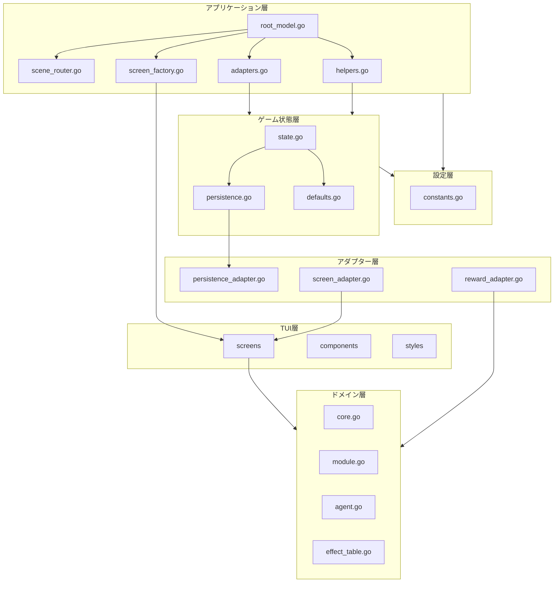

# 設計ドキュメント: codebase-refactoring

## 概要

**目的**: 本リファクタリングはコードベースの保守性・可読性・拡張性を向上させ、技術的負債を解消します。

**対象ユーザー**: 本プロジェクトの開発者が、より効率的にコードを理解・修正・拡張できるようになります。

**影響**: 既存機能の外部動作を一切変更せず、内部品質のみを改善します。セーブデータの後方互換性を維持し、ユーザー体験に影響を与えません。

### 目標

- デッドコードを削除してコードベースを簡素化（要件1）
- エラーハンドリングを改善してデバッグ容易性を向上（要件2）
- マジックナンバーを定数化して変更容易性を確保（要件3）
- 大規模ファイルを責務ごとに分割して保守性を向上（要件4, 5, 6）
- コード重複を解消してDRY原則を実現（要件7）
- 型名を整理して可読性を向上（要件8）
- Screenインターフェースを導入して一貫性を確保（要件9）
- データ変換層を作成して境界を明確化（要件10）
- 循環的複雑度を削減してコード品質を向上（要件11）
- 後方互換性を維持してユーザー影響をゼロに（要件12）

### 非目標

- 機能追加や機能変更
- パフォーマンス最適化（保守性改善の結果として副次的に向上する場合を除く）
- UIデザインの変更
- 外部APIやデータ形式の変更

## アーキテクチャ

### 既存アーキテクチャ分析

現在のアーキテクチャはレイヤードアーキテクチャを採用し、Elm Architectureパターンに基づくイベント駆動型設計です。

**現在の課題**:
- `root_model.go` (729行): シーンルーティング、画面生成、アダプター、ヘルパー関数が混在
- `game_state.go` (659行): ゲーム状態管理とセーブ/ロード変換ロジックが混在
- `battle.go` (1324行): UIレンダリングとゲームロジックが密結合
- `internal/app/app.go`: 未使用のModelが存在（RootModelと重複）
- domainパッケージに未使用メソッドが存在
- エラーが`_`で無視されている箇所が複数
- マジックナンバーがハードコードされている
- 型名に`*TestData`が本番用途で使用されている

**既存パターンの維持**:
- Elm Architecture (Model-Update-View)
- レイヤードアーキテクチャ（domain、app、tui/screens）
- インターフェースによる依存性注入（InventoryProvider等）

### アーキテクチャパターンと境界マップ



**アーキテクチャ統合**:
- 選択パターン: レイヤードアーキテクチャを維持しつつ、責務分割を強化
- ドメイン境界: ドメイン層は他パッケージに依存しない独立性を維持
- 新規コンポーネント: アダプター層の導入でデータ変換を集約
- ステアリング準拠: structure.mdのコード組織原則を遵守

### 技術スタック

| レイヤー | 選択/バージョン | 機能での役割 | 備考 |
|---------|----------------|-------------|------|
| ログ | log/slog (Go 1.21+) | 構造化ログ出力 | 標準ライブラリ採用、JSONHandler使用 |
| TUI | bubbletea, lipgloss, bubbles | 既存維持 | 変更なし |
| データ永続化 | JSON | 既存維持 | セーブデータ形式変更なし |

## システムフロー

本リファクタリングは内部構造の改善であり、外部から観測可能なフローに変更はありません。既存のシーン遷移、バトルフロー、セーブ/ロードフローはすべて維持されます。

## 要件トレーサビリティ

| 要件 | 概要 | コンポーネント | インターフェース |
|-----|------|---------------|-----------------|
| 1.1-1.6 | デッドコード削除 | app.go削除、domain/* | - |
| 2.1-2.6 | エラーハンドリング改善 | game_state.go, root_model.go | slog.Logger |
| 3.1-3.5 | マジックナンバー定数化 | internal/config/constants.go | 定数パッケージ |
| 4.1-4.7 | root_model.go分割 | scene_router.go, screen_factory.go, adapters.go, helpers.go | - |
| 5.1-5.5 | game_state.go分割 | game_state/state.go, persistence.go, defaults.go | - |
| 6.1-6.3 | battle.go分割 | battle_view.go, battle_logic.go | - |
| 7.1-7.4 | コード重複解消 | components/hp_display.go, module.Icon() | RenderHP(), Icon() |
| 8.1-8.3 | 型名整理 | types.go | EncyclopediaData, StatsData |
| 9.1-9.4 | Screenインターフェース | screens/types.go | Screen, BaseScreen |
| 10.1-10.5 | データ変換層 | internal/adapter/* | PersistenceAdapter, ScreenAdapter, RewardAdapter |
| 11.1-11.3 | 循環的複雑度削減 | root_model.go | ハンドラーマップ, 画面マップ |
| 12.1-12.3 | 後方互換性維持 | 全コンポーネント | - |

## コンポーネントとインターフェース

### コンポーネント概要

| コンポーネント | ドメイン/レイヤー | 意図 | 要件 | 依存関係 (P0/P1) | 契約 |
|---------------|------------------|------|------|-----------------|------|
| constants.go | Config | バトル/効果/インベントリ定数定義 | 3.1-3.5 | なし | - |
| Logger | Infrastructure | 構造化ログ出力 | 2.1-2.6 | slog (P0) | Service |
| SceneRouter | Application | シーン遷移ロジック | 4.2, 11.1-11.3 | RootModel (P0) | Service |
| ScreenFactory | Application | 画面インスタンス生成 | 4.3 | Screens (P0), GameState (P1) | Service |
| Adapters | Application | InventoryProviderAdapter等 | 4.4 | AgentManager (P0), InventoryManager (P0) | Service |
| Helpers | Application | データ変換ヘルパー | 4.5, 7.4 | GameState (P0) | Service |
| game_state/state.go | GameState | GameState本体 | 5.2 | domain (P0) | State |
| game_state/persistence.go | GameState | ToSaveData/FromSaveData | 5.3, 12.1-12.3 | persistence (P0) | Service |
| game_state/defaults.go | GameState | デフォルト値生成 | 5.4, 7.4 | loader (P1) | Service |
| PersistenceAdapter | Adapter | SaveData-GameState変換 | 10.2, 12.1-12.3 | persistence (P0), game_state (P0) | Service |
| ScreenAdapter | Adapter | GameState-ScreenData変換 | 10.3 | game_state (P0), screens (P1) | Service |
| RewardAdapter | Adapter | BattleStats-RewardStats変換 | 10.4 | battle (P0), reward (P0) | Service |
| Screen interface | TUI | 画面インターフェース | 9.1-9.4 | tea.Model (P0) | Service |
| BaseScreen | TUI | 共通画面機能 | 9.3 | Screen (P0) | Service |
| hp_display.go | TUI/Components | HP表示共通化 | 7.1-7.2 | styles (P1) | Service |
| Module.Icon() | Domain | カテゴリアイコン取得 | 7.3 | なし | Service |

### 設定層

#### internal/config/constants.go

| フィールド | 詳細 |
|-----------|------|
| 意図 | バトル設定、効果持続時間、インベントリ設定のマジックナンバーを一元管理 |
| 要件 | 3.1-3.5 |

**責務と制約**
- バトルパラメータ（tick間隔、クールダウン、攻撃間隔）の定数定義
- 効果持続時間（バフ、デバフ）の定数定義
- インベントリ制限（最大スロット数）の定数定義
- 他パッケージへの依存禁止（純粋な定数パッケージ）

**契約**: サービスインターフェース

##### 定数定義

```go
package config

import "time"

// バトル設定
const (
    // BattleTickInterval はバトル画面の更新間隔
    BattleTickInterval = 100 * time.Millisecond

    // DefaultModuleCooldown はモジュールのデフォルトクールダウン秒数
    DefaultModuleCooldown = 5.0

    // AccuracyPenaltyThreshold は正確性ペナルティ発生閾値
    AccuracyPenaltyThreshold = 0.5

    // MinEnemyAttackInterval は敵の最小攻撃間隔
    MinEnemyAttackInterval = 500 * time.Millisecond
)

// 効果持続時間
const (
    // BuffDuration はバフのデフォルト持続時間（秒）
    BuffDuration = 10.0

    // DebuffDuration はデバフのデフォルト持続時間（秒）
    DebuffDuration = 8.0
)

// インベントリ設定
const (
    // MaxAgentEquipSlots はエージェント装備スロット数
    MaxAgentEquipSlots = 3

    // ModulesPerAgent はエージェントあたりのモジュール数
    ModulesPerAgent = 4
)
```

**実装メモ**
- 統合: 各ファイルのハードコード値をこの定数に置換
- 検証: 既存テストが全て通ることを確認

---

### インフラストラクチャ層

#### ロギングサービス

| フィールド | 詳細 |
|-----------|------|
| 意図 | 構造化ログによるエラーハンドリング改善 |
| 要件 | 2.1-2.6 |

**責務と制約**
- slogパッケージを使用した構造化ログ出力
- エラー発生時のコンテキスト情報（ID、操作内容）の記録
- 開発環境ではTextHandler、本番環境ではJSONHandlerを使用

**依存関係**
- External: log/slog (Go標準ライブラリ) - 構造化ログ (P0)

**契約**: サービスインターフェース

##### ログ使用パターン

```go
import "log/slog"

// エラーログの例
if err := invManager.AddCore(core); err != nil {
    slog.Error("コア追加に失敗",
        slog.String("core_id", core.ID),
        slog.String("core_type", core.Type.ID),
        slog.Any("error", err),
    )
}

if err := agentMgr.AddAgent(agent); err != nil {
    slog.Error("エージェント追加に失敗",
        slog.String("agent_id", agent.ID),
        slog.Any("error", err),
    )
}

if err := agentMgr.EquipAgent(slot, agentID, player); err != nil {
    slog.Error("エージェント装備に失敗",
        slog.Int("slot", slot),
        slog.String("agent_id", agentID),
        slog.Any("error", err),
    )
}

if err := saveDataIO.SaveGame(saveData); err != nil {
    slog.Error("セーブに失敗",
        slog.Any("error", err),
    )
}
```

**実装メモ**
- 統合: `_ = `でエラーを無視している全箇所をログ出力に置換
- 検証: ログ出力が適切に行われることをテストで確認

---

### アプリケーション層

#### SceneRouter (scene_router.go)

| フィールド | 詳細 |
|-----------|------|
| 意図 | シーン遷移ロジックの集約 |
| 要件 | 4.2, 11.1-11.3 |

**責務と制約**
- シーン遷移メッセージのハンドリング
- ハンドラーマップによる分岐委譲でswitch文を削減
- RootModelからシーン遷移ロジックを分離

**依存関係**
- Inbound: RootModel - シーン遷移要求 (P0)
- Outbound: Scene - シーン定義 (P0)

**契約**: サービスインターフェース

##### サービスインターフェース

```go
// SceneRouter はシーン遷移を管理します
type SceneRouter struct {
    handlers map[string]SceneHandler
}

// SceneHandler はシーン遷移ハンドラーの型
type SceneHandler func(m *RootModel) Scene

// NewSceneRouter は新しいSceneRouterを作成します
func NewSceneRouter() *SceneRouter

// Route はシーン名に基づいてシーン遷移を実行します
func (r *SceneRouter) Route(sceneName string, m *RootModel) Scene
```

- 事前条件: sceneNameが有効なシーン名であること
- 事後条件: 対応するSceneが返される
- 不変条件: 未知のシーン名の場合はSceneHomeを返す

---

#### ScreenFactory (screen_factory.go)

| フィールド | 詳細 |
|-----------|------|
| 意図 | 画面インスタンス生成ロジックの集約 |
| 要件 | 4.3 |

**責務と制約**
- 各画面の生成ロジックを一元管理
- GameStateから必要なデータを取得して画面を初期化
- RootModelから画面生成ロジックを分離

**依存関係**
- Inbound: RootModel - 画面生成要求 (P0)
- Outbound: screens.* - 各画面 (P0)
- Outbound: GameState - ゲーム状態 (P1)

**契約**: サービスインターフェース

##### サービスインターフェース

```go
// ScreenFactory は画面インスタンスを生成します
type ScreenFactory struct {
    gameState *GameState
}

// NewScreenFactory は新しいScreenFactoryを作成します
func NewScreenFactory(gs *GameState) *ScreenFactory

// CreateHomeScreen はホーム画面を作成します
func (f *ScreenFactory) CreateHomeScreen(invProvider InventoryProvider) *screens.HomeScreen

// CreateBattleSelectScreen はバトル選択画面を作成します
func (f *ScreenFactory) CreateBattleSelectScreen(invProvider InventoryProvider) *screens.BattleSelectScreen

// CreateEncyclopediaScreen は図鑑画面を作成します
func (f *ScreenFactory) CreateEncyclopediaScreen() *screens.EncyclopediaScreen

// CreateStatsScreen は統計画面を作成します
func (f *ScreenFactory) CreateStatsScreen() *screens.StatsAchievementsScreen
```

---

#### Adapters (adapters.go)

| フィールド | 詳細 |
|-----------|------|
| 意図 | InventoryProviderAdapter等のアダプター定義 |
| 要件 | 4.4 |

**責務と制約**
- InventoryManagerとAgentManagerをInventoryProviderインターフェースに適合
- RootModelからアダプター定義を分離
- アダプターパターンによるインターフェース変換

**依存関係**
- Inbound: RootModel - アダプター利用 (P0)
- Outbound: InventoryManager - コア/モジュール管理 (P0)
- Outbound: AgentManager - エージェント管理 (P0)

**契約**: サービスインターフェース

##### サービスインターフェース

```go
// inventoryProviderAdapter はInventoryProviderインターフェースのアダプター実装
type inventoryProviderAdapter struct {
    inv      *InventoryManager
    agentMgr *agent.AgentManager
    player   *domain.PlayerModel
}

// NewInventoryProviderAdapter は新しいアダプターを作成します
func NewInventoryProviderAdapter(
    inv *InventoryManager,
    agentMgr *agent.AgentManager,
    player *domain.PlayerModel,
) *inventoryProviderAdapter
```

---

#### Helpers (helpers.go)

| フィールド | 詳細 |
|-----------|------|
| 意図 | createStatsDataFromGameState等のヘルパー関数集約 |
| 要件 | 4.5, 7.4 |

**責務と制約**
- GameStateから各種データ構造への変換ヘルパー
- 重複するデフォルトデータ生成を単一ソースに統合
- RootModelからヘルパー関数を分離

**依存関係**
- Inbound: RootModel, ScreenFactory - データ変換 (P0)
- Outbound: GameState - ゲーム状態 (P0)

**契約**: サービスインターフェース

##### サービスインターフェース

```go
// createStatsDataFromGameState はGameStateから統計データを生成します
func createStatsDataFromGameState(gs *GameState) *screens.StatsData

// createSettingsDataFromGameState はGameStateから設定データを生成します
func createSettingsDataFromGameState(gs *GameState) *screens.SettingsData

// createEncyclopediaDataFromGameState はGameStateから図鑑データを生成します
func createEncyclopediaDataFromGameState(gs *GameState) *screens.EncyclopediaData
```

---

### ゲーム状態層

#### game_state/state.go

| フィールド | 詳細 |
|-----------|------|
| 意図 | GameState本体の定義 |
| 要件 | 5.2 |

**責務と制約**
- GameState構造体とアクセサメソッドの定義
- ゲーム状態の管理（プレイヤー、インベントリ、統計等）
- 永続化ロジックは別ファイルに分離

**依存関係**
- Inbound: app - ゲーム状態参照 (P0)
- Outbound: domain - ドメインモデル (P0)

**契約**: 状態管理

---

#### game_state/persistence.go

| フィールド | 詳細 |
|-----------|------|
| 意図 | ToSaveData/FromSaveData変換ロジック |
| 要件 | 5.3, 12.1-12.3 |

**責務と制約**
- GameState <-> SaveData間の変換
- セーブデータの後方互換性を維持
- ID化最適化によるセーブデータ効率化

**依存関係**
- Inbound: GameState - 変換要求 (P0)
- Outbound: persistence.SaveData - セーブデータ形式 (P0)

**契約**: サービスインターフェース

##### サービスインターフェース

```go
// ToSaveData はGameStateをセーブデータに変換します
func (g *GameState) ToSaveData() *persistence.SaveData

// GameStateFromSaveData はセーブデータからGameStateを生成します
func GameStateFromSaveData(data *persistence.SaveData, externalData ...*loader.ExternalData) *GameState
```

- 事前条件: セーブデータが有効な形式であること
- 事後条件: セーブデータとGameStateが相互変換可能
- 不変条件: セーブデータ形式は変更しない（後方互換性）

---

#### game_state/defaults.go

| フィールド | 詳細 |
|-----------|------|
| 意図 | デフォルト値生成の単一ソース化 |
| 要件 | 5.4, 7.4 |

**責務と制約**
- getDefaultCoreTypeData、getDefaultModuleDefinitionData等の統合
- root_model.goとgame_state.goで重複していたデフォルトデータ生成を一元化
- 外部データが無い場合のフォールバックを提供

**依存関係**
- Inbound: GameState, RootModel - デフォルトデータ取得 (P0)
- Outbound: loader - データ形式 (P1)

**契約**: サービスインターフェース

##### サービスインターフェース

```go
// GetDefaultCoreTypeData はデフォルトのコア特性データを返します
func GetDefaultCoreTypeData() []loader.CoreTypeData

// GetDefaultModuleDefinitionData はデフォルトのモジュール定義データを返します
func GetDefaultModuleDefinitionData() []loader.ModuleDefinitionData

// GetDefaultPassiveSkills はデフォルトのパッシブスキルを返します
func GetDefaultPassiveSkills() map[string]domain.PassiveSkill

// GetDefaultEncyclopediaData は図鑑のデフォルトデータを返します
func GetDefaultEncyclopediaData() *screens.EncyclopediaData
```

---

### アダプター層

#### PersistenceAdapter (persistence_adapter.go)

| フィールド | 詳細 |
|-----------|------|
| 意図 | SaveData <-> GameState変換の責務集約 |
| 要件 | 10.2, 12.1-12.3 |

**責務と制約**
- セーブデータとGameState間の変換を一元管理
- 変換ロジックの重複を防止
- 後方互換性の維持を保証

**依存関係**
- Inbound: app - 変換要求 (P0)
- Outbound: persistence - セーブデータ形式 (P0)
- Outbound: game_state - ゲーム状態 (P0)

**契約**: サービスインターフェース

---

#### ScreenAdapter (screen_adapter.go)

| フィールド | 詳細 |
|-----------|------|
| 意図 | GameState -> 各種ScreenData変換 |
| 要件 | 10.3 |

**責務と制約**
- GameStateから各画面が必要とするデータ形式への変換
- 画面とGameStateの直接依存を削減
- 変換ロジックの集約

**依存関係**
- Inbound: ScreenFactory, Helpers - 変換要求 (P0)
- Outbound: GameState - ゲーム状態 (P0)
- Outbound: screens - 画面データ型 (P1)

**契約**: サービスインターフェース

##### サービスインターフェース

```go
// ToStatsData はGameStateからStatsDataに変換します
func ToStatsData(gs *GameState) *screens.StatsData

// ToEncyclopediaData はGameStateからEncyclopediaDataに変換します
func ToEncyclopediaData(gs *GameState) *screens.EncyclopediaData

// ToSettingsData はGameStateからSettingsDataに変換します
func ToSettingsData(gs *GameState) *screens.SettingsData
```

---

#### RewardAdapter (reward_adapter.go)

| フィールド | 詳細 |
|-----------|------|
| 意図 | BattleStats -> RewardStats変換 |
| 要件 | 10.4 |

**責務と制約**
- バトル統計から報酬計算用統計への変換
- battle.BattleStatisticsとreward.BattleStatisticsの橋渡し

**依存関係**
- Inbound: RootModel - 変換要求 (P0)
- Outbound: battle - バトル統計 (P0)
- Outbound: reward - 報酬統計 (P0)

**契約**: サービスインターフェース

##### サービスインターフェース

```go
// ConvertBattleStatsToRewardStats はバトル統計を報酬用統計に変換します
func ConvertBattleStatsToRewardStats(stats *battle.BattleStatistics) *reward.BattleStatistics
```

---

### TUI層

#### Screen インターフェース (screens/types.go)

| フィールド | 詳細 |
|-----------|------|
| 意図 | 画面実装の一貫性保証 |
| 要件 | 9.1-9.4 |

**責務と制約**
- tea.Modelを埋め込んだ統一インターフェース
- SetSize、GetTitleメソッドによる共通操作の保証
- 新規画面実装時の契約を明確化

**依存関係**
- External: tea.Model (bubbletea) - TUIモデル (P0)

**契約**: サービスインターフェース

##### サービスインターフェース

```go
// Screen は画面の共通インターフェースです
type Screen interface {
    tea.Model

    // SetSize は画面サイズを設定します
    SetSize(width, height int)

    // GetTitle は画面のタイトルを返します
    GetTitle() string
}

// BaseScreen は共通の画面機能を提供する基底構造体です
type BaseScreen struct {
    width  int
    height int
    title  string
}

// SetSize は画面サイズを設定します
func (b *BaseScreen) SetSize(width, height int)

// GetTitle は画面のタイトルを返します
func (b *BaseScreen) GetTitle() string
```

---

#### hp_display.go (components)

| フィールド | 詳細 |
|-----------|------|
| 意図 | HP表示ロジックの共通化 |
| 要件 | 7.1-7.2 |

**責務と制約**
- プレイヤーHP、敵HP表示の共通レンダリング
- HPバー、数値表示、色分けロジックを統合
- battle.goでの重複コードを解消

**依存関係**
- Inbound: BattleScreen - HP表示 (P0)
- Outbound: styles - スタイル定義 (P1)

**契約**: サービスインターフェース

##### サービスインターフェース

```go
// RenderHP はHP表示を共通フォーマットでレンダリングします
func RenderHP(current, max int, barWidth int, gs *styles.GameStyles) string

// RenderHPWithLabel はラベル付きHP表示をレンダリングします
func RenderHPWithLabel(label string, current, max int, barWidth int, gs *styles.GameStyles) string
```

---

### ドメイン層

#### Module.Icon() メソッド

| フィールド | 詳細 |
|-----------|------|
| 意図 | モジュールカテゴリアイコンの取得 |
| 要件 | 7.3 |

**責務と制約**
- カテゴリに応じたアイコン文字を返す
- battle.goのgetModuleIconロジックをドメイン層に移動
- ドメインモデルとしてカテゴリ表現を一元管理

**契約**: サービスインターフェース

##### サービスインターフェース

```go
// Icon はモジュールカテゴリのアイコンを返します
func (c ModuleCategory) Icon() string {
    switch c {
    case PhysicalAttack:
        return "⚔"
    case MagicAttack:
        return "✦"
    case Heal:
        return "♥"
    case Buff:
        return "▲"
    case Debuff:
        return "▼"
    default:
        return "•"
    }
}
```

---

### 削除対象コンポーネント

#### internal/app/app.go (デッドコード)

| フィールド | 詳細 |
|-----------|------|
| 意図 | 未使用Modelの削除 |
| 要件 | 1.1 |

**削除理由**
- RootModelと機能が重複
- 実際に使用されていない
- app_test.goの関連テストも削除

---

#### domain/agent.go 未使用メソッド

| フィールド | 詳細 |
|-----------|------|
| 意図 | 未使用メソッドの削除 |
| 要件 | 1.3 |

**削除対象**
- `GetModule(index int)` - 未使用
- `GetModuleCount()` - 未使用
- `GetCoreName()` - 未使用

**保持対象**
- `GetCoreTypeName()` - battle.goで使用中

---

#### domain/module.go 未使用メソッド

| フィールド | 詳細 |
|-----------|------|
| 意図 | 未使用メソッドの削除 |
| 要件 | 1.4 |

**削除対象**
- `IsAttack()` - 未使用
- `IsSupport()` - 未使用
- `TargetsEnemy()` - 未使用
- `TargetsPlayer()` - 未使用
- `GetCategoryTag()` - 未使用
- `DefaultStatRef()` - 未使用

---

#### domain/effect_table.go 未使用メソッド

| フィールド | 詳細 |
|-----------|------|
| 意図 | 未使用メソッドの削除 |
| 要件 | 1.5 |

**削除対象**
- `IsPermanent()` - 未使用
- `IsExpired()` - filterExpired内部でのみ使用（リファクタ対象）
- `FindByID(id string)` - 未使用
- `Clear()` - 未使用

**保持対象**
- `GetRowsBySource(sourceType SourceType)` - battle.goで使用中

---

## データモデル

### 型名変更

本リファクタリングでは、誤解を招く型名を適切な名前に変更します。

**変更対象** (要件8.1-8.3):

| 現在の型名 | 新しい型名 | 理由 |
|-----------|----------|------|
| EncyclopediaTestData | EncyclopediaData | 本番用途で使用されているため |
| StatsTestData | StatsData | 本番用途で使用されているため |

**データ構造は変更なし**: 型名の変更のみで、構造体のフィールドは維持されます。

### セーブデータ形式

**変更なし** (要件12.1-12.3): セーブデータの形式は一切変更しません。既存のセーブデータとの完全な後方互換性を維持します。

## エラーハンドリング

### エラー戦略

本リファクタリングでは、サイレントエラー（`_ = `によるエラー無視）を構造化ログによる適切なエラーハンドリングに置換します。

### エラーカテゴリと対応

**システムエラー**:
- セーブ/ロード失敗: slog.Errorでログ出力、ユーザーへのステータスメッセージ表示を継続
- 外部データロード失敗: slog.Warnでログ出力、デフォルト値にフォールバック

**ビジネスロジックエラー**:
- インベントリ操作失敗: slog.Errorでコンテキスト情報（ID、操作内容）をログ出力
- エージェント装備失敗: slog.Errorでスロット情報をログ出力

### モニタリング

- 開発環境: TextHandlerによる人間可読なログ出力
- 本番環境（将来）: JSONHandlerによる構造化ログ出力

## テスト戦略

### ユニットテスト

1. **constants.go**: 定数値が期待通りであることを検証
2. **SceneRouter**: 各シーン名に対して正しいSceneが返されることを検証
3. **ScreenFactory**: 各画面生成メソッドが正しい画面インスタンスを返すことを検証
4. **Adapters**: InventoryProviderAdapterが正しくデータを委譲することを検証
5. **game_state/persistence.go**: ToSaveData/FromSaveDataの往復変換が正しいことを検証
6. **Module.Icon()**: 各カテゴリに対して正しいアイコンが返されることを検証

### 統合テスト

1. **セーブ/ロード互換性**: 既存のセーブデータが正常に読み込めることを検証
2. **シーン遷移**: リファクタリング後もシーン遷移が正常に動作することを検証
3. **バトルフロー**: リファクタリング後もバトルが正常に進行することを検証

### リグレッションテスト

1. **既存テストの通過**: リファクタリング前に通過していた全テストがリファクタリング後も通過すること
2. **app_test.go関連テストの削除**: デッドコード削除に伴い、関連テストも削除

## セキュリティ考慮事項

本リファクタリングはセキュリティに影響を与えません。

- 外部通信なし
- 機密データの取り扱いなし
- 認証/認可機能なし

## パフォーマンスとスケーラビリティ

本リファクタリングはパフォーマンスに直接影響を与えません。

**副次的な効果**:
- ファイル分割によるコンパイル時間の若干の改善（大規模ファイルの分割）
- デッドコード削除によるバイナリサイズの若干の削減

## 移行戦略

### フェーズ1: デッドコード削除と定数化

1. `internal/app/app.go`と関連テストを削除
2. domainパッケージの未使用メソッドを削除
3. `internal/config/constants.go`を作成
4. ハードコード値を定数参照に置換

### フェーズ2: エラーハンドリング改善

1. slogインポートを追加
2. `_ = `パターンをslogログ出力に置換

### フェーズ3: ファイル分割

1. `root_model.go`を分割（scene_router.go, screen_factory.go, adapters.go, helpers.go）
2. `game_state.go`を分割（game_state/state.go, persistence.go, defaults.go）
3. `battle.go`を分割（UIとロジックの分離）

### フェーズ4: 共通化と型整理

1. hp_display.goを作成
2. Module.Icon()を追加
3. 型名をEncyclopediaData、StatsDataに変更
4. デフォルトデータ生成を単一ソースに統合

### フェーズ5: インターフェースとアダプター層

1. Screenインターフェースを定義
2. `internal/adapter/`ディレクトリを作成
3. 変換アダプターを実装

### フェーズ6: 複雑度削減

1. RootModel.Updateのハンドラーマップ化
2. RootModel.renderCurrentSceneの画面マップ化

### ロールバックトリガー

- 既存テストが失敗した場合
- セーブデータの読み込みに失敗した場合
- バトル進行に異常が発生した場合

### 検証チェックポイント

- 各フェーズ完了後に全テスト実行
- セーブ/ロードの動作確認
- 実際のゲームプレイによる動作確認
