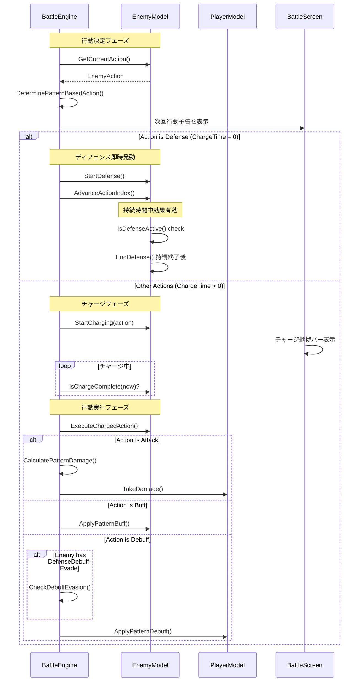
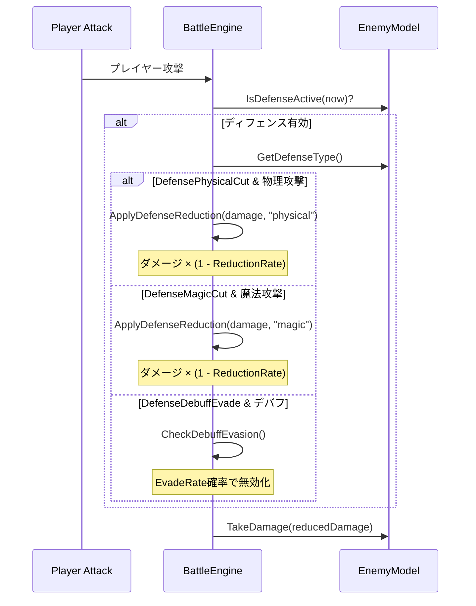

# Design Document

## Overview

**Purpose**: 本機能は、バトルレベル選択システム、敵の二重状態管理、順序実行型の行動パターン、状態別パッシブスキル、確定報酬システムを実装し、プレイヤーに戦略的な緊張感と挑戦する価値を提供します。

**Users**: プレイヤーがバトル前に自分に合った敵を選択し、敵の行動パターンを読みながら戦略的にバトルを進行できます。

**Impact**: 既存のバトル選択画面を敵種類選択に対応させ、敵の行動ロジックを順序実行型に変更、報酬システムを確定ドロップに変更します。

### Goals

- 敵種類とレベルの組み合わせでバトル難易度を選択可能にする
- 敵の行動パターンを予測可能にし、戦略性を向上させる
- 敵ごとの個性をパッシブスキルで表現する
- 挑戦への動機付けとなる確定報酬を実装する

### Non-Goals

- 新しい敵タイプの追加（マスタデータ設計のみ、実データは別途）
- バトル中の敵切り替え
- マルチプレイヤー対応
- 敵AIの学習・適応機能

## Architecture

### Existing Architecture Analysis

**現行アーキテクチャの状況**:

- **敵フェーズ管理**: `domain/enemy.go`に`EnemyPhase`（PhaseNormal/PhaseEnhanced）と50%閾値での遷移ロジックが実装済み
- **バトル選択**: `tui/screens/battle_select.go`でレベル入力のみ対応。敵種類選択なし
- **敵行動**: `usecase/combat/battle.go`の`DetermineNextAction`でランダム行動決定
- **報酬システム**: `usecase/rewarding/reward.go`で確率ドロップ（コア70%、モジュール70%×2）

**維持すべき既存パターン**:

- 5層レイヤードアーキテクチャ（domain → usecase → tui/infra → app）
- EffectTableパターンによる効果管理
- Elm Architectureベースのイベント駆動

### Architecture Pattern & Boundary Map


**Architecture Integration**:

- **Selected pattern**: 既存の5層レイヤードアーキテクチャを維持
- **Domain boundaries**: EnemyType拡張（行動パターン、パッシブスキル）はdomain層、行動実行ロジックはusecase/combat層
- **Existing patterns preserved**: EffectTableパターン、ファクトリパターン、マスタデータ駆動
- **New components rationale**: 敵パッシブスキルはEffectTableパターンに統合し、一時ステータス修正として実装
- **Steering compliance**: ドメイン層の独立性維持、マジックナンバーのconfig集約

### Technology Stack

| Layer | Choice / Version | Role in Feature | Notes |
|-------|------------------|-----------------|-------|
| Domain | Go structs | EnemyType拡張、EnemyAction、チャージ/ディフェンス状態 | 既存構造体を拡張 |
| UseCase | Go packages | チャージシステム、行動パターン実行、報酬計算 | combat, spawning, rewarding |
| TUI | Bubbletea + Lipgloss | 敵選択UI、チャージ予告表示、ディフェンス状態表示 | 既存画面を拡張 |
| Data | JSON (embed.FS) | `enemies.json`（敵定義）、`enemy_actions.json`（行動定義） | 行動をID参照で管理 |

## System Flows

### レベル選択フロー


### 敵行動パターンフロー（チャージシステム）



### ディフェンス軽減フロー



### 敵パッシブスキル適用フロー


## Requirements Traceability

| Requirement | Summary | Components | Interfaces | Flows |
|-------------|---------|------------|------------|-------|
| 1.1 | レベルと敵を一対一対応（1〜100） | EnemyType, EnemyGenerator | GenerateWithType() | レベル選択フロー |
| 1.2 | 敵タイプにデフォルトレベル設定 | EnemyType | DefaultLevel | - |
| 1.3 | 敵の特徴を表示 | BattleSelectScreen | RenderEnemyInfo() | レベル選択フロー |
| 1.4 | 未撃破はデフォルトレベルのみ | BattleSelectScreen | GetSelectableLevel() | レベル選択フロー |
| 1.5 | 撃破後のレベル上昇 | GameState, BattleSelectScreen | GetDefeatedEnemies() | レベル選択フロー |
| 1.6 | レベルに応じた報酬品質 | RewardCalculator | CalculateRewards() | - |
| 1.7 | 左右キーで敵種類変更 | BattleSelectScreen | handleKeyMsg() | レベル選択フロー |
| 1.8 | 上下キーでレベル変更 | BattleSelectScreen | handleKeyMsg() | レベル選択フロー |
| 2.1 | 敵に通常/強化状態を定義 | EnemyModel, EnemyType | NewEnemy() | - |
| 2.2 | HP50%以下で強化状態に遷移 | BattleEngine | CheckPhaseTransition() | パッシブスキル適用フロー |
| 2.3 | 強化状態から戻らない | EnemyModel | TransitionToEnhanced() | パッシブスキル適用フロー |
| 3.1 | 通常行動パターンを配列で定義 | EnemyType, ActionPattern | GetNormalPattern() | 敵行動パターンフロー |
| 3.2 | 順序実行とループ | ActionPatternExecutor | ExecuteNextAction() | 敵行動パターンフロー |
| 3.3 | 強化行動パターン定義 | EnemyType, ActionPattern | GetEnhancedPattern() | 敵行動パターンフロー |
| 3.4 | 強化時にパターン切り替え | BattleEngine | OnPhaseTransition() | 敵行動パターンフロー |
| 3.5 | 行動速度で実行間隔設定 | EnemyModel | AttackInterval | - |
| 4.1 | 通常パッシブ定義 | EnemyPassiveSkill | NormalPassive | - |
| 4.2 | 通常パッシブをEffectTableに適用 | BattleEngine | RegisterEnemyPassive() | パッシブスキル適用フロー |
| 4.3 | 強化時に通常パッシブ無効化 | BattleEngine | OnPhaseTransition() | パッシブスキル適用フロー |
| 4.4 | 強化パッシブ定義 | EnemyPassiveSkill | EnhancedPassive | - |
| 4.5 | 強化パッシブ適用 | BattleEngine | RegisterEnemyPassive() | パッシブスキル適用フロー |
| 5.1 | 撃破時に必ず1つアイテムドロップ | RewardCalculator | CalculateRewards() | - |
| 5.2 | 敵ごとにドロップカテゴリとTypeID設定 | EnemyType | DropItemCategory, DropItemTypeID | - |
| 5.3 | コアレベルを敵レベル上限でランダム | RewardCalculator | RollCoreDrop() | - |
| 5.4 | モジュールのチェイン効果を敵レベルで選択 | RewardCalculator | RollModuleDrop() | - |
| 6.1 | 敵の状態遷移ロジック実行 | BattleEngine | CheckPhaseTransition() | - |
| 6.2 | 行動パターンに従って行動実行 | BattleEngine | ProcessEnemyAction() | 敵行動パターンフロー |
| 6.3 | パッシブスキル効果適用 | BattleEngine | UpdateEnemyPassive() | パッシブスキル適用フロー |
| 6.4 | バトル終了時に報酬システム呼び出し | BattleEngine | OnBattleEnd() | - |

## Components and Interfaces

| Component | Domain/Layer | Intent | Req Coverage | Key Dependencies | Contracts |
|-----------|--------------|--------|--------------|------------------|-----------|
| EnemyType | Domain | 敵タイプ定義を拡張し行動パターンとパッシブを保持 | 1.1, 1.2, 2.1, 3.1, 3.3, 4.1, 4.4, 5.2 | なし | State |
| EnemyModel | Domain | バトル中の敵インスタンスに行動インデックスを追加 | 2.2, 2.3, 3.2, 3.5 | EnemyType | State |
| EnemyPassiveSkill | Domain | 敵用パッシブスキル定義 | 4.1, 4.4 | EffectColumn | State |
| ActionPattern | Domain | 敵行動パターンのデータ構造 | 3.1, 3.3 | なし | State |
| BattleSelectScreen | TUI | 敵種類とレベルの選択UI | 1.1-1.6 | EnemyGenerator, GameState (P0) | Service |
| BattleEngine | UseCase | 行動パターン実行とパッシブ管理 | 6.1-6.4 | EnemyModel, PlayerModel (P0) | Service |
| RewardCalculator | UseCase | 確定ドロップと品質計算 | 5.1-5.4 | EnemyType (P1) | Service |
| EnemyGenerator | UseCase | 敵タイプ指定での敵生成 | 1.1 | EnemyType (P1) | Service |

### Domain Layer

#### EnemyType (Extended)

| Field | Detail |
|-------|--------|
| Intent | 敵タイプ定義を拡張し、行動パターンとパッシブスキルを保持する |
| Requirements | 1.1, 1.2, 2.1, 3.1, 3.3, 4.1, 4.4, 5.2 |

**Responsibilities & Constraints**

- 敵の静的定義（HP、攻撃力、外観）を保持
- デフォルトレベル（1〜100）を保持
- 通常行動パターンと強化行動パターンを保持
- 通常パッシブスキルと強化パッシブスキルを保持
- ドロップアイテムのカテゴリ（"core"または"module"）とTypeIDを保持

**Dependencies**

- Outbound: なし（純粋なドメインモデル）

**Contracts**: State [x]

##### State Management

```go
type EnemyType struct {
    // 既存フィールド（ID, Name, BaseHP, BaseAttackPower, BaseAttackInterval, AttackType, ASCIIArt）

    // デフォルトレベル（1〜100、未撃破時はこのレベルのみ選択可能）
    DefaultLevel int

    // 行動パターン（行動IDの配列、ランタイムで解決）
    NormalActionPatternIDs   []string      // 通常状態での行動パターンID配列
    EnhancedActionPatternIDs []string      // 強化状態での行動パターンID配列
    ResolvedNormalActions    []EnemyAction // 解決済みの通常行動パターン
    ResolvedEnhancedActions  []EnemyAction // 解決済みの強化行動パターン

    // パッシブスキル
    NormalPassive   *EnemyPassiveSkill
    EnhancedPassive *EnemyPassiveSkill

    // ドロップ設定
    DropItemCategory string // "core" または "module"
    DropItemTypeID   string // コアまたはモジュールのTypeID
}

// SetResolvedActions は行動IDから解決された行動パターンを設定する
func (e *EnemyType) SetResolvedActions(normalActions, enhancedActions []EnemyAction)

// GetNormalActions は通常行動パターンを返す
func (e EnemyType) GetNormalActions() []EnemyAction

// GetEnhancedActions は強化行動パターンを返す
func (e EnemyType) GetEnhancedActions() []EnemyAction
```

**Implementation Notes**

- 既存の`EnemyType`構造体にフィールドを追加
- 行動パターンはIDの配列で定義し、マスタデータロード時に解決
- `enemy_actions.json`で行動を個別管理、`enemies.json`でIDを参照
- 行動パターンは最低1つの要素を持つことをバリデーション

#### EnemyAction

| Field | Detail |
|-------|--------|
| Intent | 敵の個別行動を定義する値オブジェクト（`enemy_actions.json`で管理） |
| Requirements | 3.1, 3.3 |

**Responsibilities & Constraints**

- 行動タイプ（攻撃、バフ、デバフ、ディフェンス）を定義
- 攻撃の場合はダメージ計算式（a + Lv × b）を保持
- バフ/デバフの場合は効果タイプと値を保持
- ディフェンスの場合は軽減率/回避率を保持
- 全行動にチャージタイム（行動決定から実行までの時間）を設定

**Dependencies**

- Outbound: なし（純粋な値オブジェクト）

**Contracts**: State [x]

##### State Management

```go
type EnemyActionType int

const (
    EnemyActionAttack EnemyActionType = iota
    EnemyActionBuff
    EnemyActionDebuff
    EnemyActionDefense
)

type EnemyDefenseType string

const (
    DefensePhysicalCut EnemyDefenseType = "physical_cut"
    DefenseMagicCut    EnemyDefenseType = "magic_cut"
    DefenseDebuffEvade EnemyDefenseType = "debuff_evade"
)

type EnemyAction struct {
    // ========== 共通フィールド ==========
    ID         string           // 行動の一意識別子
    Name       string           // 行動の表示名
    ActionType EnemyActionType  // 行動タイプ
    ChargeTime time.Duration    // チャージタイム（行動決定から実行までの時間）

    // ========== 攻撃行動用フィールド ==========
    AttackType     string  // "physical" または "magic"
    DamageBase     float64 // 基礎ダメージ (a)、ダメージ = a + Lv × b
    DamagePerLevel float64 // レベル係数 (b)
    Element        string  // 攻撃属性（"fire", "poison", "dark"等、空文字は無属性）

    // ========== バフ/デバフ行動用フィールド ==========
    EffectType  string  // 効果種別（"damage_mult", "cooldown_reduce"等）
    EffectValue float64 // 効果値
    Duration    float64 // 持続時間（秒）

    // ========== ディフェンス行動用フィールド ==========
    DefenseType   EnemyDefenseType // ディフェンス種別
    ReductionRate float64          // 物理/魔法ダメージ軽減割合（0.0〜1.0）
    EvadeRate     float64          // デバフ回避率（0.0〜1.0）
}
```

**Implementation Notes**

- 行動は`enemy_actions.json`で個別に定義し、IDで参照
- ディフェンス行動はチャージタイム0で即座に発動、持続時間中効果有効
- 持続時間終了後、自動的に次の行動へ移行

#### EnemyPassiveSkill

| Field | Detail |
|-------|--------|
| Intent | 敵用パッシブスキルを定義し、EffectTableに登録可能な形式を提供 |
| Requirements | 4.1, 4.2, 4.4, 4.5 |

**Responsibilities & Constraints**

- パッシブスキルの効果を定義
- EffectEntryに変換するメソッドを提供
- 一時ステータス修正として適用される

**Dependencies**

- Outbound: EffectColumn, EffectEntry（domain内参照）

**Contracts**: State [x]

##### State Management

```go
type EnemyPassiveSkill struct {
    ID          string
    Name        string
    Description string

    // 効果値（EffectColumnにマッピング）
    Effects map[EffectColumn]float64
}

// ToEntry はEffectTableに登録可能なEffectEntryに変換する
func (p *EnemyPassiveSkill) ToEntry() EffectEntry
```

**Implementation Notes**

- 既存のプレイヤー用PassiveSkillDefinitionと同様のパターンを採用
- 条件付き発動はサポートせず、状態に紐づく永続効果として実装

#### EnemyModel (Extended)

| Field | Detail |
|-------|--------|
| Intent | バトル中の敵インスタンスに行動インデックスとパッシブ管理を追加 |
| Requirements | 2.2, 2.3, 3.2, 3.5 |

**Responsibilities & Constraints**

- 現在の行動パターンインデックスを保持
- フェーズに応じた行動パターンを返す
- フェーズ遷移時のパッシブ切り替えをサポート

**Dependencies**

- Inbound: BattleEngine — 行動実行とフェーズ管理（P0）

**Contracts**: State [x]

##### State Management

```go
type EnemyModel struct {
    // 既存フィールド（ID, Name, Level, HP, MaxHP, AttackPower, AttackInterval, Type, Phase, EffectTable）

    // ========== 行動管理フィールド ==========
    ActionIndex     int    // 行動パターンの現在インデックス
    ActivePassiveID string // 現在適用中のパッシブスキルID

    // ========== チャージ状態管理フィールド ==========
    IsCharging        bool          // チャージ中かどうか
    ChargeStartTime   time.Time     // チャージ開始時刻
    CurrentChargeTime time.Duration // 現在の行動のチャージタイム
    PendingAction     *EnemyAction  // チャージ中の行動

    // ========== ディフェンス状態管理フィールド ==========
    IsDefending       bool             // ディフェンス中かどうか
    DefenseStartTime  time.Time        // ディフェンス開始時刻
    DefenseDuration   time.Duration    // ディフェンス持続時間
    ActiveDefenseType EnemyDefenseType // 発動中のディフェンス種別
    DefenseValue      float64          // 軽減率/回避率
}

// ========== 行動管理メソッド ==========
// GetCurrentAction は現在実行すべき行動を返す
func (e *EnemyModel) GetCurrentAction() EnemyAction

// AdvanceActionIndex は行動インデックスを進める（ループ対応）
func (e *EnemyModel) AdvanceActionIndex()

// ResetActionIndex は行動インデックスをリセットする（フェーズ遷移時）
func (e *EnemyModel) ResetActionIndex()

// GetCurrentPattern は現在のフェーズに対応する行動パターンを返す
func (e *EnemyModel) GetCurrentPattern() []EnemyAction

// ========== チャージ状態管理メソッド ==========
// StartCharging はチャージを開始する
func (e *EnemyModel) StartCharging(action EnemyAction, now time.Time)

// GetChargeProgress はチャージ進捗（0.0〜1.0）を返す
func (e *EnemyModel) GetChargeProgress(now time.Time) float64

// IsChargeComplete はチャージ完了かどうかを返す
func (e *EnemyModel) IsChargeComplete(now time.Time) bool

// ExecuteChargedAction はチャージ完了した行動を実行可能状態にする
func (e *EnemyModel) ExecuteChargedAction() *EnemyAction

// ========== ディフェンス状態管理メソッド ==========
// StartDefense はディフェンスを開始する
func (e *EnemyModel) StartDefense(defenseType EnemyDefenseType, value float64, duration time.Duration, now time.Time)

// IsDefenseActive はディフェンスが有効かどうかを返す
func (e *EnemyModel) IsDefenseActive(now time.Time) bool

// EndDefense はディフェンスを終了し、行動インデックスを進める
func (e *EnemyModel) EndDefense()
```

### TUI Layer

#### BattleSelectScreen (Extended)

| Field | Detail |
|-------|--------|
| Intent | 敵種類とレベルを選択するUIを提供 |
| Requirements | 1.1, 1.2, 1.3, 1.5, 1.6 |

**Responsibilities & Constraints**

- 敵タイプリストをカルーセル形式で表示
- 各敵の特徴（名前、HP目安、攻撃属性、パッシブ名）を表示
- 未撃破の敵タイプはデフォルトレベルのみ選択可能
- 撃破済み敵はデフォルトレベル以上を選択可能
- 左右キーで敵種類、上下キーでレベルを変更

**Dependencies**

- Inbound: app.RootModel — 画面遷移（P0）
- Outbound: EnemyGenerator — 敵タイプ取得（P0）
- Outbound: GameState — 撃破済み敵情報取得（P1）

**Contracts**: Service [x]

##### Service Interface

```go
// 既存のBattleSelectScreenを拡張

type BattleSelectScreen struct {
    // 既存フィールド

    // 敵種類選択用
    enemyTypes      []domain.EnemyType
    selectedTypeIdx int

    // レベル選択用
    selectedLevel    int
    minSelectableLevel int // 敵タイプのデフォルトレベル
    maxSelectableLevel int // 撃破済み最高レベル+1（未撃破ならデフォルトレベル）

    // 撃破済み敵情報プロバイダー
    defeatedProvider DefeatedEnemyProvider
}

// DefeatedEnemyProvider は撃破済み敵情報を提供するインターフェース
type DefeatedEnemyProvider interface {
    // GetDefeatedEnemies は敵タイプIDをキー、撃破最高レベルを値とするマップを返す
    GetDefeatedEnemies() map[string]int
}

// StartBattleMsg にEnemyTypeIDを追加
type StartBattleMsg struct {
    Level       int
    EnemyTypeID string
}
```

**Implementation Notes**

- 既存の入力フィールド方式からカルーセル方式に変更
- 敵情報パネルで特徴を表示
- 未撃破の敵タイプはデフォルトレベルのみ選択可能
- レベル範囲は1〜100、敵タイプは100種類定義

### UseCase Layer

#### BattleEngine (Extended)

| Field | Detail |
|-------|--------|
| Intent | 敵の行動パターン実行とパッシブスキル管理をバトルに統合 |
| Requirements | 6.1, 6.2, 6.3, 6.4 |

**Responsibilities & Constraints**

- 敵の行動パターンに従って順序実行
- フェーズ遷移時にパッシブスキルを切り替え
- 敵パッシブスキルをEffectTableで管理

**Dependencies**

- Inbound: BattleScreen — バトル進行制御（P0）
- Outbound: EnemyModel — 敵状態管理（P0）
- Outbound: RewardCalculator — 報酬計算（P1）

**Contracts**: Service [x]

##### Service Interface

```go
// 既存のBattleEngineを拡張

// ========== チャージシステム（Phase 3.2） ==========

// DeterminePatternBasedAction はパターンベースの次回行動を決定する
func (e *BattleEngine) DeterminePatternBasedAction(state *BattleState) NextEnemyAction

// CalculatePatternDamage はパターンベース攻撃のダメージを計算する
// ダメージ = DamageBase + Level × DamagePerLevel
func (e *BattleEngine) CalculatePatternDamage(state *BattleState, action domain.EnemyAction) int

// StartEnemyCharging は敵のチャージを開始する
// ディフェンス行動はチャージタイム0なので即座に発動する
func (e *BattleEngine) StartEnemyCharging(state *BattleState, now time.Time)

// ExecuteChargedAction はチャージ完了した行動を実行する
func (e *BattleEngine) ExecuteChargedAction(state *BattleState) (damage int, message string)

// ========== ディフェンス処理 ==========

// ActivateDefense はディフェンス行動を発動する
func (e *BattleEngine) ActivateDefense(state *BattleState, now time.Time)

// CheckDefenseExpired はディフェンス終了をチェックし、必要なら終了処理を行う
func (e *BattleEngine) CheckDefenseExpired(state *BattleState, now time.Time) bool

// ApplyDefenseReduction はディフェンスによるダメージ軽減を適用する
func (e *BattleEngine) ApplyDefenseReduction(state *BattleState, baseDamage int, attackType string) int

// CheckDebuffEvasion はデバフ回避を判定する
func (e *BattleEngine) CheckDebuffEvasion(state *BattleState) bool

// ========== パターンベース行動実行 ==========

// ExecutePatternAttack はパターンベースの攻撃を実行する
func (e *BattleEngine) ExecutePatternAttack(state *BattleState, action domain.EnemyAction) int

// ApplyPatternBuff はパターンベースのバフを適用する
func (e *BattleEngine) ApplyPatternBuff(state *BattleState, action domain.EnemyAction)

// ApplyPatternDebuff はパターンベースのデバフを適用する
func (e *BattleEngine) ApplyPatternDebuff(state *BattleState, action domain.EnemyAction)

// ========== UI表示用 ==========

// GetChargeInfo はチャージ情報を取得する（UI表示用）
func (e *BattleEngine) GetChargeInfo(state *BattleState, now time.Time) (progress float64, remainingMs int, actionName string)

// GetDefenseInfo はディフェンス情報を取得する（UI表示用）
func (e *BattleEngine) GetDefenseInfo(state *BattleState, now time.Time) (active bool, remainingMs int, typeName string)

// ========== 既存メソッド（パッシブスキル） ==========

// RegisterEnemyPassive は敵のパッシブスキルをEffectTableに登録する
func (e *BattleEngine) RegisterEnemyPassive(state *BattleState)

// OnPhaseTransition はフェーズ遷移時の処理を実行する
func (e *BattleEngine) OnPhaseTransition(state *BattleState)

// CheckPhaseTransitionWithPassive はフェーズ遷移をチェックし、パッシブも切り替える
func (e *BattleEngine) CheckPhaseTransitionWithPassive(state *BattleState) bool
```

**Implementation Notes**

- 既存の`DetermineNextAction`はランダム行動決定だが、`DeterminePatternBasedAction`はパターン順序実行
- チャージシステム: 行動決定後、チャージタイム経過で実行
- ディフェンス行動: チャージタイム0で即座に発動、持続時間中効果有効
- 後方互換性のため、EnemyTypeに行動パターンがない場合は既存のランダムロジックにフォールバック

#### RewardCalculator (Extended)

| Field | Detail |
|-------|--------|
| Intent | 確定ドロップと敵レベルに応じた報酬品質を計算 |
| Requirements | 5.1, 5.2, 5.3, 5.4 |

**Responsibilities & Constraints**

- 撃破時に必ず1つのアイテムをドロップ
- ドロップアイテムは敵タイプのDropItemCategoryとDropItemTypeID設定に従う
- DropItemCategoryが"core"の場合、指定されたTypeIDのコアをレベル（敵レベル以下でランダム）で生成
- DropItemCategoryが"module"の場合、指定されたTypeIDのモジュールを敵レベルに応じたチェイン効果で生成

**Dependencies**

- Inbound: BattleEngine — 報酬計算呼び出し（P0）
- Outbound: EnemyType — ドロップカテゴリ・TypeID参照（P1）
- Outbound: ChainEffectPool — チェイン効果選択（P1）

**Contracts**: Service [x]

##### Service Interface

```go
// 既存のRewardCalculatorを拡張

// CalculateGuaranteedReward は確定ドロップを計算する（既存のCalculateRewardsを拡張）
func (c *RewardCalculator) CalculateGuaranteedReward(
    stats *BattleStatistics,
    enemyLevel int,
    enemyType domain.EnemyType,
) *RewardResult

// RollCoreDropWithLevelCap は指定されたTypeIDでコアを敵レベル以下でランダム生成する
func (c *RewardCalculator) RollCoreDropWithLevelCap(typeID string, maxLevel int) *domain.CoreModel

// RollModuleDropWithLevelEffect は指定されたTypeIDで敵レベルに応じたチェイン効果付きモジュールを生成する
func (c *RewardCalculator) RollModuleDropWithLevelEffect(typeID string, enemyLevel int) *domain.ModuleModel
```

**Implementation Notes**

- 既存の確率ドロップロジックを維持しつつ、確定ドロップモードを追加
- 敵タイプにDropItemCategoryまたはDropItemTypeIDがない場合は既存の確率ドロップにフォールバック
- チェイン効果の選択は敵レベルが高いほど高品質な効果が出やすくなる

#### EnemyGenerator (Extended)

| Field | Detail |
|-------|--------|
| Intent | 敵タイプを指定した敵生成をサポート |
| Requirements | 1.1 |

**Responsibilities & Constraints**

- 既存の`GenerateWithType`メソッドを活用
- 行動パターン初期化をサポート

**Dependencies**

- Inbound: BattleSelectScreen — 敵生成要求（P0）
- Outbound: EnemyType — 敵定義参照（P1）

**Contracts**: Service [x]

##### Service Interface

```go
// 既存のEnemyGeneratorを使用（GenerateWithTypeメソッドが既に存在）

// GetEnemyTypes は全ての敵タイプを返す（既存メソッド）
func (g *EnemyGenerator) GetEnemyTypes() []domain.EnemyType
```

**Implementation Notes**

- 新しいフィールド（行動パターン、パッシブ）を持つEnemyTypeからの生成をサポート
- NewEnemy関数でActionIndexを0に初期化

## Data Models

### Domain Model

**EnemyType拡張**:

```go
type EnemyType struct {
    // 既存
    ID                 string
    Name               string
    BaseHP             int
    BaseAttackPower    int
    BaseAttackInterval time.Duration
    AttackType         string
    ASCIIArt           string

    // 新規追加
    DefaultLevel             int      // デフォルトレベル（1〜100）
    NormalActionPatternIDs   []string // 通常行動パターンID配列
    EnhancedActionPatternIDs []string // 強化行動パターンID配列
    ResolvedNormalActions    []EnemyAction // 解決済み通常行動
    ResolvedEnhancedActions  []EnemyAction // 解決済み強化行動
    NormalPassive            *EnemyPassiveSkill
    EnhancedPassive          *EnemyPassiveSkill
    DropItemCategory         string // "core" または "module"
    DropItemTypeID           string // コアまたはモジュールのTypeID
}
```

**EnemyAction**:

```go
type EnemyActionType int

const (
    EnemyActionAttack EnemyActionType = iota
    EnemyActionBuff
    EnemyActionDebuff
    EnemyActionDefense
)

type EnemyDefenseType string

const (
    DefensePhysicalCut EnemyDefenseType = "physical_cut"
    DefenseMagicCut    EnemyDefenseType = "magic_cut"
    DefenseDebuffEvade EnemyDefenseType = "debuff_evade"
)

type EnemyAction struct {
    ID             string           // 行動ID（enemy_actions.jsonで定義）
    Name           string           // 表示名
    ActionType     EnemyActionType
    ChargeTime     time.Duration    // チャージタイム
    AttackType     string           // Attack時: "physical" | "magic"
    DamageBase     float64          // ダメージ = a + Lv × b
    DamagePerLevel float64
    Element        string           // 攻撃属性
    EffectType     string           // Buff/Debuff時の効果種別
    EffectValue    float64
    Duration       float64          // 秒
    DefenseType    EnemyDefenseType // Defense時の種別
    ReductionRate  float64          // 軽減率
    EvadeRate      float64          // 回避率
}
```

**EnemyPassiveSkill**:

```go
type EnemyPassiveSkill struct {
    ID          string
    Name        string
    Description string
    Effects     map[EffectColumn]float64
}
```

**ビジネスルール/不変条件**:

- `DefaultLevel`は1〜100の範囲
- 敵タイプは100種類定義（レベルと一対一対応）
- `NormalActionPatternIDs`は最低1つの行動IDを含む
- `EnhancedActionPatternIDs`が空の場合は`NormalActionPatternIDs`を継続
- `DropItemCategory`は"core"または"module"のいずれか
- `DropItemTypeID`は`DropItemCategory`に対応する有効なTypeIDであること
- 行動のダメージ計算: `DamageBase + Level × DamagePerLevel`
- ディフェンス行動のチャージタイムは0（即座に発動）
- ディフェンス持続時間終了後、自動的に次の行動へ移行
- `DefensePhysicalCut`/`DefenseMagicCut`は対応する属性のダメージのみ軽減
- `DefenseDebuffEvade`はプレイヤーからのデバフを確率で回避

### Logical Data Model

**enemy_actions.json（行動マスタデータ）**:

```json
{
  "enemy_actions": [
    {
      "id": "act_slime_attack_phys",
      "name": "体当たり",
      "action_type": "attack",
      "attack_type": "physical",
      "damage_base": 5,
      "damage_per_level": 1.0,
      "charge_time_ms": 3000
    },
    {
      "id": "act_slime_attack_magic",
      "name": "酸攻撃",
      "action_type": "attack",
      "attack_type": "magic",
      "damage_base": 8,
      "damage_per_level": 1.5,
      "element": "poison",
      "charge_time_ms": 4000
    },
    {
      "id": "act_goblin_buff_attack",
      "name": "怒り",
      "action_type": "buff",
      "effect_type": "damage_mult",
      "effect_value": 1.3,
      "duration_seconds": 10.0,
      "charge_time_ms": 2000
    },
    {
      "id": "act_bat_defense_phys",
      "name": "回避飛行",
      "action_type": "defense",
      "defense_type": "physical_cut",
      "reduction_rate": 0.5,
      "duration_seconds": 3.0,
      "charge_time_ms": 0
    },
    {
      "id": "act_bat_defense_debuff",
      "name": "超音波",
      "action_type": "defense",
      "defense_type": "debuff_evade",
      "evade_rate": 0.7,
      "duration_seconds": 4.0,
      "charge_time_ms": 0
    }
  ]
}
```

**enemies.json拡張例（行動IDを参照）**:

```json
{
  "enemy_types": [
    {
      "id": "slime",
      "name": "スライム",
      "base_hp": 50,
      "base_attack_power": 5,
      "base_attack_interval_ms": 10000,
      "attack_type": "physical",
      "ascii_art": "...",
      "default_level": 1,
      "normal_action_pattern": ["act_slime_attack_phys"],
      "enhanced_action_pattern": ["act_slime_attack_phys", "act_slime_attack_magic"],
      "drop_item_category": "core",
      "drop_item_type_id": "attack_balance"
    },
    {
      "id": "bat",
      "name": "コウモリ",
      "base_hp": 40,
      "base_attack_power": 6,
      "base_attack_interval_ms": 12000,
      "attack_type": "physical",
      "ascii_art": "...",
      "default_level": 2,
      "normal_action_pattern": ["act_bat_attack_phys", "act_bat_attack_phys"],
      "enhanced_action_pattern": ["act_bat_attack_phys", "act_bat_defense_phys", "act_bat_attack_phys", "act_bat_defense_debuff"],
      "drop_item_category": "module",
      "drop_item_type_id": "heal_lv1"
    }
  ]
}
```

**GameState拡張（撃破済み敵管理）**:

```go
type DefeatedEnemy struct {
    EnemyTypeID string
    MaxLevel    int // 撃破した最高レベル
}
```

## Error Handling

### Error Strategy

- **敵タイプ未設定**: 既存のランダム敵生成にフォールバック
- **行動パターン空**: 通常攻撃のみの1要素パターンをデフォルト適用
- **パッシブスキル未設定**: パッシブなしとして処理（EffectTableへの登録をスキップ）
- **DropItemCategory/DropItemTypeID未設定**: 既存の確率ドロップにフォールバック

### Error Categories and Responses

**User Errors**:
- 未撃破敵のLv.2以上選択 → UI上で選択不可にする

**System Errors**:
- JSONパース失敗 → 起動時エラーログ出力、該当敵タイプをスキップ

**Business Logic Errors**:
- 撃破済み敵情報の不整合 → 撃破記録をリセット

## Testing Strategy

### Unit Tests

- `domain/enemy_test.go`: EnemyAction, EnemyPassiveSkillの値オブジェクトテスト
- `domain/enemy_test.go`: EnemyModel.GetCurrentAction, AdvanceActionIndexのテスト
- `usecase/combat/battle_action_pattern_test.go`: 行動パターン実行のテスト
- `usecase/rewarding/reward_guaranteed_test.go`: 確定ドロップのテスト

### Integration Tests

- `integration_test/enemy_level_design_test.go`: レベル選択→バトル→報酬の一連フロー
- `integration_test/enemy_passive_test.go`: フェーズ遷移とパッシブ切り替え
- `integration_test/defeated_enemy_test.go`: 撃破記録の永続化

### E2E Tests

- バトル選択画面での敵種類変更操作
- バトル中の敵行動パターン順序確認
- 撃破後の報酬確認と次回選択可能レベルの確認

## Optional Sections

### Performance & Scalability

**懸念点**:

- 敵タイプ数の増加によるメモリ使用量
- 行動パターン配列のサイズ

**対策**:

- 敵タイプはアプリ起動時に一度だけロード（既存パターン維持）
- 行動パターンは最大20要素程度を想定（現時点では制限なし）

### Migration Strategy

**Phase 1: データモデル拡張**

1. EnemyType構造体に新フィールド追加
2. enemies.jsonの既存敵に最小限の行動パターンを追加
3. 新フィールドが空の場合のフォールバックロジック実装

**Phase 2: UI変更**

1. BattleSelectScreenをカルーセル方式に変更
2. DefeatedEnemyProviderインターフェース実装
3. 撃破済み敵情報のセーブ/ロード対応

**Phase 3: バトルロジック変更**

1. 行動パターン実行ロジック追加
2. 敵パッシブスキル登録ロジック追加
3. 確定ドロップロジック追加

**Rollback Triggers**:

- 行動パターンのバグによるバトル進行不能
- パッシブスキルによるバランス崩壊

**Validation Checkpoints**:

- 各Phase完了時に既存テストがすべてパス
- 新規テストの追加と実行
