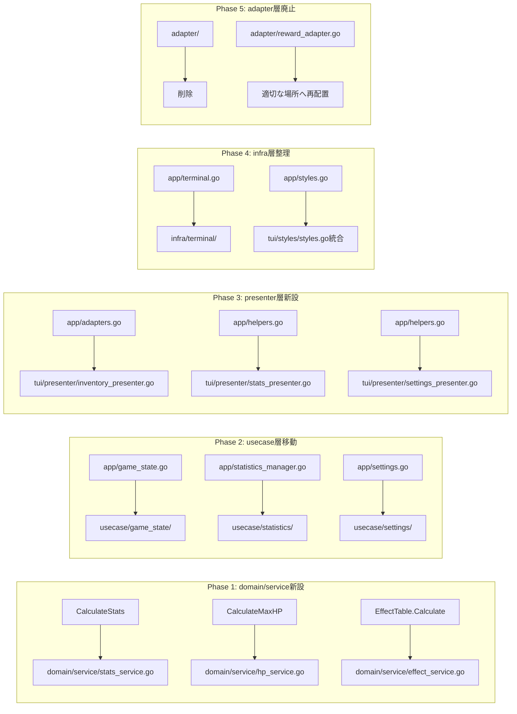

# 技術設計ドキュメント

## Overview

**目的**: 本設計は、BlitzTypingOperatorプロジェクトの`internal/`配下のパッケージ構成を5層レイヤードアーキテクチャに再編成し、コードベースの可読性と保守性を向上させる。

**ユーザー**: 開発者が本設計を参照し、パッケージの責務と配置を理解できるようにする。

**影響**: 現在の19個のフラットなパッケージ構成を、論理的なレイヤーグループに再編成する。

### Goals

- 5層レイヤードアーキテクチャ（domain, usecase, infra, app, tui）の導入
- 各パッケージの責務を明確化し、依存関係を整理
- 重複コードの解消と一元管理の実現
- usecase層からinfra層への逆依存を解消

### Non-Goals

- 機能追加や新規ビジネスロジックの実装
- パフォーマンス最適化
- 外部APIとの新規連携
- テストカバレッジの拡大（リグレッション防止のための既存テスト維持のみ）

## Architecture

### Existing Architecture Analysis

**現在のパッケージ構成の問題点:**

1. **フラット構造**: 19個のパッケージが同一階層に並び、責務の関連性が把握しづらい
2. **責務混在**: `app/`パッケージにビジネスロジック、UI変換、インフラ関心事が混在
3. **重複実装**: `app/game_state.go`と`app/game_state/state.go`に重複コード
4. **逆依存**: usecase層（achievement, reward, enemy）がinfra層（persistence, loader）に依存
5. **アダプター層の分散**: データ変換ロジックが複数箇所に散在

**現在の依存関係の課題:**
```
achievement → persistence（逆依存）
reward → loader（逆依存）
enemy → loader（逆依存）
```

### Architecture Pattern & Boundary Map

```mermaid
flowchart TB
    subgraph "横断的関心事"
        config["config"]
    end

    subgraph "app層 - オーケストレーション"
        app["app"]
    end

    subgraph "tui層 - UI"
        tui_screens["tui/screens"]
        tui_components["tui/components"]
        tui_styles["tui/styles"]
        tui_presenter["tui/presenter"]
    end

    subgraph "usecase層 - ユースケース"
        battle["usecase/battle"]
        typing["usecase/typing"]
        agent["usecase/agent"]
        enemy["usecase/enemy"]
        inventory["usecase/inventory"]
        reward["usecase/reward"]
        achievement["usecase/achievement"]
        balance["usecase/balance"]
        game_state["usecase/game_state"]
        settings["usecase/settings"]
        statistics["usecase/statistics"]
    end

    subgraph "infra層 - インフラストラクチャ"
        persistence["infra/persistence"]
        loader["infra/loader"]
        embedded["infra/embedded"]
        errorhandler["infra/errorhandler"]
        startup["infra/startup"]
        terminal["infra/terminal"]
    end

    subgraph "domain層 - ドメインモデル"
        domain["domain - VO/エンティティ"]
        domain_service["domain/service"]
    end

    app --> tui_screens
    app --> tui_presenter
    app --> game_state
    app --> persistence
    app --> domain

    tui_screens --> tui_components
    tui_screens --> tui_styles
    tui_presenter --> domain
    tui_presenter --> game_state

    domain_service --> domain

    battle --> domain
    battle --> domain_service
    battle --> typing
    typing --> domain
    agent --> domain
    agent --> domain_service
    enemy --> domain
    inventory --> domain
    reward --> domain
    reward --> inventory
    achievement --> domain
    balance --> domain
    game_state --> domain
    game_state --> domain_service
    settings --> domain
    statistics --> domain

    loader --> domain
    startup --> domain
    persistence --> domain

    app -.-> config
    tui_presenter -.-> config
    battle -.-> config
    enemy -.-> config
```



**Architecture Integration:**

- **選択パターン**: 5層レイヤードアーキテクチャ（Clean Architectureの簡略版）
- **ドメイン境界**: domain層は最内層で外部依存なし、domain/serviceは複数ドメインオブジェクトの組み合わせロジックを配置
- **既存パターン維持**: Elm Architectureパターン（Bubbletea）、ファクトリパターン、ルーターパターン
- **新規コンポーネント理由**: `tui/presenter/`は UI向けデータ変換を一元管理、`domain/service/`は複数オブジェクト間ロジックを分離
- **Steering準拠**: ドメイン層の独立性、変換ロジックの集約、定数の一元管理を維持

### Technology Stack

| Layer | Choice / Version | Role in Feature | Notes |
|-------|------------------|-----------------|-------|
| Backend / Services | Go 1.25+ | メイン実装言語 | 既存スタック維持 |
| TUI Framework | bubbletea, lipgloss, bubbles | UI層 | 既存スタック維持 |
| Data / Storage | JSON, ファイルシステム | 永続化 | 既存スタック維持 |

## System Flows

### パッケージ移動フロー



## Requirements Traceability

| Requirement | Summary | Components | Interfaces | Flows |
|-------------|---------|------------|------------|-------|
| 1.1-1.5 | レイヤー分類定義 | 全コンポーネント | LayerConfig | Phase 1-5 |
| 2.1-2.5 | ドメイン層整理 | domain/service/* | StatsService, HPService, EffectService | Phase 1 |
| 3.1-3.5 | ユースケース層整理 | usecase/* | 各ユースケースインターフェース | Phase 2 |
| 4.1-4.6 | app層ビジネスロジック分離 | usecase/game_state, usecase/statistics, usecase/settings | GameStateService | Phase 2 |
| 5.1-5.4 | presenter層新設 | tui/presenter/* | StatsPresenter, SettingsPresenter, EncyclopediaPresenter, InventoryPresenter | Phase 3 |
| 6.1-6.3 | app層インフラ分離 | infra/terminal, infra/defaults | TerminalService | Phase 4 |
| 7.1-7.3 | app層UI分離 | tui/styles | GameStyles | Phase 4 |
| 8.1-8.3 | app層責務限定 | app/* | RootModel, SceneRouter, ScreenFactory | Phase 5 |
| 9.1-9.4 | インフラ層整理 | infra/* | Loader, Persistence, Startup | Phase 4 |
| 10.1-10.4 | adapter層廃止 | - | - | Phase 5 |
| 11.1-11.5 | TUI層拡張 | tui/* | InventoryProvider | Phase 3-4 |
| 12.1-12.3 | 設定定数配置 | config | Constants | 維持 |
| 13.1-13.2 | 統合テスト配置 | integration_test | - | 維持 |
| 14.1-14.6 | 重複コード解消 | usecase/game_state | GameState | Phase 2 |
| 15.1-15.3 | 逆依存解消 | usecase/achievement, usecase/reward, usecase/enemy | ドメイン型への変換 | Phase 2 |
| 16.1-16.4 | balance層責務整理 | usecase/balance, app/scene | BalanceParams, Scene | Phase 2 |
| 17.1-17.4 | 移行安全性 | 全コンポーネント | - | 全Phase |
| 18.1-18.4 | ドキュメント更新 | .kiro/steering/structure.md | - | Phase 5 |

## Components and Interfaces

### コンポーネントサマリー

| Component | Domain/Layer | Intent | Req Coverage | Key Dependencies | Contracts |
|-----------|--------------|--------|--------------|------------------|-----------|
| domain/service/stats_service | domain/service | ステータス計算 | 2.5 | domain (P0) | Service |
| domain/service/hp_service | domain/service | MaxHP計算 | 2.5 | domain (P0) | Service |
| domain/service/effect_service | domain/service | エフェクト計算・更新 | 2.5 | domain (P0) | Service |
| usecase/game_state | usecase | ゲーム状態管理 | 4.1-4.5 | domain (P0), domain/service (P0) | Service |
| usecase/statistics | usecase | 統計管理 | 4.3 | domain (P0) | Service |
| usecase/settings | usecase | 設定管理 | 4.4 | domain (P0) | Service |
| tui/presenter/stats_presenter | tui/presenter | 統計データ変換 | 5.3 | usecase/statistics (P0), domain (P1) | Service |
| tui/presenter/settings_presenter | tui/presenter | 設定データ変換 | 5.3 | usecase/settings (P0), domain (P1) | Service |
| tui/presenter/encyclopedia_presenter | tui/presenter | 図鑑データ変換 | 5.3 | domain (P0) | Service |
| tui/presenter/inventory_presenter | tui/presenter | インベントリデータ変換 | 5.2 | usecase/game_state (P0), domain (P1) | Service |
| infra/terminal | infra | ターミナル環境検証 | 6.1 | - | Service |

### domain/service

#### StatsService

| Field | Detail |
|-------|--------|
| Intent | コアレベルとコア特性からステータス値を計算 |
| Requirements | 2.5 |
| Owner / Reviewers | - |

**Responsibilities & Constraints**
- コアレベルとコア特性の重みからStats構造体を計算
- 純粋関数として実装（副作用なし）
- domain層のみに依存

**Dependencies**
- Inbound: usecase/battle, usecase/agent, app — ステータス計算呼び出し (P0)
- Outbound: domain — CoreType, Stats型使用 (P0)

**Contracts**: Service [x] / API [ ] / Event [ ] / Batch [ ] / State [ ]

##### Service Interface
```go
package service

import "hirorocky/type-battle/internal/domain"

// CalculateStats はコアレベルとコア特性からステータス値を計算します。
// 計算式: 基礎値(10) × レベル × ステータス重み
func CalculateStats(level int, coreType domain.CoreType) domain.Stats
```

**Implementation Notes**
- Integration: domain/core.goから`CalculateStats`関数を移動
- Validation: level > 0, coreType.StatWeightsが設定済みであること
- Risks: 既存のNewCore呼び出し箇所のインポートパス更新が必要

#### HPService

| Field | Detail |
|-------|--------|
| Intent | 装備中エージェントからMaxHPを計算 |
| Requirements | 2.5 |
| Owner / Reviewers | - |

**Responsibilities & Constraints**
- 装備エージェントのコアレベル平均からMaxHPを計算
- 計算式: レベル平均 × HP係数 + 基礎HP

**Dependencies**
- Inbound: usecase/game_state, app — HP計算呼び出し (P0)
- Outbound: domain — AgentModel型使用 (P0)

**Contracts**: Service [x] / API [ ] / Event [ ] / Batch [ ] / State [ ]

##### Service Interface
```go
package service

import "hirorocky/type-battle/internal/domain"

// CalculateMaxHP は装備中エージェントのコアレベル平均からMaxHPを計算します。
// 計算式: レベル平均 × HP係数(10) + 基礎HP(100)
func CalculateMaxHP(agents []*domain.AgentModel) int
```

**Implementation Notes**
- Integration: domain/player.goから`CalculateMaxHP`関数を移動
- Validation: agents配列が空の場合は基礎HPを返す

#### EffectService

| Field | Detail |
|-------|--------|
| Intent | エフェクトテーブルの計算と更新 |
| Requirements | 2.5 |
| Owner / Reviewers | - |

**Responsibilities & Constraints**
- EffectTableから最終ステータスを計算
- 時限効果の残り時間を更新

**Dependencies**
- Inbound: usecase/battle, app — エフェクト計算呼び出し (P0)
- Outbound: domain — EffectTable, Stats, FinalStats型使用 (P0)

**Contracts**: Service [x] / API [ ] / Event [ ] / Batch [ ] / State [ ]

##### Service Interface
```go
package service

import "hirorocky/type-battle/internal/domain"

// Calculate は基礎ステータスに効果を適用して最終ステータスを計算します。
func Calculate(table *domain.EffectTable, baseStats domain.Stats) domain.FinalStats

// UpdateDurations は時限効果の残り時間を更新します。
func UpdateDurations(table *domain.EffectTable, deltaSeconds float64)
```

**Implementation Notes**
- Integration: EffectTableのメソッドをサービス関数として再実装
- Validation: table != nil
- Risks: 既存のEffectTableメソッド呼び出し箇所の更新が必要

### usecase

#### GameStateService

| Field | Detail |
|-------|--------|
| Intent | ゲーム全体の状態を管理 |
| Requirements | 4.1, 4.2, 4.5, 14.1-14.6 |
| Owner / Reviewers | - |

**Responsibilities & Constraints**
- プレイヤー情報、インベントリ、統計、実績、設定の一元管理
- バトル結果・タイピング結果の記録
- セーブ/ロード対応（ただし永続化変換はinfra層）

**Dependencies**
- Inbound: app — ゲーム状態アクセス (P0)
- Outbound: domain (P0), domain/service (P0), usecase/statistics (P1), usecase/settings (P1)
- External: なし

**Contracts**: Service [x] / API [ ] / Event [ ] / Batch [ ] / State [x]

##### Service Interface
```go
package game_state

import (
    "hirorocky/type-battle/internal/domain"
    "hirorocky/type-battle/internal/inventory"
)

// GameState はゲーム全体の状態を保持する構造体
type GameState struct {
    MaxLevelReached    int
    player             *domain.PlayerModel
    inventory          *InventoryManager
    // ... その他のフィールド
}

// NewGameState はデフォルト値で新しいGameStateを作成
func NewGameState() *GameState

// Player はプレイヤーの状態を返す
func (g *GameState) Player() *domain.PlayerModel

// RecordBattleVictory はバトル勝利を記録
func (g *GameState) RecordBattleVictory(level int)

// PreparePlayerForBattle はプレイヤーをバトル用に準備
func (g *GameState) PreparePlayerForBattle()
```

##### State Management
- State model: GameState構造体で全状態を保持
- Persistence: infra/persistenceを通じてJSON形式で永続化
- Concurrency: 単一スレッドアクセス前提（Bubbletea Model）

**Implementation Notes**
- Integration: app/game_state.goとapp/game_state/state.goを統合
- Validation: 重複定義を解消し単一ソースを維持
- Risks: app層からの参照パス変更が広範囲に影響

### tui/presenter

#### StatsPresenter

| Field | Detail |
|-------|--------|
| Intent | GameStateから統計表示用データを生成 |
| Requirements | 5.3 |
| Owner / Reviewers | - |

**Responsibilities & Constraints**
- StatisticsManagerから画面表示用のStatsDataを生成
- AchievementManagerから実績データを変換

**Dependencies**
- Inbound: app, tui/screens — 統計データ取得 (P0)
- Outbound: usecase/game_state (P0), usecase/statistics (P0), domain (P1)

**Contracts**: Service [x] / API [ ] / Event [ ] / Batch [ ] / State [ ]

##### Service Interface
```go
package presenter

import (
    "hirorocky/type-battle/internal/tui/screens"
    "hirorocky/type-battle/internal/usecase/game_state"
)

// CreateStatsData はGameStateから統計データを生成
func CreateStatsData(gs *game_state.GameState) *screens.StatsData
```

**Implementation Notes**
- Integration: app/helpers.goから`CreateStatsDataFromGameState`を移動

#### SettingsPresenter

| Field | Detail |
|-------|--------|
| Intent | GameStateから設定表示用データを生成 |
| Requirements | 5.3 |
| Owner / Reviewers | - |

**Dependencies**
- Outbound: usecase/game_state (P0), usecase/settings (P0)

**Contracts**: Service [x]

##### Service Interface
```go
package presenter

import (
    "hirorocky/type-battle/internal/tui/screens"
    "hirorocky/type-battle/internal/usecase/game_state"
)

// CreateSettingsData はGameStateから設定データを生成
func CreateSettingsData(gs *game_state.GameState) *screens.SettingsData
```

#### EncyclopediaPresenter

| Field | Detail |
|-------|--------|
| Intent | GameStateから図鑑表示用データを生成 |
| Requirements | 5.3 |
| Owner / Reviewers | - |

**Dependencies**
- Outbound: usecase/game_state (P0), domain (P0)

**Contracts**: Service [x]

##### Service Interface
```go
package presenter

import (
    "hirorocky/type-battle/internal/tui/screens"
    "hirorocky/type-battle/internal/usecase/game_state"
)

// CreateEncyclopediaData はGameStateから図鑑データを生成
func CreateEncyclopediaData(gs *game_state.GameState) *screens.EncyclopediaData
```

#### InventoryPresenter

| Field | Detail |
|-------|--------|
| Intent | InventoryManagerとAgentManagerをInventoryProviderに適合 |
| Requirements | 5.2 |
| Owner / Reviewers | - |

**Dependencies**
- Outbound: usecase/game_state (P0), usecase/agent (P0), domain (P0)

**Contracts**: Service [x]

##### Service Interface
```go
package presenter

import (
    "hirorocky/type-battle/internal/domain"
    "hirorocky/type-battle/internal/usecase/game_state"
    "hirorocky/type-battle/internal/usecase/agent"
)

// InventoryProviderAdapter はInventoryProviderインターフェースを実装
type InventoryProviderAdapter struct {
    inv      *game_state.InventoryManager
    agentMgr *agent.AgentManager
    player   *domain.PlayerModel
}

func NewInventoryProviderAdapter(
    inv *game_state.InventoryManager,
    agentMgr *agent.AgentManager,
    player *domain.PlayerModel,
) *InventoryProviderAdapter

func (a *InventoryProviderAdapter) GetCores() []*domain.CoreModel
func (a *InventoryProviderAdapter) GetModules() []*domain.ModuleModel
func (a *InventoryProviderAdapter) GetAgents() []*domain.AgentModel
func (a *InventoryProviderAdapter) GetEquippedAgents() []*domain.AgentModel
```

**Implementation Notes**
- Integration: app/adapters.goから`inventoryProviderAdapter`を移動

### infra/terminal

#### TerminalService

| Field | Detail |
|-------|--------|
| Intent | ターミナル環境の検証と警告メッセージ生成 |
| Requirements | 6.1 |
| Owner / Reviewers | - |

**Responsibilities & Constraints**
- 最小要件（140x40文字）に基づくサイズ検証
- 警告メッセージの生成

**Dependencies**
- Inbound: app — ターミナルサイズ検証 (P0)
- Outbound: なし

**Contracts**: Service [x]

##### Service Interface
```go
package terminal

const (
    MinTerminalWidth  = 140
    MinTerminalHeight = 40
)

// CheckTerminalSize はターミナルサイズが最小要件を満たしているか検証
func CheckTerminalSize(width, height int) error

// TerminalState は現在のターミナルサイズと検証状態を保持
type TerminalState struct {
    Width  int
    Height int
}

func NewTerminalState(width, height int) *TerminalState
func (t *TerminalState) IsValid() bool
func (t *TerminalState) WarningMessage() string
```

**Implementation Notes**
- Integration: app/terminal.goをinfra/terminal/に移動

## Data Models

### Domain Model

**既存構造の維持:**
- `domain.CoreModel`: コアエンティティ
- `domain.ModuleModel`: モジュールエンティティ
- `domain.AgentModel`: エージェントエンティティ（コア+モジュール）
- `domain.PlayerModel`: プレイヤーエンティティ
- `domain.EffectTable`: エフェクトテーブル（バフ/デバフ管理）
- `domain.Stats`, `domain.FinalStats`: ステータス値オブジェクト

**新規追加（domain/service/）:**
- 複数ドメインオブジェクトの組み合わせロジックをサービスとして分離
- 関数型アプローチ（構造体ではなく関数として実装）

### Logical Data Model

**レイヤー間のデータフロー:**

```
domain層: CoreModel, ModuleModel, AgentModel, Stats, EffectTable
    ↓
domain/service層: CalculateStats(), CalculateMaxHP(), Calculate()
    ↓
usecase層: GameState（集約）, StatisticsManager, Settings
    ↓
tui/presenter層: StatsData, SettingsData, EncyclopediaData（ViewModel）
    ↓
tui/screens層: 画面表示
```

**永続化フロー:**
```
usecase/game_state: GameState
    ↓
infra/persistence: ToSaveData() / GameStateFromSaveData()
    ↓
JSON ファイル
```

## Error Handling

### Error Strategy

- **既存パターン維持**: slogによるエラーログ出力
- **Graceful Degradation**: デフォルト値へのフォールバック
- **User Context**: ユーザー向けエラーメッセージは画面レベルで生成

### Error Categories and Responses

**User Errors (4xx相当)**
- インベントリ満杯 → 一時保管への案内
- 装備制限超過 → 制限説明の表示

**System Errors (5xx相当)**
- ファイル読み込み失敗 → デフォルトデータへのフォールバック
- セーブ失敗 → リトライ案内

### Monitoring

- 既存のslogによるログ出力を維持
- 各パッケージで適切なログレベルを使用

## Testing Strategy

### Unit Tests

- **domain/service/**: CalculateStats, CalculateMaxHP, Calculate関数のテスト
- **usecase/game_state/**: GameState操作のテスト
- **tui/presenter/**: データ変換のテスト
- **infra/terminal/**: サイズ検証のテスト

### Integration Tests

- **既存テスト維持**: integration_test/配下の全テストがパスすること
- **リファクタリング後検証**: 各移動ステップ後にビルドとテストを実行
- **パス更新確認**: インポートパス変更後の動作確認

### E2E/UI Tests

- **既存動作維持**: アプリケーション全体の動作確認
- **シーン遷移**: 全シーン間の遷移が正常に動作すること

## Migration Strategy

### Phase 1: domain/service新設

1. `domain/service/`ディレクトリを作成
2. `CalculateStats`, `CalculateMaxHP`, EffectTable関連関数を移動
3. 既存呼び出し箇所のインポートパスを更新
4. ビルド・テスト実行

### Phase 2: usecase層移動

1. `usecase/game_state/`に`app/game_state.go`を移動
2. `app/game_state/`サブディレクトリの重複を解消
3. `usecase/statistics/`, `usecase/settings/`を新設
4. usecase層からinfra層への逆依存を解消
5. ビルド・テスト実行

### Phase 3: presenter層新設

1. `tui/presenter/`ディレクトリを作成
2. `app/adapters.go`, `app/helpers.go`の関数を移動
3. 既存呼び出し箇所のインポートパスを更新
4. ビルド・テスト実行

### Phase 4: infra層整理

1. `infra/terminal/`に`app/terminal.go`を移動
2. `app/styles.go`を`tui/styles/styles.go`に統合
3. 既存infraパッケージをinfra/配下に移動
4. ビルド・テスト実行

### Phase 5: adapter層廃止・ドキュメント更新

1. `adapter/`パッケージの残機能を適切な場所に再配置
2. `adapter/`ディレクトリを削除
3. `.kiro/steering/structure.md`を更新
4. 最終ビルド・テスト実行

### Phase 6: app層重複コード解消（追加フェーズ）

ギャップ分析により、app層とusecase/game_state層の重複コードが残存していることが判明。本フェーズでこの問題を解消する。

**残存する重複ファイル:**
| app層ファイル | usecase/game_state対応ファイル | 対応方針 |
|--------------|-------------------------------|---------|
| `app/game_state.go` | `usecase/game_state/game_state.go` | app側の重複定義を削除、usecase参照に統一 |
| `app/inventory_manager.go` | `usecase/game_state/inventory_manager.go` | app側を削除、usecase参照に統一 |
| `app/statistics_manager.go` | `usecase/game_state/statistics_manager.go` | app側を削除、usecase参照に統一 |
| `app/settings.go` | `usecase/game_state/settings.go` | app側を削除、usecase参照に統一 |
| `app/helpers.go` | `tui/presenter/*.go` | 将来的に削除（後方互換性維持中） |
| `app/adapters.go` | `tui/presenter/inventory_presenter.go` | 将来的に削除（後方互換性維持中） |

**実施内容:**
1. app層の重複構造体定義（GameState, InventoryManager等）を削除
2. app層がusecase/game_stateの型をimportして使用するよう変更
3. セーブ/ロード変換関数（ToSaveData, FromSaveData）はapp層に維持
4. インポートパスを統一し、ビルド・テスト実行

**維持する後方互換性:**
- usecase/reward、usecase/enemyのloader依存は後方互換性のため維持（ドメイン型APIを追加済み）
- GameState⇔SaveDataの変換はapp層に維持（usecase層からのinfra依存を避けるため）

### Rollback Triggers

- テスト失敗時は該当ステップをロールバック
- ビルドエラー時は即座に修正またはロールバック

### Validation Checkpoints

- 各Phase終了時にCI/CDでビルド・テスト実行
- 既存機能の動作確認（手動テスト）
