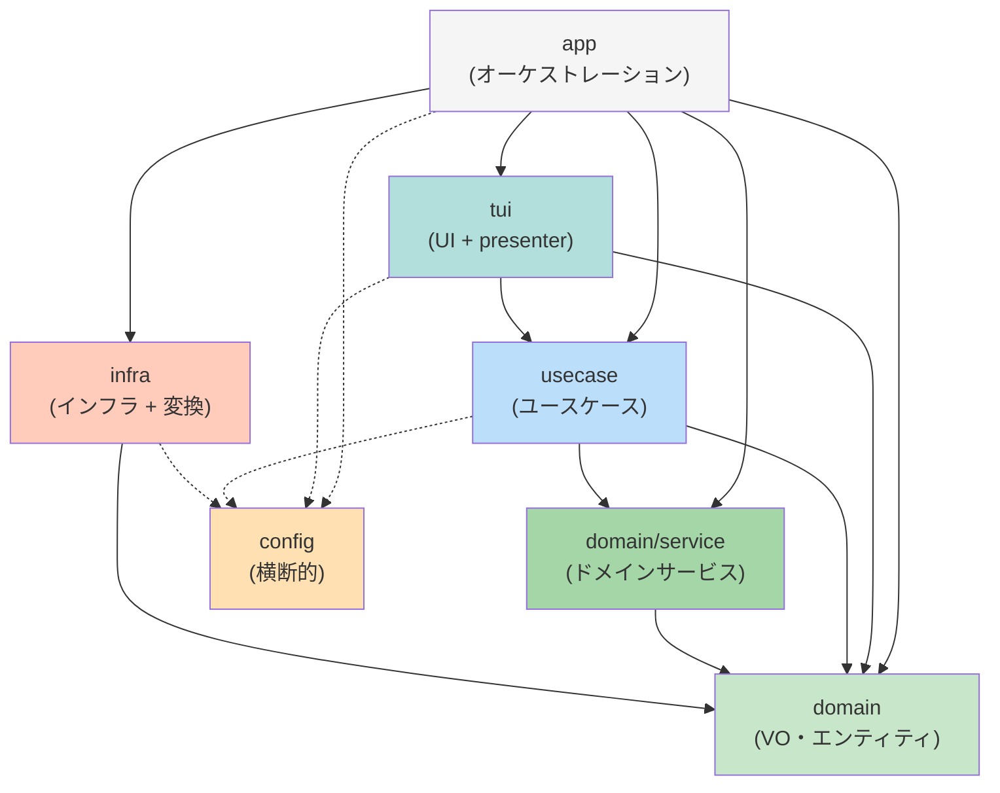

# 要件ドキュメント

## はじめに

本プロジェクトでは、`internal/` 配下のパッケージ構成がフラットになっており、19個のパッケージが同一階層に並んでいる状態である。この構成では責務の関連性が把握しづらく、可読性・保守性に課題がある。

本仕様では、5層レイヤードアーキテクチャの原則に基づいてパッケージを論理的なグループに再編成し、コードベースの可読性と保守性を向上させることを目的とする。

**5層構造:**
- `domain` - ドメインモデル（VO、エンティティ、ドメインサービス）
  - `domain/` - VO、エンティティ（単一オブジェクトの振る舞い）
  - `domain/service/` - ドメインサービス（複数ドメインオブジェクトの組み合わせロジック）
- `usecase` - ユースケース（ドメインオブジェクト + ドメインサービスの組み合わせ）
- `infra` - インフラストラクチャ（データ変換含む）
- `app` - アプリケーション層（オーケストレーション）
- `tui` - UI層（presenter含む）

**レイヤー間の責務:**
- **VO/エンティティ**: 単一オブジェクトのデータと振る舞い
- **ドメインサービス**: 複数ドメインオブジェクトを組み合わせた純粋なビジネスロジック
- **ユースケース**: ドメインオブジェクト + ドメインサービスを組み合わせたアプリケーション固有の処理フロー

※ adapter層は設けず、infra用の変換はinfra層内で実装し、TUI用の変換はtui層のpresenterファイルで実装する。

### 現状の構造

```
internal/
├── achievement/    # 実績システム（usecase層だがpersistenceに依存）
├── adapter/        # データ変換層（削除予定）
├── agent/          # エージェント操作（usecase層、domain/inventoryに依存）
├── app/            # アプリケーションコア（責務混在）
│   ├── adapters.go           # tui/presenterへ移動予定
│   ├── game_state.go         # usecase層の責務
│   ├── game_state/           # 重複実装（削除対象）
│   ├── helpers.go            # tui/presenterへ移動予定
│   ├── inventory_manager.go  # usecase層の責務
│   ├── message_handlers.go   # app層の責務（維持）
│   ├── root_model.go         # app層の責務（維持）
│   ├── scene.go              # app層の責務（維持）
│   ├── scene_router.go       # app層の責務（維持）
│   ├── screen_factory.go     # app層の責務（維持）
│   ├── screen_map.go         # app層の責務（維持）
│   ├── settings.go           # usecase層の責務
│   ├── statistics_manager.go # usecase層の責務
│   ├── styles.go             # tui層の責務
│   └── terminal.go           # infra層の責務
├── balance/        # バランス計算（シーン定義も混在）
├── battle/         # バトルロジック（usecase層、domain/typing/configに依存）
├── config/         # 設定定数（横断的関心事）
├── domain/         # ドメインモデル（外部依存なし、ドメインサービス分離予定）
│   ├── *.go              # VO、エンティティ（単一オブジェクトの振る舞い）
│   └── service/          # 新設：ドメインサービス（複数オブジェクトの組み合わせ）
├── embedded/       # 埋め込みデータ（infra層）
├── enemy/          # 敵操作（usecase層だがloaderに依存）
├── errorhandler/   # エラーハンドリング（infra層）
├── integration_test/ # 統合テスト
├── inventory/      # インベントリ管理（usecase層、domainのみに依存）
├── loader/         # データローダー（infra層、domainに依存）
├── persistence/    # 永続化（infra層）
├── reward/         # 報酬システム（usecase層だがloaderに依存）
├── startup/        # 起動処理（infra層）
├── tui/            # TUI画面（既に整理済み）
│   ├── ascii/
│   ├── components/
│   ├── screens/
│   └── styles/
└── typing/         # タイピング評価（usecase層、外部依存なし）
```

### 現状の依存関係分析

| パッケージ | 推定レイヤー | 依存先 | 問題点 |
|-----------|-------------|--------|--------|
| domain | domain | なし | ⚠️ ドメインサービスの分離が必要 |
| config | 横断的関心事 | なし | ✅ 適切 |
| typing | usecase | なし | ✅ 適切 |
| inventory | usecase | domain | ✅ 適切 |
| battle | usecase | domain, typing, config | ✅ 適切 |
| agent | usecase | domain, inventory | ✅ 適切 |
| balance | usecase | なし | ⚠️ シーン定義が混在 |
| achievement | usecase | **persistence** | ⚠️ infraへの逆依存 |
| reward | usecase | domain, inventory, **loader** | ⚠️ infraへの逆依存 |
| enemy | usecase | domain, config, **loader** | ⚠️ infraへの逆依存 |
| adapter | adapter（削除予定） | domain, persistence, battle, reward | ⚠️ tui/presenterとinfraへ分散 |
| persistence | infra | なし | ✅ 適切 |
| loader | infra | domain | ✅ 適切 |
| embedded | infra | なし | ✅ 適切 |
| errorhandler | infra | なし | ✅ 適切 |
| startup | infra | domain, loader, persistence | ✅ 適切 |
| tui | tui | domain | ✅ 適切（presenterを追加予定） |
| app | app | 多数（混在） | ⚠️ 責務混在 |

### 目標のレイヤー依存関係図

```mermaid
flowchart TB
    subgraph "横断的関心事"
        config["config<br/>設定定数"]
    end

    subgraph "app層"
        app["app<br/>オーケストレーション"]
    end

    subgraph "tui層"
        tui_screens["tui/screens"]
        tui_components["tui/components"]
        tui_styles["tui/styles"]
        tui_presenter["tui/presenter<br/>（新規）"]
    end

    subgraph "usecase層"
        battle["battle"]
        typing["typing"]
        agent["agent"]
        enemy["enemy"]
        inventory["inventory"]
        reward["reward"]
        achievement["achievement"]
        balance["balance"]
        game_state["game_state"]
        settings["settings"]
        statistics["statistics"]
    end

    subgraph "infra層"
        persistence["persistence"]
        loader["loader"]
        embedded["embedded"]
        errorhandler["errorhandler"]
        startup["startup"]
        terminal["terminal"]
    end

    subgraph "domain層"
        domain["domain<br/>VO・エンティティ"]
        domain_service["domain/service<br/>ドメインサービス"]
    end

    %% app層からの依存（全層に依存可能）
    app --> tui_screens
    app --> tui_presenter
    app --> battle
    app --> game_state
    app --> persistence
    app --> domain
    app -.-> config

    %% tui層からの依存
    tui_screens --> tui_components
    tui_screens --> tui_styles
    tui_presenter --> domain
    tui_presenter --> usecase
    tui_presenter -.-> config

    %% ドメインサービスからの依存（domainのみ）
    domain_service --> domain

    %% usecase層からの依存（domain, domain/service, configのみ）
    battle --> domain
    battle --> domain_service
    battle --> typing
    battle -.-> config
    typing --> domain
    agent --> domain
    agent --> domain_service
    agent --> inventory
    enemy --> domain
    enemy -.-> config
    inventory --> domain
    reward --> domain
    reward --> inventory
    achievement --> domain
    balance --> domain
    game_state --> domain
    game_state --> domain_service
    settings --> domain
    statistics --> domain

    %% infra層からの依存（domainのみ）
    loader --> domain
    startup --> domain
    persistence --> domain
```



### レイヤー依存関係サマリー（5層構造）



### 禁止されている依存関係

以下の依存関係はレイヤードアーキテクチャの原則に違反するため禁止：

| 層 | 禁止されている依存先 |
|----|---------------------|
| domain（VO・エンティティ） | domain/service, usecase, infra, tui, app |
| domain/service | usecase, infra, tui, app |
| usecase | infra, tui, app |
| infra | domain/service, usecase, tui, app |
| tui | infra, app |

### 目標構造（5層アーキテクチャ）

```
internal/
├── domain/           # ドメインモデル
│   ├── *.go          # VO、エンティティ（単一オブジェクトの振る舞い）
│   └── service/      # 新設：ドメインサービス
│       ├── stats_service.go    # CalculateStats（CoreType×Level→Stats）
│       ├── hp_service.go       # CalculateMaxHP（[]Agent→int）
│       └── effect_service.go   # Calculate（EffectTable×Stats→FinalStats）
├── usecase/          # ユースケース層（ドメイン + ドメインサービスの組み合わせ）
│   ├── achievement/
│   ├── agent/
│   ├── balance/      # シーン定義を除外
│   ├── battle/
│   ├── enemy/
│   ├── game_state/   # appから移動
│   ├── inventory/
│   ├── reward/
│   ├── settings/     # appから移動
│   ├── statistics/   # appから移動
│   └── typing/
├── infra/            # インフラストラクチャ層（データ変換含む）
│   ├── embedded/
│   ├── errorhandler/
│   ├── loader/       # ドメイン型への変換を含む
│   ├── persistence/  # セーブ/ロード変換を含む
│   ├── startup/
│   └── terminal/     # appから移動
├── app/              # アプリケーション層（責務限定）
│   ├── message_handlers.go
│   ├── root_model.go
│   ├── scene.go
│   ├── scene_router.go
│   ├── screen_factory.go
│   └── screen_map.go
├── tui/              # UI層（presenterを追加）
│   ├── ascii/
│   ├── components/
│   ├── screens/
│   ├── styles/       # app/styles.goを統合
│   └── presenter/    # 新規：UI用データ変換
│       ├── stats_presenter.go       # 統計データ変換
│       ├── settings_presenter.go    # 設定データ変換
│       ├── encyclopedia_presenter.go # 図鑑データ変換
│       └── inventory_presenter.go   # インベントリデータ変換
├── config/           # 横断的関心事（維持）
└── integration_test/ # 統合テスト（維持）
```

**注記:**
- `adapter/`パッケージは削除し、機能を分散配置
- infra用変換 → 各infraパッケージ内で実装（loader, persistence）
- TUI用変換 → `tui/presenter/`で実装
- `domain/service/`は複数ドメインオブジェクトを組み合わせる純粋なビジネスロジックを配置

## 要件一覧

### 要件1: レイヤー分類の定義（5層構造）

**目的:** 開発者として、パッケージの責務に応じたレイヤー分類を定義したい。これにより、コードベース全体の構造が一目で把握できるようになる。

#### 受け入れ基準

1. 内部アーキテクチャは以下の5レイヤーカテゴリを定義すること: `domain`（ドメインモデル）、`usecase`（ユースケース）、`infra`（インフラストラクチャ）、`app`（アプリケーション層）、`tui`（UI層）
2. `domain`層は以下の2つのサブカテゴリを持つこと:
   - `domain/` - VO、エンティティ（単一オブジェクトのデータと振る舞い）
   - `domain/service/` - ドメインサービス（複数ドメインオブジェクトの組み合わせロジック）
3. 各パッケージは必ず1つのレイヤーカテゴリに属すること
4. レイヤー間の依存ルールをsteeringファイルに文書化すること
5. レイヤー間の依存方向は以下とすること:
   - `domain`（VO・エンティティ） ← 他のどの層にも依存しない
   - `domain/service` ← `domain`のみに依存
   - `usecase` ← `domain`、`domain/service`、`config`に依存（infraへの依存は禁止）
   - `infra` ← `domain`、`config`のみに依存（domain/serviceへの依存は禁止）
   - `tui` ← `domain`、`usecase`、`config`に依存（presenterはusecase層のデータを変換）
   - `app` ← 全ての層に依存可能（オーケストレーション層）

### 要件2: ドメイン層の整理

**目的:** 開発者として、ドメイン層をVO・エンティティとドメインサービスに分離したい。これにより、責務が明確になり保守性が向上する。

#### 受け入れ基準

1. ドメイン層（VO・エンティティ）は外部依存のない純粋なドメインモデルのみを含むこと
2. ドメイン層はusecase、infra、app、tuiレイヤーからパッケージをインポートしないこと
3. 新しいVO・エンティティを追加する場合は、`internal/domain/`ディレクトリ配下に配置すること
4. `domain/service/`サブディレクトリを新設し、複数ドメインオブジェクトの組み合わせロジックを配置すること
5. 以下の関数をドメインサービスとして`domain/service/`に移動すること:
   - `CalculateStats(level, coreType)` → `domain/service/stats_service.go`
   - `CalculateMaxHP(agents)` → `domain/service/hp_service.go`
   - `EffectTable.Calculate(baseStats)` → `domain/service/effect_service.go`
   - `EffectTable.UpdateDurations(delta)` → `domain/service/effect_service.go`

### 要件3: ユースケース層の整理

**目的:** 開発者として、アプリケーション固有の処理フローをユースケース層としてグループ化したい。これにより、ドメインオブジェクトとドメインサービスを組み合わせた処理が明確に分離される。

#### 受け入れ基準

1. ユースケース層は以下のパッケージをグループ化すること: `battle`、`typing`、`agent`、`enemy`、`inventory`、`reward`、`achievement`、`balance`
2. ユースケース層は`domain`、`domain/service`、および`config`のみに依存すること
3. ユースケース層はinfra、app、tuiレイヤーからパッケージをインポートしないこと
4. 新しいユースケースパッケージを追加する場合は、`internal/usecase/`ディレクトリ配下に配置すること
5. ユースケースはドメインオブジェクト + ドメインサービスを組み合わせたアプリケーション固有の処理フローを実装すること

### 要件4: app層からのビジネスロジック分離

**目的:** 開発者として、app層に混在しているビジネスロジックをusecase層に移動したい。これにより、app層の責務が明確になり、テスタビリティが向上する。

#### 受け入れ基準

1. `app/game_state.go`の`GameState`構造体とそのメソッドを`usecase/game_state/`に移動すること
2. `app/inventory_manager.go`を`usecase/game_state/`に統合すること
3. `app/statistics_manager.go`を`usecase/statistics/`に移動すること
4. `app/settings.go`を`usecase/settings/`に移動すること
5. `app/game_state/`サブディレクトリ（重複実装）を削除すること
6. 移動後、app層からusecase層への依存は最小限にすること

### 要件5: tui/presenter層の新設

**目的:** 開発者として、app層に混在しているUI向けデータ変換ロジックをtui/presenter層に移動したい。これにより、UI用の変換ロジックが一元管理される。

#### 受け入れ基準

1. `tui/presenter/`ディレクトリを新設すること
2. `app/adapters.go`の`inventoryProviderAdapter`を`tui/presenter/inventory_presenter.go`に移動すること
3. `app/helpers.go`のデータ変換関数を`tui/presenter/`の適切なファイルに移動すること
   - `CreateStatsDataFromGameState` → `tui/presenter/stats_presenter.go`
   - `CreateSettingsDataFromGameState` → `tui/presenter/settings_presenter.go`
   - `CreateEncyclopediaDataFromGameState` → `tui/presenter/encyclopedia_presenter.go`
4. presenterはusecase層のデータをtui/screens用のViewModelに変換すること

### 要件6: app層からのインフラ分離

**目的:** 開発者として、app層に混在しているインフラ関心事をinfra層に移動したい。これにより、技術的関心事が分離される。

#### 受け入れ基準

1. `app/terminal.go`を`infra/terminal/`に移動すること
2. `app/game_state/defaults.go`のデフォルトデータ定義を`infra/defaults/`または`embedded/`に移動すること
3. `app/game_state/persistence.go`のセーブ/ロード変換ロジックを`infra/persistence/`に統合すること

### 要件7: app層からのUI関心事分離

**目的:** 開発者として、app層に混在しているUI関心事をtui層に移動したい。これにより、UIスタイルが一元管理される。

#### 受け入れ基準

1. `app/styles.go`の内容を既存の`tui/styles/styles.go`に統合すること
2. カラーパレット（`ColorPrimary`等）とスタイル定義（`Styles`構造体）をtui層で管理すること
3. 重複するスタイル定義がある場合は統合して一元化すること

### 要件8: app層の責務限定

**目的:** 開発者として、app層の責務をBubbleteaのModel実装とシーン管理に限定したい。これにより、app層の保守性が向上する。

#### 受け入れ基準

1. app層は以下のファイルのみを含むこと:
   - `root_model.go`: BubbleteaのModel実装
   - `scene.go`: シーン列挙型とChangeSceneMsg
   - `scene_router.go`: シーン名からSceneへの変換
   - `screen_factory.go`: 画面インスタンスの生成
   - `screen_map.go`: シーンと画面のマッピング
   - `message_handlers.go`: Bubbleteaメッセージハンドリング
2. app層は他のすべての層をオーケストレーションすること
3. app層はビジネスロジック、データ変換、インフラ関心事を含まないこと

### 要件9: インフラストラクチャ層の整理

**目的:** 開発者として、外部リソースとのやり取りを担うパッケージをインフラ層としてグループ化したい。これにより、技術的関心事が分離される。

#### 受け入れ基準

1. インフラストラクチャ層は以下のパッケージをグループ化すること: `persistence`、`loader`、`embedded`、`errorhandler`、`startup`、`terminal`（新規追加）
2. インフラストラクチャ層は`internal/infra/`ディレクトリ配下に配置すること
3. インフラストラクチャ層は`domain`のみに依存すること
4. 外部リソースアクセスロジックを追加する場合は、適切なinfraサブディレクトリ配下に配置すること

### 要件10: 既存adapter層の廃止

**目的:** 開発者として、既存のadapter層を廃止し、変換ロジックを適切な層に分散配置したい。これにより、レイヤー構造がシンプルになる。

#### 受け入れ基準

1. 既存の`internal/adapter/`パッケージを削除すること
2. UI向け変換ロジックは`tui/presenter/`に移動すること
3. infra向け変換ロジックは各infraパッケージ（loader, persistence）に統合すること
4. 既存のadapter/reward_adapter.goの機能を適切な場所に再配置すること

### 要件11: TUI層の拡張

**目的:** 開発者として、UI関連のコードをtui層に集約し、presenterパターンを導入したい。これにより、UIの関心事が分離される。

#### 受け入れ基準

1. tui層は`internal/tui/`に配置すること
2. tui層はすべての画面実装、コンポーネント、スタイル、ASCIIアート、およびpresenterを含むこと
3. tui層はデータ変換のために`tui/presenter/`を使用すること（外部adapter層への依存を削除）
4. 既存の`tui/styles/`にapp層から移動したスタイル定義を統合すること
5. presenterはusecase層とdomain層に依存し、UI向けViewModelを生成すること

### 要件12: 設定定数の配置

**目的:** 開発者として、設定定数を適切な場所に配置したい。これにより、マジックナンバーが一元管理される。

#### 受け入れ基準

1. configパッケージは横断的関心事として`internal/config/`に維持すること
2. configパッケージはどのレイヤーからもインポート可能であること
3. configパッケージは他のinternalパッケージに依存しないこと

### 要件13: 統合テストの配置

**目的:** 開発者として、統合テストを適切な場所に配置したい。これにより、テストコードが本番コードと分離される。

#### 受け入れ基準

1. 統合テストパッケージは`internal/integration_test/`に維持すること
2. 統合テストパッケージはテスト目的ですべてのレイヤーからインポート可能であること

### 要件14: 重複コードの解消

**目的:** 開発者として、重複しているコードを解消したい。これにより、保守性が向上する。

#### 受け入れ基準

1. `app/game_state.go`と`app/game_state/state.go`の重複を解消すること
2. `InventoryManager`の重複定義を解消すること
3. `StatisticsManager`の重複定義を解消すること
4. `Settings`の重複定義を解消すること
5. デフォルトデータ生成関数（`getDefaultCoreTypeData`等）の重複を解消すること
6. 統合後は単一のソースを維持すること

### 要件15: usecase層からinfra層への逆依存解消

**目的:** 開発者として、usecase層からinfra層への不適切な依存を解消したい。これにより、レイヤードアーキテクチャの原則が守られる。

#### 受け入れ基準

1. `achievement`パッケージから`persistence`パッケージへの直接依存を解消すること
   - `ToSaveData()`と`LoadFromSaveData()`メソッドを`infra/persistence/`に移動すること
   - `achievement`パッケージはドメイン型のみを使用し、永続化変換はinfra層で実装すること
2. `reward`パッケージから`loader`パッケージへの直接依存を解消すること
   - `loader.CoreTypeData`と`loader.ModuleDefinitionData`の使用をドメイン型に置き換えること
   - データ変換が必要な場合は`infra/loader/`内で実装すること
3. `enemy`パッケージから`loader`パッケージへの直接依存を解消すること
   - `loader.EnemyTypeData`の使用をドメイン型に置き換えること
   - データ変換が必要な場合は`infra/loader/`内で実装すること

### 要件16: balance層の責務整理

**目的:** 開発者として、balance層に混在している責務を分離したい。これにより、各パッケージの責務が明確になる。

#### 受け入れ基準

1. `balance`パッケージからシーン定義（`SceneHome`等）を`app/scene.go`に移動すること
2. `balance`パッケージからセーブイベント定義（`SaveEventBattleEnd`等）を適切な場所に移動すること
3. `balance`パッケージはゲームバランスパラメータ（HP係数、ドロップ率等）のみを含むこと
4. シーン遷移ルール（`allowedTransitions`）は`app`層で管理すること

### 要件17: 移行の安全性

**目的:** 開発者として、既存の機能を壊さずにリファクタリングしたい。これにより、リグレッションが発生しない。

#### 受け入れ基準

1. パッケージの場所を変更する際は、すべてのインポートパスを適切に更新すること
2. リファクタリング完了時に、すべての既存テストがパスすること
3. リファクタリングは各ステップで検証しながらインクリメンタルに実施すること
4. 各移動ステップ後にビルドとテストを実行すること

### 要件18: ドキュメントの更新

**目的:** 開発者として、steeringドキュメントを更新したい。これにより、新しい構造がプロジェクトメモリに反映される。

#### 受け入れ基準

1. リファクタリング完了時に、`structure.md` steeringドキュメントが新しいディレクトリ構造を反映すること
2. ドキュメントにレイヤー依存関係図を含めること
3. ドキュメントに各レイヤーの目的を記述すること
4. 各パッケージの責務と配置理由を記述すること
