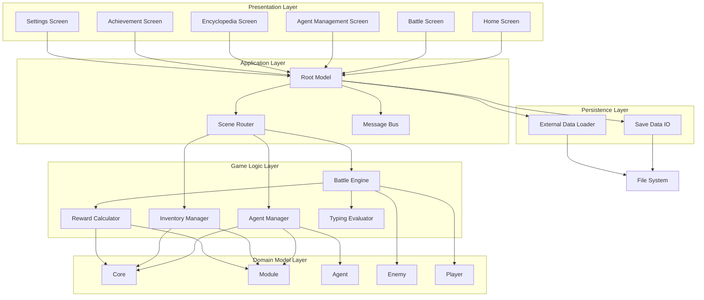
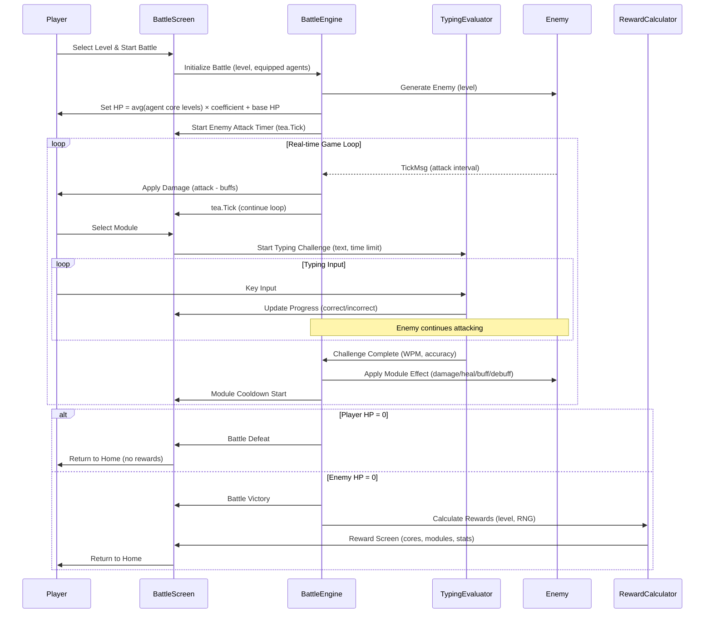
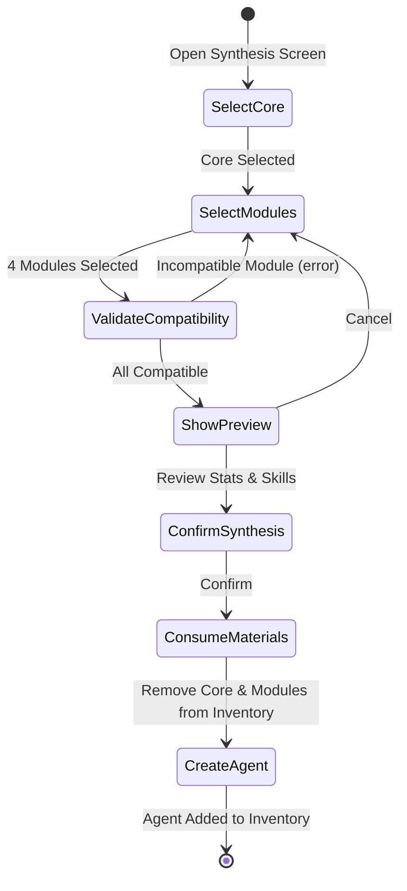

# 技術設計書

## Overview

本機能は、ターミナル上で動作するシングルプレイヤー向けリアルタイムタイピングバトルゲームを提供する。プレイヤーはタイピングスキルを駆使して最大3体のエージェント（各エージェントは1コア+4モジュールで構成）を同時操作し、完全リアルタイムで敵と戦闘する。敵を倒すことでコア（レベル固定）とモジュール（レベルなし）を獲得し、新しいエージェントを合成して育成する。Go言語とBubbletea TUIフレームワークを用いて、Elm Architectureパターンに基づく堅牢なイベント駆動型アーキテクチャを実現する。

**Users**: ターミナル環境を好むタイピングゲーム愛好者、プログラマー、コマンドラインツールユーザーが対象。タイピングスキルを楽しみながら向上させ、エージェントの合成と戦略的な編成を通じて長期的なプレイ体験を得る。

**Impact**: 新規プロジェクトとして、完全なゲームシステムをゼロから構築する。オフラインで動作し、ネットワーク接続を必要としない。ローカルファイルシステムにセーブデータと外部定義データ（コア/モジュール/敵）を配置する。

### Goals

- Elm Architectureパターンに基づく完全リアルタイムTUIゲームの実装
- プレイヤーの入力状態に関係なく継続する敵の自動攻撃システム
- 最大3体のエージェントを同時操作する柔軟なバトルシステム
- コア（レベル固定）とモジュール（レベルなし）の組み合わせによる拡張可能な育成システム
- タイピングパフォーマンス（WPM、正確性）が直接戦闘に影響するスキルベースのゲームプレイ
- 原子的書き込みパターンとバックアップによるセーブデータの整合性保証
- 外部JSONファイルによるコア/モジュール/敵定義の拡張可能性

### Non-Goals

- マルチプレイヤー機能、ネットワーク対戦
- グラフィカルUI（GUI）版の提供
- クラウドセーブ、オンラインランキング
- ゲーム内購入、課金システム
- 音声・効果音の再生
- モバイル版の提供
- 初期リリース時の高度な難易度調整システム（レベルベースのスケーリングで対応）

## Architecture

### Architecture Pattern & Boundary Map

**Selected Architecture**: **Model-View-Update (Elm Architecture) + Component-Based Design**

**Rationale**:
- Bubbletea標準パターンとの完全な親和性
- リアルタイムゲームループとイベント駆動型の自然な統合
- 単一方向データフロー（Model → Update → View）による予測可能な状態管理
- メッセージパッシングによる疎結合なコンポーネント間通信

**Domain Boundaries**:
- **Presentation Layer**: TUIコンポーネント（画面、ウィジェット）、ユーザー入力の受付、描画ロジック
- **Application Layer**: 画面遷移、ゲームフロー制御、メッセージルーティング
- **Game Logic Layer**: バトルシステム、エージェント管理、報酬計算、タイピング評価
- **Domain Model Layer**: コア、モジュール、エージェント、敵のドメインモデルとビジネスルール
- **Persistence Layer**: セーブデータI/O、外部データファイル読み込み



**Architecture Integration**:
- **Selected pattern**: Elm Architecture - 単一方向データフロー、イベント駆動、純粋関数的更新
- **Domain/feature boundaries**: 各画面を独立したコンポーネントとし、Root Modelが統括。Game Logic Layerは再利用可能なサービスとして分離。
- **Existing patterns preserved**: 新規プロジェクトのため既存パターンなし
- **New components rationale**:
  - Root Model: 全体状態管理とシーンルーティング
  - Scene-specific components: 各画面の責務を明確化
  - Game Logic Layer: ビジネスロジックをプレゼンテーションから分離
- **Steering compliance**: Go + Bubbletea + Lipgloss + Bubbles、JSON永続化、イベント駆動型アーキテクチャ

### Technology Stack

| Layer | Choice / Version | Role in Feature | Notes |
|-------|------------------|-----------------|-------|
| Language | Go 1.21+ | メイン実装言語 | シンプルな構文、優れた並行処理、クロスプラットフォーム対応 |
| TUI Framework | Bubbletea (latest) | イベント駆動型TUI基盤 | Elm Architecture、tea.Cmd/Msg、リアルタイム更新に最適 |
| Styling | Lipgloss (latest) | ターミナルスタイリング | 自動色プロファイル検出、ANSI対応、日本語幅計算 |
| Components | Bubbles (latest) | 再利用可能TUIウィジェット | Progress Bar（クールダウン表示）、カスタムコンポーネント参考 |
| Data Persistence | Go encoding/json | セーブデータ、外部定義ファイル | 可読性、デバッグ性、Go標準ライブラリ |
| File I/O | Go os, io/ioutil | ファイル読み書き | 原子的書き込み（一時ファイル→リネーム） |
| Testing | Go testing | ユニットテスト | 標準テストフレームワーク、モックを用いた状態遷移テスト |

**Key Technology Decisions**:
- **Bubbletea**: tea.Tickを用いた継続的ゲームループで敵の自動攻撃を実現。生goroutine使用は避け、tea.Cmdを通じた並行処理を採用（フレームワーク推奨パターン）。
- **Lipgloss**: AdaptiveColorで明暗背景対応、自動色ダウンサンプリングで環境非依存な視覚表現。
- **JSON**: セーブデータと外部定義ファイルの一貫したフォーマット、可読性とデバッグ性を重視。

## System Flows

### Battle Flow

プレイヤーがバトル選択からバトル終了までの完全リアルタイムフロー。敵の自動攻撃はプレイヤーの入力状態に関係なく継続する。



**Key Flow Decisions**:
- 敵攻撃タイマーはバトル開始時に即座に開始し、tea.Tickループで継続
- タイピング中も敵攻撃は停止せず、完全リアルタイムを保証
- モジュール効果計算は TypingEvaluator の結果（WPM、正確性）を反映
- バトル終了時のみ報酬画面へ遷移、敗北時は報酬なし

### Agent Synthesis Flow

プレイヤーがコア1個とモジュール4個を選択してエージェントを合成するフロー。



**Key Flow Decisions**:
- コア選択後、そのコア特性の許可タグに一致するモジュールのみ選択可能にフィルタリング
- 4個すべてのモジュール選択完了後にバリデーション実行
- プレビュー画面で最終的なエージェントステータスとスキルを確認
- 合成確定後、素材（コア、モジュール）を消費し新規エージェント作成

### Save/Load Data Flow

セーブデータの原子的書き込みと破損時の復元フロー。

```mermaid
graph TB
    Start[Game Start] --> CheckSave{Save File Exists?}
    CheckSave -->|Yes| LoadSave[Load Save Data]
    CheckSave -->|No| NewGame[Initialize New Game]

    LoadSave --> Validate{Validate Data}
    Validate -->|Valid| GameLoop[Game Loop]
    Validate -->|Corrupted| TryBackup{Backup Exists?}
    TryBackup -->|Yes| LoadBackup[Load from Backup]
    TryBackup -->|No| ErrorMsg[Error Message]
    LoadBackup --> GameLoop
    ErrorMsg --> NewGame

    NewGame --> GameLoop

    GameLoop --> SaveEvent{Save Trigger}
    SaveEvent -->|Battle End / Manual| StartSave[Start Save Process]
    StartSave --> WriteTmp[Write to Temp File]
    WriteTmp --> ValidateTmp{Validate Temp}
    ValidateTmp -->|Valid| Rename[Rename to Save File]
    ValidateTmp -->|Invalid| RetryMsg[Retry or Error]
    Rename --> RotateBackup[Rotate Backups (.bak1, .bak2, .bak3)]
    RotateBackup --> GameLoop
    RetryMsg --> GameLoop
```

**Key Flow Decisions**:
- 起動時にセーブファイル存在確認、存在すればロード、なければ新規ゲーム
- ロード時にバージョンチェックとデータ検証、破損時はバックアップから復元試行
- セーブ処理は一時ファイルへ書き込み → 検証 → リネーム（原子的操作）
- 直近3世代のバックアップをローテーション管理

## Requirements Traceability

| Requirement | Summary | Components | Interfaces | Flows |
|-------------|---------|------------|------------|-------|
| 1.1, 1.2, 1.3, 1.4, 1.5, 1.6, 1.7 | ゲーム起動とTUI環境 | RootModel, MainEntry | tea.Model Init/Update/View | - |
| 2.1, 2.2, 2.3, 2.4, 2.5, 2.6, 2.7, 2.8, 2.9, 2.10 | ホーム画面システム | HomeScreen, SceneRouter | HomeScreenModel | - |
| 3.1, 3.2, 3.3, 3.4, 3.5, 3.6, 3.7, 3.8, 3.9, 3.10 | バトル選択システム | BattleSelectionScreen, BattleEngine | BattleInitMsg | Battle Flow |
| 4.1, 4.2, 4.3, 4.4, 4.5, 4.6, 4.7 | プレイヤー管理 | PlayerModel, BattleEngine | PlayerState | Battle Flow |
| 5.1〜5.19 | コア管理システム | CoreManager, InventoryManager | CoreService, CoreModel | - |
| 6.1〜6.18 | モジュール管理システム | ModuleManager, InventoryManager | ModuleService, ModuleModel | - |
| 7.1〜7.13 | エージェント合成システム | AgentSynthesisScreen, AgentManager | AgentSynthesisService | Agent Synthesis Flow |
| 8.1〜8.10 | エージェント装備・管理システム | AgentEquipmentScreen, AgentManager | AgentEquipmentService | - |
| 9.1〜9.17 | リアルタイムバトルシステム | BattleScreen, BattleEngine | BattleService, TickMsg | Battle Flow |
| 10.1〜10.10 | モジュール効果計算システム | EffectCalculator, TypingEvaluator | EffectCalculationService | Battle Flow |
| 11.1〜11.30 | 敵攻撃システム | EnemyAttackEngine, EnemyModel | EnemyAttackService, TickMsg | Battle Flow |
| 12.1〜12.18 | ドロップ・報酬システム | RewardCalculator, InventoryManager | RewardService | Battle Flow |
| 13.1〜13.8 | 敵生成システム | EnemyGenerator, EnemyModel | EnemyGenerationService | Battle Flow |
| 14.1〜14.11 | 図鑑システム | EncyclopediaScreen | EncyclopediaService | - |
| 15.1〜15.11 | 実績システム | AchievementManager, StatisticsManager | AchievementService | - |
| 16.1〜16.13 | タイピングチャレンジ生成 | TypingChallengeGenerator | TypingChallengeService | Battle Flow |
| 17.1〜17.8 | セーブとロード機能 | SaveDataIO, SaveLoadManager | SaveDataService, SaveData | Save/Load Data Flow |
| 18.1〜18.10 | ビジュアル表現とUI/UX | All UI Components, Lipgloss Styles | ViewRenderer | - |
| 19.1〜19.6 | エラー処理と安定性 | ErrorHandler, SaveDataIO | ErrorHandlingService | Save/Load Data Flow |
| 20.1〜20.8 | ゲームバランスと難易度調整 | BattleEngine, EnemyGenerator, RewardCalculator | BalancingConfig | - |
| 21.1〜21.7 | 拡張性と設定 | SettingsManager, ExternalDataLoader | SettingsService, ExternalDataService | - |

## Components and Interfaces

### Component Summary

| Component | Domain/Layer | Intent | Req Coverage | Key Dependencies (P0/P1) | Contracts |
|-----------|--------------|--------|--------------|--------------------------|-----------|
| RootModel | Application | 全体状態管理、シーンルーティング、メッセージ統括 | 1, 2 | GameState (P0), SceneRouter (P0), SaveDataIO (P0) | State |
| HomeScreen | Presentation | ホーム画面UI、メニュー選択 | 2 | RootModel (P0) | State |
| BattleScreen | Presentation | バトル画面UI、リアルタイム表示 | 9, 11, 16, 18 | BattleEngine (P0), TypingEvaluator (P0) | State, Event |
| BattleEngine | Game Logic | バトルロジック、敵攻撃管理、効果適用 | 9, 10, 11 | EnemyModel (P0), PlayerModel (P0), TypingEvaluator (P0), EffectCalculator (P0) | Service, Event |
| AgentManager | Game Logic | エージェント合成、装備管理、インベントリ | 7, 8 | CoreModel (P0), ModuleModel (P0), AgentModel (P0) | Service |
| InventoryManager | Game Logic | コア・モジュールインベントリ管理 | 5, 6, 12 | CoreModel (P0), ModuleModel (P0) | Service |
| SaveDataIO | Persistence | セーブデータ読み書き、原子的操作 | 17, 19 | FileSystem (P0) | Service |
| ExternalDataLoader | Persistence | 外部定義ファイル読み込み（コア/モジュール/敵） | 21 | FileSystem (P0) | Service |
| TypingEvaluator | Game Logic | タイピングパフォーマンス計測（WPM、正確性） | 10, 16 | - | Service |
| RewardCalculator | Game Logic | バトル報酬計算、ドロップ判定 | 12 | EnemyModel (P0), ExternalData (P1) | Service |
| EnemyGenerator | Game Logic | 敵生成、ステータス計算 | 13 | EnemyModel (P0), ExternalData (P0) | Service |
| EffectCalculator | Game Logic | モジュール効果計算、ダメージ/回復/バフ/デバフ | 10 | AgentModel (P0), ModuleModel (P0) | Service |

### Application Layer

#### RootModel

| Field | Detail |
|-------|--------|
| Intent | 全体ゲーム状態の統括、シーン間遷移の管理、メッセージルーティング |
| Requirements | 1.1, 1.2, 1.5, 1.7, 2.1 |

**Responsibilities & Constraints**
- ゲーム全体の状態（GameState）を保持し、各シーンコンポーネントへ委譲
- 現在のシーン（HomeScreen, BattleScreen, AgentManagementScreen等）を管理
- メッセージを現在のシーンへルーティング、シーン遷移メッセージを処理
- 起動時のセーブデータロード、終了時の状態保存

**Dependencies**
- Inbound: MainEntry — プログラムエントリーポイントからの初期化 (P0)
- Outbound: GameState — 共有ゲーム状態 (P0)
- Outbound: SceneRouter — シーン遷移管理 (P0)
- Outbound: SaveDataIO — セーブデータ永続化 (P0)
- Outbound: ExternalDataLoader — 外部定義ファイルロード (P0)

**Contracts**: State [x]

##### State Management

**State model**:
```go
type RootModel struct {
    currentScene  Scene
    gameState     *GameState
    homeScreen    *HomeScreen
    battleScreen  *BattleScreen
    agentScreen   *AgentManagementScreen
    encyclopediaScreen *EncyclopediaScreen
    achievementScreen  *AchievementScreen
    settingsScreen     *SettingsScreen
    errorMessage  string
}

type GameState struct {
    player         *PlayerModel
    inventory      *InventoryManager
    agentManager   *AgentManager
    statistics     *StatisticsManager
    achievements   *AchievementManager
    externalData   *ExternalData
    settings       *Settings
}
```

**Persistence & consistency**: GameState全体をセーブデータとしてJSON形式で永続化。バトル終了時、手動セーブ時に SaveDataIO へ委譲。

**Concurrency strategy**: Bubbleteaのイベントループは単一スレッド、状態更新はUpdate関数内で同期的に実行。

**Implementation Notes**
- **Integration**: Init()でセーブデータロードと外部データロード実行、Update()でシーン別分岐とChangeSceneMsgを処理
- **Validation**: ターミナルサイズ検証（最小120x40）、セーブデータバージョンチェック
- **Risks**: シーン数増加によるRootModelの肥大化（各シーンを独立コンポーネント化で緩和）

### Presentation Layer

#### BattleScreen

| Field | Detail |
|-------|--------|
| Intent | バトル画面の描画、プレイヤー入力の受付、リアルタイム状態表示 |
| Requirements | 9.2, 9.3, 9.4, 9.5, 9.13, 9.14, 9.15, 18.1, 18.2, 18.4, 18.5, 18.6, 18.8, 18.9, 18.10 |

**Responsibilities & Constraints**
- 敵の名前、HP、レベル、攻撃予告タイマーの表示
- プレイヤーのHP、バフ・デバフの表示
- 装備中エージェントのモジュール一覧（各エージェントごとにグループ化）とクールダウン状態の表示
- タイピングチャレンジテキストの表示と入力進捗の視覚的フィードバック
- ダメージ/回復のアニメーション効果、HPバーの色分け

**Dependencies**
- Inbound: RootModel — シーン遷移とメッセージルーティング (P0)
- Outbound: BattleEngine — バトルロジック実行 (P0)
- Outbound: TypingEvaluator — タイピング評価 (P0)
- Outbound: Lipgloss — スタイリング (P0)
- Outbound: Bubbles Progress Bar — クールダウン表示 (P1)

**Contracts**: State [x] / Event [x]

##### State Management

**State model**:
```go
type BattleScreen struct {
    battleState   *BattleState
    selectedModule *ModuleSlot
    typingChallenge *TypingChallenge
    styles        *BattleScreenStyles
}

type BattleState struct {
    enemy          *EnemyModel
    player         *PlayerModel
    equippedAgents []*AgentModel
    moduleSlots    []*ModuleSlot // max 12 (3 agents × 4 modules)
    activeBuffs    []Buff
    activeDebuffs  []Debuff
    battleStats    *BattleStatistics
}

type ModuleSlot struct {
    module       *ModuleModel
    cooldownLeft time.Duration
    isActive     bool
}
```

**Persistence & consistency**: BattleStateはバトル開始時に初期化、終了時に破棄。統計情報のみGameStateへ反映。

**Concurrency strategy**: tea.TickMsgで敵攻撃タイマーを処理、tea.KeyMsgでタイピング入力を処理。

##### Event Contract

**Published events**:
- `ModuleSelectedMsg` - プレイヤーがモジュールを選択
- `TypingCompleteMsg` - タイピングチャレンジ完了（WPM、正確性を含む）
- `BattleEndMsg` - バトル終了（勝利/敗北、報酬データ）

**Subscribed events**:
- `EnemyAttackTickMsg` - 敵攻撃タイマーティック
- `ModuleCooldownTickMsg` - モジュールクールダウンティック
- `tea.KeyMsg` - キーボード入力

**Ordering / delivery guarantees**: Bubbleteaメッセージキューによる順序保証、ティックは tea.Tick 継続ループで管理。

**Implementation Notes**
- **Integration**: Update()でEnemyAttackTickMsgを処理し、BattleEngineへ攻撃実行を委譲。TypingCompleteMsgでEffectCalculatorへ効果計算を委譲。
- **Validation**: モジュール選択時にクールダウン中でないか、タイピング中でないかをチェック。
- **Risks**: 複雑な状態管理（敵攻撃、タイピング、クールダウンの並行処理） - イベント駆動型で明確化。

#### AgentManagementScreen

| Field | Detail |
|-------|--------|
| Intent | エージェント管理UI（合成、装備、コア/モジュール一覧、破棄） |
| Requirements | 5, 6, 7, 8 |

**Responsibilities & Constraints**
- コア一覧表示（フィルタリング、ソート）
- モジュール一覧表示（フィルタリング、ソート）
- エージェント合成画面（コア選択、モジュール4個選択、プレビュー）
- エージェント装備画面（3スロット、装備/装備解除）
- アイテム破棄機能

**Dependencies**
- Inbound: RootModel — シーン遷移とメッセージルーティング (P0)
- Outbound: AgentManager — エージェント合成、装備管理 (P0)
- Outbound: InventoryManager — コア/モジュールインベントリ (P0)

**Contracts**: State [x]

##### State Management

**State model**:
```go
type AgentManagementScreen struct {
    mode             AgentMgmtMode // List / Synthesis / Equipment
    coreList         []*CoreModel
    moduleList       []*ModuleModel
    agentList        []*AgentModel
    selectedCore     *CoreModel
    selectedModules  []*ModuleModel // max 4
    equippedAgents   []*AgentModel  // max 3
    filterOptions    FilterOptions
    sortOptions      SortOptions
}
```

**Implementation Notes**
- **Integration**: モード切り替え（一覧/合成/装備）、AgentManagerへの合成・装備リクエスト委譲
- **Validation**: 合成時にコア特性とモジュールタグの互換性チェック、装備時にスロット数上限チェック

### Game Logic Layer

#### BattleEngine

| Field | Detail |
|-------|--------|
| Intent | バトルロジックの中核、敵攻撃管理、効果適用、勝敗判定 |
| Requirements | 9.1, 9.11, 9.12, 9.13, 9.14, 9.15, 9.16, 9.17, 11.1, 11.2, 11.3, 11.4, 11.5 |

**Responsibilities & Constraints**
- バトル初期化（敵生成、プレイヤーHP設定）
- 敵攻撃タイマー管理（tea.Tickループ）
- モジュール効果適用（ダメージ、回復、バフ、デバフ）
- バフ・デバフの時間管理と効果適用
- 勝敗判定（プレイヤーHP=0 or 敵HP=0）
- 敵のフェーズ変化管理（HP50%以下で強化）

**Dependencies**
- Inbound: BattleScreen — バトル開始、モジュール使用リクエスト (P0)
- Outbound: EnemyModel — 敵状態管理 (P0)
- Outbound: PlayerModel — プレイヤー状態管理 (P0)
- Outbound: TypingEvaluator — タイピング評価 (P0)
- Outbound: EffectCalculator — 効果計算 (P0)
- Outbound: EnemyGenerator — 敵生成 (P0)

**Contracts**: Service [x] / Event [x]

##### Service Interface

```go
type BattleEngineService interface {
    InitializeBattle(level int, equippedAgents []*AgentModel) (*BattleState, tea.Cmd)
    ProcessEnemyAttackTick(state *BattleState) (*BattleState, tea.Cmd)
    ProcessModuleUse(state *BattleState, moduleSlot *ModuleSlot, typingResult *TypingResult) (*BattleState, tea.Cmd)
    UpdateBuffsDebuffs(state *BattleState, deltaTime time.Duration) *BattleState
    CheckBattleEnd(state *BattleState) (bool, BattleResult)
}

type BattleResult struct {
    isVictory bool
    rewards   *RewardData
    stats     *BattleStatistics
}
```

**Preconditions**:
- InitializeBattle: level >= 1, equippedAgents.length >= 1 && <= 3
- ProcessModuleUse: moduleSlot.cooldownLeft == 0, typingResult.completed == true

**Postconditions**:
- InitializeBattle: BattleState初期化、敵攻撃タイマー開始（tea.Tick返却）
- ProcessEnemyAttackTick: プレイヤーHP減少、次回ティックコマンド返却
- ProcessModuleUse: 効果適用、モジュールクールダウン設定
- CheckBattleEnd: 勝敗判定結果返却

**Invariants**:
- プレイヤーHP >= 0
- 敵HP >= 0
- バフ・デバフの効果時間 >= 0

##### Event Contract

**Published events**:
- `EnemyAttackTickMsg` - 敵攻撃タイマーティック（継続ループ）
- `BattleEndMsg` - バトル終了（勝利/敗北、報酬）

**Subscribed events**:
- `ModuleUsedMsg` - モジュール使用リクエスト
- `TypingCompleteMsg` - タイピング完了結果

**Ordering / delivery guarantees**: tea.Tickは指定間隔で継続発行、メッセージキューによる順序保証。

**Implementation Notes**
- **Integration**: InitializeBattle()でEnemyGeneratorから敵生成、tea.Tickで敵攻撃ループ開始。ProcessEnemyAttackTick()で次のtea.Tickを返却し継続。
- **Validation**: モジュール使用時にクールダウン状態確認、タイピング結果の正確性50%未満で効果半減。
- **Risks**: 複雑な状態遷移（敵攻撃、モジュール効果、バフ/デバフ管理） - 明確なイベント駆動型で分離。

#### AgentManager

| Field | Detail |
|-------|--------|
| Intent | エージェント合成、装備管理、エージェントインベントリ管理（装備状態の唯一のソース） |
| Requirements | 7.1, 7.2, 7.3, 7.4, 7.5, 7.6, 7.7, 7.8, 7.9, 8.1, 8.2, 8.3, 8.4, 8.5, 8.6, 8.7, 8.8 |

**Responsibilities & Constraints**
- エージェント合成（コア1個 + モジュール4個）
- コア特性とモジュールタグの互換性検証
- エージェント装備・装備解除（最大3スロット）
- 装備変更時のプレイヤーHP再計算
- エージェントインベントリ管理（保有上限チェック）
- **装備状態の一元管理**: AgentManagerが装備中エージェントの唯一の信頼できるソースとして機能する

**Architecture Decision: Single Source of Truth for Equipment**
- 装備状態はAgentManagerのみで管理し、各画面はAgentProviderインターフェース経由で参照
- InventoryManagerはコアとモジュールのみを管理（エージェントは含まない）
- 各画面（HomeScreen、BattleSelectScreen等）はローカルキャッシュを持たず、常に最新の装備状態を取得

**Dependencies**
- Inbound: AgentManagementScreen — 合成・装備リクエスト (P0)
- Inbound: HomeScreen, BattleSelectScreen — 装備状態参照（AgentProvider経由）(P0)
- Outbound: CoreModel — コアドメインモデル (P0)
- Outbound: ModuleModel — モジュールドメインモデル (P0)
- Outbound: AgentModel — エージェントドメインモデル (P0)
- Outbound: PlayerModel — プレイヤーHP再計算 (P0)

**Contracts**: Service [x]

##### Service Interface

```go
type AgentManagerService interface {
    SynthesizeAgent(core *CoreModel, modules []*ModuleModel) (*AgentModel, error)
    ValidateModuleCompatibility(core *CoreModel, module *ModuleModel) bool
    EquipAgent(slot int, agent *AgentModel) error
    UnequipAgent(slot int) error
    GetEquippedAgents() []*AgentModel
    DeleteAgent(agentID string) error
}
```

**Preconditions**:
- SynthesizeAgent: core != nil, len(modules) == 4, すべてのモジュールがコアの許可タグに含まれる
- EquipAgent: slot >= 0 && slot < 3, agent != nil
- UnequipAgent: slot >= 0 && slot < 3

**Postconditions**:
- SynthesizeAgent: 新規エージェント作成、コアとモジュールを消費、プレイヤーHP再計算
- EquipAgent: 指定スロットにエージェント装備、プレイヤーHP再計算
- UnequipAgent: 指定スロットからエージェント解除、プレイヤーHP再計算

**Invariants**:
- 装備中エージェント数 >= 0 && <= 3
- エージェント保有数 <= 保有上限（最低20体）

**Implementation Notes**
- **Integration**: SynthesizeAgent()でコア特性の許可タグとモジュールタグを照合、互換性確認。
- **Validation**: 合成時に全モジュールの互換性チェック、装備時にスロット上限チェック。
- **Risks**: コアとモジュールの複雑なタグシステム - 外部定義ファイルで管理、明確なバリデーションルール。

#### TypingEvaluator

| Field | Detail |
|-------|--------|
| Intent | タイピングパフォーマンス計測（WPM、正確性、速度係数） |
| Requirements | 10.1, 10.2, 10.3, 10.6, 10.7, 10.8, 10.9, 16.11, 16.12, 16.13 |

**Responsibilities & Constraints**
- タイピングチャレンジ開始時にタイムスタンプ記録
- 各文字入力の正誤判定、進捗更新
- 完了時のWPM計算（正しい文字数 / 完了時間(秒) * 60 / 5）
- 正確性計算（正しい文字数 / 総入力文字数）
- 速度係数計算（基準時間 / 実際完了時間、上限2.0）
- 制限時間超過の検出とキャンセル処理

**Dependencies**
- Inbound: BattleScreen — タイピングチャレンジ開始、キー入力 (P0)
- Outbound: なし

**Contracts**: Service [x]

##### Service Interface

```go
type TypingEvaluatorService interface {
    StartChallenge(text string, timeLimit time.Duration) *TypingChallenge
    ProcessKeyInput(challenge *TypingChallenge, key rune) *TypingChallenge
    CompleteChallenge(challenge *TypingChallenge) *TypingResult
    CheckTimeout(challenge *TypingChallenge) bool
}

type TypingChallenge struct {
    text           string
    timeLimit      time.Duration
    startTime      time.Time
    currentIndex   int
    correctCount   int
    totalInputCount int
    mistakes       []int
}

type TypingResult struct {
    completed      bool
    wpm            float64
    accuracy       float64
    speedFactor    float64
    accuracyFactor float64
    completionTime time.Duration
}
```

**Preconditions**:
- StartChallenge: text != "", timeLimit > 0
- ProcessKeyInput: challenge != nil, currentIndex < len(text)
- CompleteChallenge: challenge.currentIndex == len(challenge.text)

**Postconditions**:
- StartChallenge: TypingChallenge初期化、startTime設定
- ProcessKeyInput: 正誤判定、currentIndex更新、correctCount/totalInputCount更新
- CompleteChallenge: WPM、正確性、速度係数、正確性係数を計算しTypingResult返却

**Invariants**:
- currentIndex >= 0 && <= len(text)
- correctCount <= totalInputCount
- accuracy >= 0 && <= 1.0
- speedFactor >= 0 && <= 2.0

**Implementation Notes**
- **Integration**: BattleScreenからのキー入力を受け取り、ProcessKeyInput()で正誤判定。完了時にCompleteChallenge()を呼び出しTypingResultを返却。
- **Validation**: 制限時間超過チェック、正確性50%未満で効果半減フラグ設定。
- **Risks**: リアルタイム入力処理の精度 - Go標準time.Nowで十分な精度確保。

#### SaveDataIO

| Field | Detail |
|-------|--------|
| Intent | セーブデータの読み書き、原子的書き込み、バックアップ管理 |
| Requirements | 17.1, 17.2, 17.3, 17.4, 17.5, 17.6, 17.7, 19.1, 19.2, 19.3 |

**Responsibilities & Constraints**
- セーブデータのJSON形式での永続化
- 原子的書き込み（一時ファイル → リネーム）
- 自動バックアップ（直近3世代保持）
- ロード時のバージョン検証とデータ整合性確認
- 破損時のバックアップからの復元試行

**Dependencies**
- Inbound: RootModel — セーブ・ロードリクエスト (P0)
- Outbound: FileSystem (os, io/ioutil) — ファイルI/O (P0)

**Contracts**: Service [x]

##### Service Interface

```go
type SaveDataIOService interface {
    SaveGame(data *GameState) error
    LoadGame() (*GameState, error)
    LoadFromBackup(backupIndex int) (*GameState, error)
    ValidateSaveData(data *GameState) error
    RotateBackups() error
}

type SaveData struct {
    Version       string
    Timestamp     time.Time
    Player        *PlayerModel
    Inventory     *InventoryData
    Agents        []*AgentModel
    Statistics    *StatisticsData
    Achievements  *AchievementData
    Settings      *Settings
}
```

**Preconditions**:
- SaveGame: data != nil
- LoadGame: セーブファイルが存在する
- LoadFromBackup: backupIndex >= 1 && <= 3

**Postconditions**:
- SaveGame: 一時ファイルへ書き込み → 検証 → リネーム → バックアップローテーション
- LoadGame: セーブファイルロード、検証、GameState返却。破損時はLoadFromBackup()試行。
- RotateBackups: save.json.bak1 → bak2 → bak3、save.json → bak1

**Invariants**:
- セーブファイルは常に有効なJSON形式
- バックアップは最大3世代まで保持

**Implementation Notes**
- **Integration**: SaveGame()で一時ファイル（save.json.tmp）へ書き込み、json.Marshalで検証後、os.Rename()で原子的にリネーム。RotateBackups()で旧ファイルをバックアップ化。
- **Validation**: LoadGame()でjson.Unmarshal、Versionフィールドチェック、必須フィールドの存在確認。
- **Risks**: ファイルI/O中のクラッシュ - 原子的書き込みパターンで緩和、バックアップからの復元機能。

### Domain Model Layer

#### Core Domain Models

エージェントシステムの中核となるドメインモデル。コア、モジュール、エージェント、敵、プレイヤーの各エンティティを定義。

**CoreModel**:
```go
type CoreModel struct {
    ID            string
    Name          string
    Level         int
    Type          CoreType
    Stats         Stats
    PassiveSkill  PassiveSkill
    AllowedTags   []string
}

type CoreType struct {
    ID             string
    Name           string
    StatWeights    map[string]float64 // STR, MAG, SPD, LUK
    PassiveSkillID string
    AllowedTags    []string
    MinDropLevel   int
}

type Stats struct {
    STR int  // 物理攻撃力
    MAG int  // 魔法攻撃力
    SPD int  // 速度（行動間隔に影響）
    LUK int  // 運（クリティカル・回避に影響）
}
```

**ModuleModel**:
```go
type ModuleModel struct {
    ID           string
    Name         string
    Category     ModuleCategory
    Level        int
    Tags         []string
    BaseEffect   float64
    StatRef      string // "STR", "MAG", "SPD", "LUK"
    Description  string
}

type ModuleCategory string
const (
    PhysicalAttack ModuleCategory = "physical_attack"
    MagicAttack    ModuleCategory = "magic_attack"
    Heal           ModuleCategory = "heal"
    Buff           ModuleCategory = "buff"
    Debuff         ModuleCategory = "debuff"
)
```

#### ステータス効果テーブル（Effect Table）

コア特性、モジュールパッシブ、バフ、デバフの効果を表形式で効率的に管理するシステム。各行が1つの効果ソースを表し、列がステータス修正値を表す。

**設計思想**:
- 表形式管理: 効果を行として追加・削除、ステータス計算は列の集計
- 加算と乗算の分離: +10 と ×1.2 のような異なる効果タイプを両立
- 個別ID管理: 同種バフも別々に追跡（重ね掛け可能）
- 時限管理の統合: 行に残り時間を含め、期限切れで自動削除

**ソース種別**:
```go
type SourceType string

const (
    SourceCore          SourceType = "Core"          // コア特性（装備中常時有効）
    SourceModule SourceType = "Module" // モジュールパッシブ（装備中常時有効）
    SourceBuff          SourceType = "Buff"          // バフ（時限）
    SourceDebuff        SourceType = "Debuff"        // デバフ（時限）
)
```

**効果行（EffectRow）**:
```go
type EffectRow struct {
    ID         string        // 一意ID (例: "core_001", "buff_a3f2")
    SourceType SourceType    // Core, Module, Buff, Debuff
    Name       string        // 表示名
    Duration   *float64      // 残り秒数 (nil = 永続、Core/Moduleは永続)
    Modifiers  StatModifiers // ステータス修正値
}

type StatModifiers struct {
    // 基本ステータス（加算・乗算）
    STR_Add  int
    STR_Mult float64  // 1.0 = 変化なし
    MAG_Add  int
    MAG_Mult float64
    SPD_Add  int
    SPD_Mult float64
    LUK_Add  int
    LUK_Mult float64

    // 特殊効果
    CDReduction      float64 // クールダウン短縮率（0.1 = 10%短縮）
    TypingTimeExt    float64 // タイピング時間延長（秒数）
    DamageReduction  float64 // ダメージ軽減率（0.1 = 10%軽減）
    CritRate         float64 // クリティカル率加算（0.05 = 5%）
    PhysicalEvade    float64 // 物理回避率加算（0.1 = 10%）
    MagicEvade       float64 // 魔法回避率加算（0.1 = 10%）
}
```

**効果テーブル**:
```go
type EffectTable struct {
    Rows []EffectRow
}

// 行の追加（バフ付与時、バトル開始時のコア/モジュールパッシブ登録）
func (t *EffectTable) AddRow(row EffectRow) {
    t.Rows = append(t.Rows, row)
}

// 行の削除（時限切れ、バトル終了時）
func (t *EffectTable) RemoveRow(id string) {
    // IDで検索して削除
}

// 時限効果の更新（毎ティック呼び出し）
func (t *EffectTable) UpdateDurations(deltaSeconds float64) {
    for i := range t.Rows {
        if t.Rows[i].Duration != nil {
            *t.Rows[i].Duration -= deltaSeconds
        }
    }
    // 残り時間 <= 0 の行を削除
    t.Rows = filterExpired(t.Rows)
}

// 最終ステータス計算
func (t *EffectTable) Calculate(baseStats Stats) FinalStats {
    var addSTR, addMAG, addSPD, addLUK int
    multSTR, multMAG, multSPD, multLUK := 1.0, 1.0, 1.0, 1.0
    var cdReduction, typingTimeExt, dmgReduction float64
    var critRate, physEvade, magEvade float64

    for _, row := range t.Rows {
        m := row.Modifiers
        addSTR += m.STR_Add
        multSTR *= m.STR_Mult
        addMAG += m.MAG_Add
        multMAG *= m.MAG_Mult
        addSPD += m.SPD_Add
        multSPD *= m.SPD_Mult
        addLUK += m.LUK_Add
        multLUK *= m.LUK_Mult

        cdReduction += m.CDReduction
        typingTimeExt += m.TypingTimeExt
        dmgReduction += m.DamageReduction
        critRate += m.CritRate
        physEvade += m.PhysicalEvade
        magEvade += m.MagicEvade
    }

    return FinalStats{
        STR: int(float64(baseStats.STR+addSTR) * multSTR),
        MAG: int(float64(baseStats.MAG+addMAG) * multMAG),
        SPD: int(float64(baseStats.SPD+addSPD) * multSPD),
        LUK: int(float64(baseStats.LUK+addLUK) * multLUK),
        CDReduction:     cdReduction,
        TypingTimeExt:   typingTimeExt,
        DamageReduction: dmgReduction,
        CritRate:        critRate,
        PhysicalEvade:   physEvade,
        MagicEvade:      magEvade,
    }
}

type FinalStats struct {
    STR             int
    MAG             int
    SPD             int
    LUK             int
    CDReduction     float64
    TypingTimeExt   float64
    DamageReduction float64
    CritRate        float64
    PhysicalEvade   float64
    MagicEvade      float64
}
```

**テーブル構造例**:
```
| ID     | ソース種別      | 名前              | 残り秒 | STR+ | STR× | MAG+ | MAG× | CD短縮 | 物理回避 |
|--------|-----------------|-------------------|--------|------|------|------|------|--------|----------|
| c001   | Core            | 攻撃特化          | -      | +10  | 1.0  |  0   | 1.0  | 0      | 0        |
| mp001  | Module   | 物理攻撃Lv2_受け  | -      | +3   | 1.0  |  0   | 1.0  | 0      | 0        |
| b001   | Buff            | 攻撃UP            | 5.0    | +5   | 1.0  |  0   | 1.0  | 0      | 0        |
| b002   | Buff            | 会心強化          | 4.0    |  0   | 1.2  |  0   | 1.0  | 0      | 0        |
| d001   | Debuff          | 防御DOWN          | 8.0    |  0   | 1.0  |  0   | 1.0  | 0      | -0.1     |
```

**計算例**（ベースSTR=100の場合）:
```
最終STR = (100 + 10 + 3 + 5 + 0 + 0) × (1.0 × 1.0 × 1.0 × 1.2 × 1.0)
        = 118 × 1.2
        = 141
```

**ソース別ライフサイクル**:
| SourceType | 永続/時限 | 追加タイミング | 削除タイミング |
|------------|-----------|----------------|----------------|
| Core | 永続 | バトル開始時（装備コアから） | バトル終了時 |
| Module | 永続 | バトル開始時（装備モジュールから） | バトル終了時 |
| Buff | 時限 | スキル発動時 | 時間経過（Duration <= 0） |
| Debuff | 時限 | 敵攻撃時 | 時間経過（Duration <= 0） |

**PlayerModel（更新）**:
```go
type PlayerModel struct {
    HP            int
    MaxHP         int
    EffectTable   *EffectTable // バフ/デバフ/コア特性/モジュールパッシブを集約
}
```

**AgentModel（更新）**:
```go
type AgentModel struct {
    ID        string
    Core      *CoreModel
    Modules   []*ModuleModel // length == 4
    Level     int            // == Core.Level
    BaseStats Stats          // コアから算出された基礎ステータス（STR/MAG/SPD/LUK）
}

// エージェント固有の最終ステータスを取得
// playerEffectTable: プレイヤーのEffectTable（バフ/デバフ/コア特性/モジュールパッシブ）
func (a *AgentModel) GetFinalStats(playerEffectTable *EffectTable) FinalStats {
    return playerEffectTable.Calculate(a.BaseStats)
}
```

**設計思想: エージェント固有ステータス + 共有バフ**:
```
┌─────────────────────────────────────────────────────────────┐
│ プレイヤー                                                   │
│  - HP（エージェントのコアレベル平均 × 係数 + 基礎HPから算出）   │
│  - EffectTable（全エージェントに影響）                        │
│    ├─ [Core] 攻撃特化パッシブ（STR+10）← エージェント1のコア  │
│    ├─ [Core] ヒーラーパッシブ（MAG+15）← エージェント2のコア  │
│    ├─ [Module] 物理攻撃Lv2受け（STR+3）               │
│    ├─ [Buff] 攻撃UP（STR×1.2, 5秒）                         │
│    └─ [Debuff] 防御DOWN（物理回避-10%, 8秒）                 │
└─────────────────────────────────────────────────────────────┘
        │ 装備（最大3体）
        ▼
┌─────────────────────┐  ┌─────────────────────┐
│ エージェント1       │  │ エージェント2       │
│  - コア: 攻撃特化   │  │  - コア: ヒーラー   │
│  - 基礎ステータス   │  │  - 基礎ステータス   │
│    STR:50, MAG:30   │  │    STR:20, MAG:60   │
│  - モジュール×4     │  │  - モジュール×4     │
└─────────────────────┘  └─────────────────────┘
```

**モジュール効果計算の流れ**:
1. エージェント1がモジュール（物理攻撃Lv1, StatRef=STR）を発動
2. エージェント1の基礎STR（50）にプレイヤーEffectTableの修正を適用
   - Core攻撃特化: +10
   - Module: +3
   - Buff攻撃UP: ×1.2
3. 最終STR = (50 + 10 + 3) × 1.2 = 75
4. ダメージ = 基礎効果 × 75 × 速度係数 × 正確性係数

**利点**:
- 各エージェントが固有の基礎ステータスを持つため、物理特化/魔法特化のビルドが1エージェント内で完結
- バフ/デバフは共有されるため、パーティ全体への効果が期待できる
- コア特性/モジュールパッシブも共有されるため、エージェント編成の相乗効果を狙える

**EnemyModel（更新）**:
```go
type EnemyModel struct {
    ID              string
    Name            string
    Level           int
    HP              int
    MaxHP           int
    AttackPower     int
    AttackInterval  time.Duration
    Type            EnemyType
    Phase           EnemyPhase
    BaseStats       Stats
    EffectTable     *EffectTable // 敵自身のバフ（フェーズ変化時など）
}

type EnemyPhase int
const (
    PhaseNormal    EnemyPhase = 0
    PhaseEnhanced  EnemyPhase = 1
)
```

**Business Rules & Invariants**:
- エージェントのレベル = コアのレベル（固定）
- エージェントは必ず4個のモジュールを装備
- モジュールタグがコア特性の許可タグに含まれる場合のみ装備可能
- プレイヤーHP = 装備中エージェントのコアレベル平均 × HP係数 + 基礎HP
- 敵のHP <= 50% で PhaseEnhanced に移行
- バフ・デバフの残り時間 >= 0、0になったら削除

## Data Models

### Logical Data Model

**InventoryData**:
```go
type InventoryData struct {
    Cores         []*CoreModel
    Modules       []*ModuleModel
    Agents        []*AgentModel
    MaxCoreSlots  int
    MaxModuleSlots int
    MaxAgentSlots int
}
```

**StatisticsData**:
```go
type StatisticsData struct {
    TotalBattles      int
    Victories         int
    Defeats           int
    MaxLevelReached   int
    HighestWPM        float64
    AverageWPM        float64
    PerfectAccuracyCount int
    TotalCharactersTyped int
}
```

**AchievementData**:
```go
type AchievementData struct {
    Unlocked       []string // achievement IDs
    Progress       map[string]int // achievement ID -> progress
}
```

**ExternalData**:
```go
type ExternalData struct {
    CoreTypes      []*CoreType
    ModuleTypes    []*ModuleType
    EnemyTypes     []*EnemyType
    TypingDictionary []string
}
```

**Consistency & Integrity**:
- インベントリのスロット上限チェック（追加前）
- エージェント合成時のコア・モジュール消費（トランザクション的に処理）
- セーブデータ保存時に全体を一括でJSON化（整合性保証）

### Physical Data Model (JSON Files)

**Save Data File** (`~/.typebattle/save.json`):
```json
{
  "version": "1.0.0",
  "timestamp": "2025-11-29T12:00:00Z",
  "player": {
    "hp": 100,
    "maxHp": 100
  },
  "inventory": {
    "cores": [...],
    "modules": [...],
    "agents": [...]
  },
  "statistics": {...},
  "achievements": {...},
  "settings": {...}
}
```

**External Data Files** (`data/cores.json`, `data/modules.json`, `data/enemies.json`, `data/words.json`):
```json
// cores.json
{
  "core_types": [
    {
      "id": "attack_balance",
      "name": "攻撃バランス",
      "allowed_tags": ["physical_low", "magic_low"],
      "stat_weights": {"STR": 1.2, "WIL": 1.0, "SPD": 0.8, "LUK": 1.0},
      "passive_skill_id": "balanced_stance",
      "min_drop_level": 1
    }
  ]
}

// modules.json
{
  "modules": [
    {
      "id": "fireball_lv1",
      "name": "ファイアボール",
      "category": "magic_attack",
      "level": 1,
      "tags": ["magic_low"],
      "base_effect": 10.0,
      "stat_reference": "WIL"
    }
  ]
}
```

**File Locations**:
- セーブデータ: `~/.typebattle/save.json`, `~/.typebattle/save.json.bak1`, `.bak2`, `.bak3`
- 外部定義: `data/cores.json`, `data/modules.json`, `data/enemies.json`, `data/words.json`

**Backup Strategy**:
- セーブ時にバックアップローテーション（save.json → bak1 → bak2 → bak3）
- ロード時に破損検出したら bak1 → bak2 → bak3 の順で復元試行

### Data Contracts & Integration

**Save Data Schema Versioning**:
- `version` フィールドでスキーマバージョン管理（例: "1.0.0"）
- ロード時にバージョンチェック、将来のバージョンアップ時にマイグレーション処理

**External Data Validation**:
- 起動時に外部定義ファイルをロードし、必須フィールドの存在確認
- 不正データ検出時はエラーメッセージ表示、デフォルト定義を使用

## Error Handling

### Error Strategy

具体的なエラー分類と回復メカニズムを定義し、プレイヤーに明確なフィードバックを提供する。

### Error Categories and Responses

**User Errors (入力エラー)**:
- 無効なレベル番号入力 → エラーメッセージ表示、再入力促進
- エージェント未装備でバトル開始 → エージェント装備を促すメッセージ
- インベントリ満杯時のアイテム獲得 → 警告表示、破棄またはスキップ選択

**System Errors (システムエラー)**:
- セーブファイル読み込み失敗 → バックアップから復元試行、失敗時は新規ゲーム提案
- 外部定義ファイル読み込み失敗 → エラーメッセージ、デフォルト定義使用
- ターミナルサイズ不足 → 警告表示、推奨サイズ通知
- ファイル書き込み失敗 → リトライオプション提供、一時的なメモリ保持

**Business Logic Errors**:
- コア特性とモジュールタグの不一致 → 合成拒否、互換性エラー表示
- 装備スロット上限超過 → エラーメッセージ、既存装備解除促進
- タイピング制限時間超過 → スキル発動キャンセル、クールダウン開始

### Monitoring

**Error Tracking**:
- デバッグモードでエラー詳細をログファイルに記録（`~/.typebattle/debug.log`）
- 重要なエラー（セーブ失敗、データ破損）はログに記録

**Health Monitoring**:
- 起動時にセーブファイルとバックアップの存在確認
- 外部定義ファイルの読み込み成功確認

## Testing Strategy

### Unit Tests

**Core Domain Logic**:
- `CoreModel.ValidateModuleCompatibility()` - コア特性とモジュールタグの互換性検証
- `TypingEvaluator.CalculateWPM()` - WPM計算ロジックの正確性
- `EffectCalculator.CalculateDamage()` - ダメージ計算式（基礎効果 × ステータス × 速度係数 × 正確性係数）
- `PlayerModel.CalculateMaxHP()` - プレイヤーHP計算（装備エージェントのコアレベル平均 × HP係数 + 基礎HP）
- `BattleEngine.CheckBattleEnd()` - 勝敗判定ロジック

### Integration Tests

**Save/Load Flow**:
- セーブデータの書き込み → ロード → 整合性確認
- 破損データの検出 → バックアップからの復元

**Battle Flow**:
- バトル初期化 → 敵攻撃ティック → モジュール使用 → 効果適用 → 勝敗判定
- タイピングチャレンジ開始 → 入力処理 → 完了 → 効果計算

**Agent Synthesis Flow**:
- コア選択 → モジュール選択 → 互換性検証 → 合成 → インベントリ追加

### Component Tests

**BattleScreen UI**:
- 敵情報表示の正確性
- HPバーの色分け（緑/黄/赤）
- クールダウンプログレスバーの表示
- タイピング入力の視覚的フィードバック

**AgentManagementScreen UI**:
- フィルタリング・ソート機能
- 合成プレビューの正確性
- 装備変更時のプレイヤーHP更新

### E2E Tests

**Full Game Loop**:
- 起動 → ホーム → バトル選択 → バトル実行 → 勝利 → 報酬獲得 → エージェント合成 → 装備変更 → 次のバトル
- 起動 → セーブデータロード → 既存状態確認 → バトル → セーブ → 終了 → 再起動 → ロード確認

**Error Recovery**:
- セーブファイル破損 → バックアップ復元 → ゲーム継続
- ターミナルサイズ変更 → 警告表示 → 再調整または終了

### Performance Tests

**Real-time Responsiveness**:
- 敵攻撃タイマーの精度（指定間隔で実行）
- タイピング入力のレスポンス（キー入力から視覚的フィードバックまでの遅延）
- 画面描画のフレームレート（ちらつき防止）

**Concurrency Handling**:
- 複数モジュールのクールダウン同時管理
- 敵攻撃とタイピング処理の並行実行

## Optional Sections

### Performance & Scalability

**Target Metrics**:
- タイピング入力レスポンス: < 50ms
- 敵攻撃タイマー精度: ± 50ms
- 画面描画更新: 30 FPS以上（Bubbletea標準で十分）

**Optimization Techniques**:
- Bubbleteaの効率的な差分描画を活用
- モジュール数制限（最大12個、3エージェント × 4モジュール）で計算量制御
- セーブデータのJSON圧縮は不要（オフラインゲーム、ファイルサイズ小）

### Security Considerations

**Data Integrity**:
- セーブデータの改ざん検出は初期実装では省略（オフラインゲーム、ローカルファイル）
- 将来的にチェックサムやデジタル署名を追加可能

**Input Validation**:
- ユーザー入力の範囲チェック（レベル番号、スロット番号）
- 外部定義ファイルのスキーマ検証

### Migration Strategy

初期リリースのため移行戦略は不要。将来のバージョンアップ時には以下を実施:
- セーブデータのバージョンフィールドチェック
- 旧バージョンから新バージョンへのフィールド追加・変換
- デフォルト値の設定でバックワード互換性確保

## Supporting References

### Initial Core Types Definition

| Core Type | Allowed Module Tags | Stat Weights | Min Drop Level |
|-----------|---------------------|--------------|----------------|
| 攻撃バランス | physical_low, magic_low | STR:1.2, MAG:1.0, SPD:0.8, LUK:1.0 | 1 |
| パラディン | buff_mid, heal_low | STR:1.0, MAG:1.1, SPD:0.7, LUK:1.2 | 5 |
| オールラウンダー | physical_low, magic_low, heal_low, buff_low, debuff_low | STR:1.0, MAG:1.0, SPD:1.0, LUK:1.0 | 1 |
| ヒーラー | heal_mid, heal_high | STR:0.5, MAG:1.5, SPD:0.8, LUK:1.2 | 3 |

### Initial Module Types Definition

| Module Name | Category | Level | Tags | Base Effect | Stat Ref | Min Drop Level |
|-------------|----------|-------|------|-------------|----------|----------------|
| 物理打撃Lv1 | physical_attack | 1 | physical_low | 10 | STR | 1 |
| ファイアボールLv1 | magic_attack | 1 | magic_low | 10 | MAG | 1 |
| ヒールLv1 | heal | 1 | heal_low | 8 | MAG | 1 |
| 攻撃バフLv1 | buff | 1 | buff_low | 5 | SPD | 1 |
| 防御バフLv1 | buff | 1 | buff_low | 5 | MAG | 1 |
| 物理打撃Lv2 | physical_attack | 2 | physical_mid | 20 | STR | 10 |
| ファイアボールLv2 | magic_attack | 2 | magic_mid | 20 | MAG | 10 |
| ヒールLv2 | heal | 2 | heal_mid | 16 | MAG | 10 |

### WPM & Accuracy Calculation Formula

```
// WPM計算
WPM = (correctCharacters / completionTime(seconds) * 60) / 5

// 速度係数
speedFactor = min(referenceTime / actualTime, 2.0)

// 正確性係数
accuracyFactor = correctCharacters / totalInputCharacters

// 最終効果量
effectAmount = baseEffect × coreStatValue × speedFactor × accuracyFactor

// 正確性50%未満の場合
if accuracyFactor < 0.5:
    effectAmount *= 0.5
```
