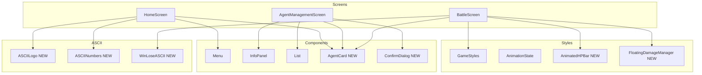
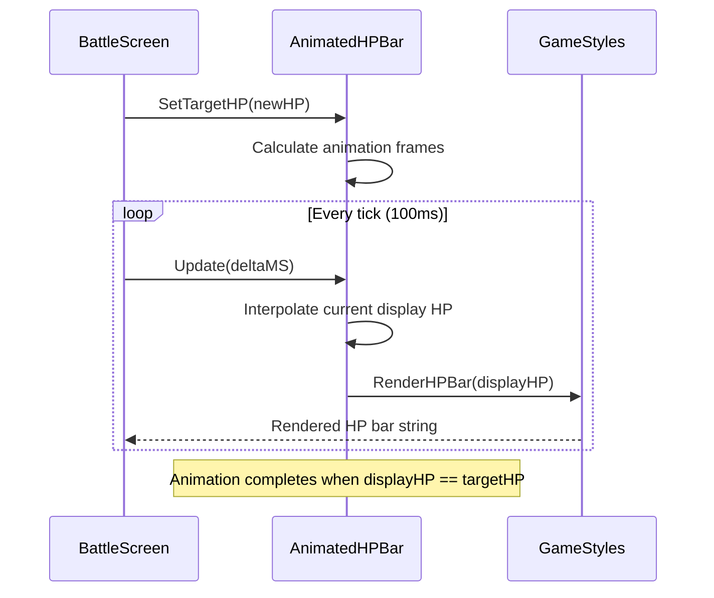
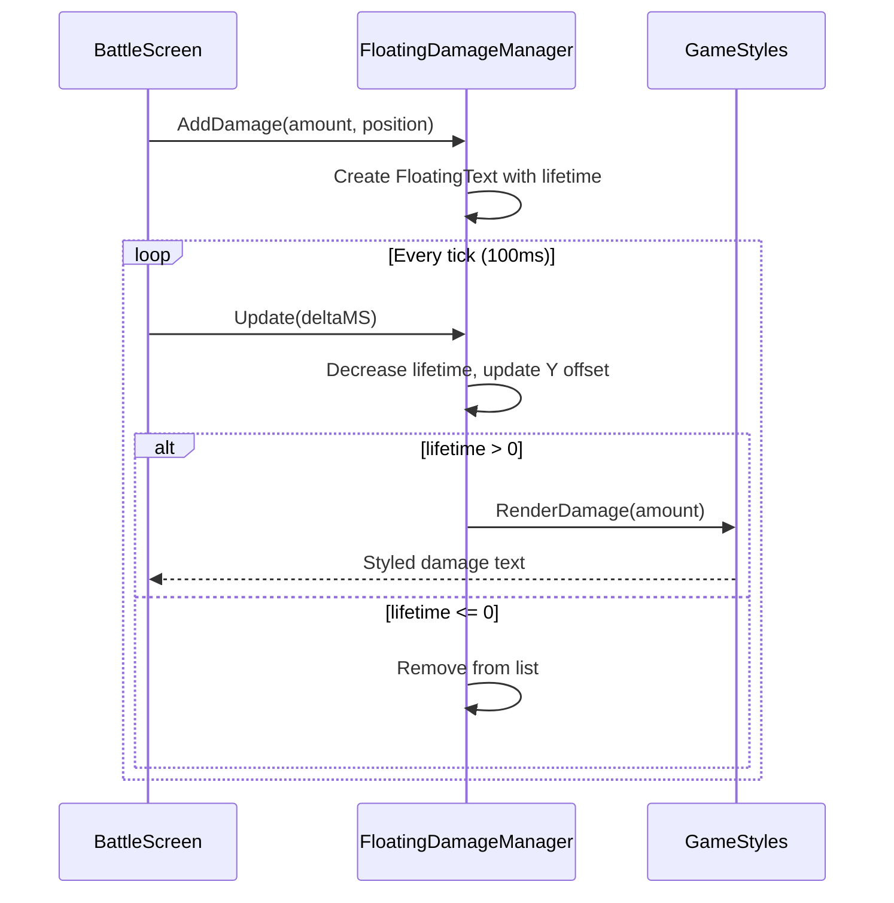

# Design Document

## Overview

**Purpose**: この機能は、TypeBattleの全体的なUI体験を改善し、視覚的な一貫性、操作性、フィードバックを強化することで、プレイヤーの没入感とゲームへの満足度を向上させます。

**Users**: 全てのプレイヤーが、ホーム画面でのナビゲーション、エージェント管理での合成・装備操作、バトル中の戦闘状況把握において、この改善の恩恵を受けます。

**Impact**: 既存の画面コンポーネント（home.go, agent_management.go, battle.go）を拡張し、新規のASCIIアートモジュールとアニメーションシステムを追加します。既存のstyles.goの設計を維持しながら、統一されたデザインシステムを構築します。

### Goals

- ホーム画面にフィグレット風ASCIIアートロゴと大きなレベル表示を実装し、視覚的インパクトを向上
- エージェント管理画面の合成・装備タブレイアウトを改善し、操作効率を向上
- バトル画面に3エリアレイアウト、HPアニメーション、フローティングダメージを実装
- 全画面でカラーテーマとスタイルを統一し、プロフェッショナルな印象を確立
- 視覚的フィードバック（ハイライト、フォーカス、エラー表示）を強化

### Non-Goals

- サウンドエフェクトの実装（将来検討）
- キーボードショートカットのカスタマイズ機能
- テーマの切り替え機能（ダークモード/ライトモードなど）
- 国際化（i18n）対応

## Architecture

### Existing Architecture Analysis

現在のアーキテクチャは以下のパターンに従っています：

- **Elm Architecture**: bubbletea によるModel-Update-Viewパターン
- **レイヤー分離**: screens（画面）、components（再利用コンポーネント）、styles（スタイル定義）
- **既存のスタイルシステム**: `styles.GameStyles`による一元管理、カラーパレット定義済み
- **既存のアニメーション基盤**: `animation.go`にAnimationState、DamageAnimation、HealAnimationが実装済み

維持すべきパターン：
- `tea.Model`インターフェースを実装する画面設計
- `lipgloss.Style`によるスタイリング
- RoundedBorderの統一使用
- 定義済みカラーパレット（ColorPrimary, ColorSecondary, etc.）

### Architecture Pattern & Boundary Map



**Architecture Integration**:
- Selected pattern: コンポーネントベースUI拡張（既存パターン継続）
- Domain/feature boundaries: ASCII描画は独立パッケージ、アニメーションはstylesパッケージ内
- Existing patterns preserved: GameStyles、Menu、InfoPanel、Listコンポーネント
- New components rationale: ASCIIアートは独立性が高いため新パッケージ、アニメーションは既存stylesの拡張
- Steering compliance: structure.mdのレイヤー分離、tech.mdのbubbletea/lipgloss使用を維持

### Technology Stack

| Layer | Choice / Version | Role in Feature | Notes |
|-------|------------------|-----------------|-------|
| TUI Framework | bubbletea v0.27+ | 画面更新・イベント処理 | 既存使用 |
| Styling | lipgloss v1.0+ | スタイル定義・レイアウト | 既存使用 |
| Progress Bar | bubbles/progress | HPバーアニメーション | 新規追加検討（SetPercent/FrameMsg） |
| ASCII Art | 内製（ascii pkg） | ロゴ・数字・結果表示 | 新規作成 |

## System Flows

### HPバーアニメーションフロー



### フローティングダメージフロー



## Requirements Traceability

| Requirement | Summary | Components | Interfaces | Flows |
|-------------|---------|------------|------------|-------|
| 1.1 | ASCIIアートロゴ表示 | ASCIILogo, HomeScreen | RenderLogo() | - |
| 1.2 | 左右分割レイアウト | HomeScreen | View() | - |
| 1.3 | 操作キーヘルプ表示 | HomeScreen | View() | - |
| 1.4 | レベルASCII数字表示 | ASCIINumbers, HomeScreen | RenderNumber() | - |
| 1.5 | 装備エージェント一覧 | HomeScreen, AgentCard | renderStatusPanel() | - |
| 1.6 | 装備空時の誘導・無効化 | HomeScreen, Menu | View(), MenuItem.Disabled | - |
| 2.1 | 合成タブ左側パーツリスト | AgentManagementScreen | renderSynthesis() | - |
| 2.2 | 合成タブ右側選択済みリスト | AgentManagementScreen | renderSynthesisSelection() | - |
| 2.3 | パーツ詳細性能表示 | AgentManagementScreen, InfoPanel | renderSynthesisCoreList() | - |
| 2.4 | 完成後ステータス予測表示 | AgentManagementScreen | renderSynthesisPreview() | - |
| 2.5 | 装備タブ上部左側エージェント縦リスト | AgentManagementScreen | renderEquip() | - |
| 2.6 | 装備タブ上部右側エージェント詳細 | AgentManagementScreen, InfoPanel | renderAgentDetail() | - |
| 2.7 | 装備タブ下部3スロット横並び | AgentManagementScreen, AgentCard | renderEquipSlots() | - |
| 2.8 | Tabキーでスロット切替 | AgentManagementScreen | handleKeyMsg() | - |
| 2.9 | エージェント削除確認ダイアログ | AgentManagementScreen, ConfirmDialog | handleDelete() | - |
| 3.1 | 3エリアレイアウト | BattleScreen | View() | - |
| 3.2 | エージェント横並びカード表示 | BattleScreen, AgentCard | renderAgentArea() | - |
| 3.3 | HPバーアニメーション | AnimatedHPBar | Update(), Render() | HPアニメーション |
| 3.4 | フローティングダメージ表示 | FloatingDamageManager | AddDamage(), Update() | フローティングダメージ |
| 3.5 | 敵攻撃タイマープログレスバー | BattleScreen, GameStyles | renderEnemyAttackTimer() | - |
| 3.6 | モジュールカテゴリアイコン | BattleScreen | renderModuleList() | - |
| 3.7 | バフ・デバフ視覚区別 | BattleScreen, GameStyles | RenderBuff(), RenderDebuff() | - |
| 3.8 | タイピング色分け表示 | BattleScreen, GameStyles | RenderTypingChallenge() | - |
| 3.9 | WIN/LOSEアスキーアート表示 | BattleScreen, WinLoseASCII | renderBattleResult() | - |
| 4.1 | 統一カラーパレット使用 | GameStyles | 全画面 | - |
| 4.2 | RoundedBorder統一 | GameStyles | BoxStyle | - |
| 4.3 | プライマリ・セカンダリ・アクセント定義 | GameStyles | ColorPrimary等 | - |
| 4.4 | モノクロ代替表示 | GameStyles | NewGameStylesWithNoColor() | - |
| 4.5 | テキスト階層スタイル | GameStyles, TextStyles | Title, Subtitle, Normal, Subtle | - |
| 5.1 | 選択項目ハイライト | Menu, List | Render() | - |
| 5.2 | フォーカスアニメーション | Menu, components | Render() | - |
| 5.3 | 無効操作エラーメッセージ | All Screens | handleKeyMsg() | - |
| 5.4 | 成功フィードバック | All Screens, GameStyles | RenderHighlightMessage() | - |

## Components and Interfaces

| Component | Domain/Layer | Intent | Req Coverage | Key Dependencies | Contracts |
|-----------|--------------|--------|--------------|------------------|-----------|
| ASCIILogo | ascii | ゲームロゴのASCIIアート描画 | 1.1 | lipgloss (P1) | Service |
| ASCIINumbers | ascii | 大きな数字のASCIIアート描画 | 1.4 | lipgloss (P1) | Service |
| WinLoseASCII | ascii | WIN/LOSEのASCIIアート描画 | 3.9 | lipgloss (P1) | Service |
| AnimatedHPBar | styles | HPバーのスムーズアニメーション | 3.3 | GameStyles (P0), bubbletea (P0) | State |
| FloatingDamageManager | styles | フローティングダメージ管理 | 3.4 | GameStyles (P0) | State |
| AgentCard | components | エージェント情報カード表示 | 1.5, 2.6, 3.2 | GameStyles (P1), domain.AgentModel (P0) | Service |
| ConfirmDialog | components | 確認ダイアログ表示 | 2.7 | GameStyles (P1), Menu (P1) | Service, State |
| ModuleIcon | styles | モジュールカテゴリアイコン | 3.6 | domain.ModuleCategory (P0) | Service |

### ASCII Layer

#### ASCIILogo

| Field | Detail |
|-------|--------|
| Intent | フィグレット風のゲームタイトルロゴを描画 |
| Requirements | 1.1 |

**Responsibilities & Constraints**
- 5-8行程度の複数行ASCIIアートでTypeBattleロゴを表現
- カラーモード・モノクロモードの両方に対応
- 固定幅レイアウトで中央揃え表示をサポート

**Dependencies**
- Outbound: lipgloss - スタイリング (P1)

**Contracts**: Service [x]

##### Service Interface
```go
// ASCIILogoRenderer はゲームロゴのASCIIアート描画を提供します
type ASCIILogoRenderer interface {
    // Render はロゴをレンダリングします
    // colorMode: true=カラー、false=モノクロ
    Render(colorMode bool) string

    // GetWidth はロゴの幅（文字数）を返します
    GetWidth() int

    // GetHeight はロゴの高さ（行数）を返します
    GetHeight() int
}

// NewASCIILogo は新しいASCIILogoRendererを作成します
func NewASCIILogo() ASCIILogoRenderer
```

**Implementation Notes**
- Integration: HomeScreenのView()から呼び出し
- Validation: カラーモード検出はGameStyles.noColorフラグを参照
- Risks: フォントによっては表示が崩れる可能性（等幅フォント前提）

#### ASCIINumbers

| Field | Detail |
|-------|--------|
| Intent | 0-9の大きな数字をASCIIアートで描画 |
| Requirements | 1.4 |

**Responsibilities & Constraints**
- 各数字は3-5行程度のASCIIアートで表現
- 複数桁の数値を連結して表示可能
- カラー対応（到達レベルに応じた色分け）

**Dependencies**
- Outbound: lipgloss - スタイリング (P1)

**Contracts**: Service [x]

##### Service Interface
```go
// ASCIINumberRenderer は数字のASCIIアート描画を提供します
type ASCIINumberRenderer interface {
    // RenderNumber は指定された数値をASCIIアートで描画します
    // number: 描画する数値（0以上）
    // color: 数字の色
    RenderNumber(number int, color lipgloss.Color) string

    // RenderDigit は単一の数字（0-9）を描画します
    RenderDigit(digit int) []string
}

// NewASCIINumbers は新しいASCIINumberRendererを作成します
func NewASCIINumbers() ASCIINumberRenderer
```

**Implementation Notes**
- Integration: HomeScreenのrenderStatusPanel()から呼び出し
- Validation: 負数は0として扱う、1000以上は"999+"表示

#### WinLoseASCII

| Field | Detail |
|-------|--------|
| Intent | 戦闘結果（WIN/LOSE）をASCIIアートで描画 |
| Requirements | 3.9 |

**Responsibilities & Constraints**
- 勝利時は緑色で「WIN」、敗北時は赤色で「LOSE」を大きく表示
- エージェントエリア内に収まるサイズ

**Dependencies**
- Outbound: lipgloss - スタイリング (P1)
- Outbound: GameStyles - カラー定義 (P1)

**Contracts**: Service [x]

##### Service Interface
```go
// WinLoseRenderer は戦闘結果のASCIIアート描画を提供します
type WinLoseRenderer interface {
    // RenderWin は勝利時のASCIIアートを描画します
    RenderWin() string

    // RenderLose は敗北時のASCIIアートを描画します
    RenderLose() string
}

// NewWinLoseRenderer は新しいWinLoseRendererを作成します
func NewWinLoseRenderer(styles *GameStyles) WinLoseRenderer
```

### Styles Layer

#### AnimatedHPBar

| Field | Detail |
|-------|--------|
| Intent | HPバーのスムーズな増減アニメーションを管理 |
| Requirements | 3.3 |

**Responsibilities & Constraints**
- 目標HPへの滑らかな補間（線形またはイージング）
- 100msごとの更新で自然なアニメーションを実現
- 増加（回復）と減少（ダメージ）で異なる速度設定可能

**Dependencies**
- Inbound: BattleScreen - アニメーション更新呼び出し (P0)
- Outbound: GameStyles - HPバー描画 (P0)

**Contracts**: State [x]

##### State Management
```go
// AnimatedHPBar はアニメーション付きHPバーの状態を管理します
type AnimatedHPBar struct {
    // CurrentDisplayHP は現在表示中のHP値（アニメーション用）
    CurrentDisplayHP float64

    // TargetHP は目標HP値
    TargetHP int

    // MaxHP は最大HP値
    MaxHP int

    // AnimationSpeed は1秒あたりのHP変化量
    AnimationSpeed float64

    // IsAnimating はアニメーション中かどうか
    IsAnimating bool
}

// NewAnimatedHPBar は新しいAnimatedHPBarを作成します
func NewAnimatedHPBar(maxHP int) *AnimatedHPBar

// SetTarget は目標HP値を設定しアニメーションを開始します
func (a *AnimatedHPBar) SetTarget(targetHP int)

// Update はアニメーションを更新します（deltaMS: 経過ミリ秒）
func (a *AnimatedHPBar) Update(deltaMS int)

// Render は現在の表示HPでHPバーを描画します
func (a *AnimatedHPBar) Render(styles *GameStyles, width int) string

// GetCurrentHP は現在の表示HP（整数）を返します
func (a *AnimatedHPBar) GetCurrentHP() int
```

- State model: CurrentDisplayHP（表示用float）、TargetHP（目標int）、IsAnimating
- Persistence: メモリ内のみ（バトル中のみ有効）
- Concurrency: シングルスレッド（bubbleteaのUpdate内でのみ更新）

**Implementation Notes**
- Integration: BattleScreen.handleTick()でUpdate()を呼び出し、View()でRender()
- Validation: CurrentDisplayHPは0からMaxHPの範囲に制限
- Risks: tickが遅延した場合のスキップ処理が必要

#### FloatingDamageManager

| Field | Detail |
|-------|--------|
| Intent | ダメージ・回復数値のフローティング表示を管理 |
| Requirements | 3.4 |

**Responsibilities & Constraints**
- ダメージ/回復発生時に数値を一時表示（2-3秒）
- Y方向への浮遊アニメーション
- 複数の同時表示をサポート

**Dependencies**
- Inbound: BattleScreen - ダメージ/回復イベント (P0)
- Outbound: GameStyles - 数値描画 (P0)

**Contracts**: State [x]

##### State Management
```go
// FloatingText は浮遊テキストの状態を表します
type FloatingText struct {
    Text        string
    IsHealing   bool    // true=回復（緑）、false=ダメージ（赤）
    RemainingMS int     // 残り表示時間（ミリ秒）
    YOffset     int     // Y方向オフセット（上方向に増加）
    TargetArea  string  // "enemy", "player", "agent_{index}"
}

// FloatingDamageManager はフローティングダメージの状態を管理します
type FloatingDamageManager struct {
    Texts []FloatingText
}

// NewFloatingDamageManager は新しいFloatingDamageManagerを作成します
func NewFloatingDamageManager() *FloatingDamageManager

// AddDamage はダメージ表示を追加します
func (m *FloatingDamageManager) AddDamage(amount int, targetArea string)

// AddHeal は回復表示を追加します
func (m *FloatingDamageManager) AddHeal(amount int, targetArea string)

// Update は状態を更新します（deltaMS: 経過ミリ秒）
func (m *FloatingDamageManager) Update(deltaMS int)

// GetTextsForArea は指定エリアの表示テキストを取得します
func (m *FloatingDamageManager) GetTextsForArea(targetArea string) []FloatingText

// HasActiveTexts はアクティブな表示があるかを返します
func (m *FloatingDamageManager) HasActiveTexts() bool
```

- State model: 複数のFloatingTextのスライス管理
- Persistence: メモリ内のみ
- Concurrency: シングルスレッド

### Components Layer

#### AgentCard

| Field | Detail |
|-------|--------|
| Intent | エージェント情報をカード形式で表示 |
| Requirements | 1.5, 2.6, 3.2 |

**Responsibilities & Constraints**
- エージェント名、レベル、コアタイプ、HP（オプション）を表示
- 選択状態・非選択状態のスタイル切り替え
- 縦型（詳細）・横型（コンパクト）の2種類のレイアウト

**Dependencies**
- Inbound: HomeScreen, AgentManagementScreen, BattleScreen - カード描画 (P0)
- Outbound: domain.AgentModel - エージェントデータ (P0)
- Outbound: GameStyles - スタイリング (P1)

**Contracts**: Service [x]

##### Service Interface
```go
// AgentCardStyle はカードのスタイルバリエーションです
type AgentCardStyle int

const (
    AgentCardCompact AgentCardStyle = iota  // コンパクト（横並び用）
    AgentCardDetailed                        // 詳細（単体表示用）
)

// AgentCard はエージェント情報カードを表します
type AgentCard struct {
    Agent       *domain.AgentModel
    Style       AgentCardStyle
    Selected    bool
    ShowHP      bool
    CurrentHP   int  // ShowHP=true時に使用
    styles      *GameStyles
}

// NewAgentCard は新しいAgentCardを作成します
func NewAgentCard(agent *domain.AgentModel, style AgentCardStyle) *AgentCard

// SetSelected は選択状態を設定します
func (c *AgentCard) SetSelected(selected bool)

// SetHP はHP表示を設定します
func (c *AgentCard) SetHP(current int)

// Render はカードをレンダリングします
func (c *AgentCard) Render(width int) string
```

**Implementation Notes**
- Integration: 各画面のView()からRender()を呼び出し
- Validation: Agentがnilの場合は空スロット表示
- Risks: 幅が狭い場合のテキスト切り詰め処理

#### ConfirmDialog

| Field | Detail |
|-------|--------|
| Intent | 確認ダイアログ（はい/いいえ）を表示 |
| Requirements | 2.7 |

**Responsibilities & Constraints**
- モーダルダイアログとして画面中央に表示
- メッセージとはい/いいえボタンを表示
- キーボードで選択・決定

**Dependencies**
- Inbound: AgentManagementScreen - ダイアログ表示要求 (P0)
- Outbound: GameStyles - スタイリング (P1)

**Contracts**: Service [x] / State [x]

##### Service Interface
```go
// ConfirmResult はダイアログの結果を表します
type ConfirmResult int

const (
    ConfirmResultNone ConfirmResult = iota
    ConfirmResultYes
    ConfirmResultNo
    ConfirmResultCancelled
)

// ConfirmDialog は確認ダイアログを表します
type ConfirmDialog struct {
    Title       string
    Message     string
    Visible     bool
    SelectedYes bool  // true=はい選択中、false=いいえ選択中
    Result      ConfirmResult
    styles      *GameStyles
}

// NewConfirmDialog は新しいConfirmDialogを作成します
func NewConfirmDialog(title, message string) *ConfirmDialog

// Show はダイアログを表示します
func (d *ConfirmDialog) Show()

// Hide はダイアログを非表示にします
func (d *ConfirmDialog) Hide()

// HandleKey はキー入力を処理します
func (d *ConfirmDialog) HandleKey(key string) ConfirmResult

// Render はダイアログをレンダリングします
func (d *ConfirmDialog) Render(screenWidth, screenHeight int) string
```

##### State Management
- State model: Visible（表示中）、SelectedYes（選択位置）、Result（結果）
- Persistence: メモリ内のみ
- Concurrency: シングルスレッド

#### ModuleIcon

| Field | Detail |
|-------|--------|
| Intent | モジュールカテゴリに対応するアイコンを提供 |
| Requirements | 3.6 |

**Responsibilities & Constraints**
- 各ModuleCategoryに対応するUnicode/ASCIIアイコンを返す
- カラーモード対応

**Dependencies**
- Outbound: domain.ModuleCategory - カテゴリ判定 (P0)

**Contracts**: Service [x]

##### Service Interface
```go
// GetModuleIcon はモジュールカテゴリに対応するアイコンを返します
func GetModuleIcon(category domain.ModuleCategory) string

// GetModuleIconColored はカラー付きアイコンを返します
func GetModuleIconColored(category domain.ModuleCategory, styles *GameStyles) string
```

アイコンマッピング:
- PhysicalAttack: "⚔" (剣)
- MagicAttack: "✦" (星)
- Heal: "♥" (ハート)
- Buff: "▲" (上矢印)
- Debuff: "▼" (下矢印)

## Data Models

### Domain Model

本機能は主にUI層の改善であり、ドメインモデルへの変更は最小限です。

**既存エンティティの使用**:
- `domain.AgentModel`: エージェント情報表示
- `domain.PlayerModel`: プレイヤーHP表示
- `domain.EnemyModel`: 敵HP表示
- `domain.ModuleModel`: モジュール一覧表示

### Logical Data Model

**新規追加なし**: 全てのUI状態はメモリ内で管理され、永続化の必要はありません。

## Error Handling

### Error Strategy

UIコンポーネントは基本的にエラーを発生させず、代わりにフォールバック表示を行います。

### Error Categories and Responses

**User Errors (入力エラー)**:
- 無効な操作（装備空でバトル選択）→ グレーアウト表示 + 誘導メッセージ (1.6)
- 削除確認のキャンセル → ダイアログを閉じて元の状態に戻る (2.7)

**System Errors (描画エラー)**:
- ターミナルカラー非対応 → モノクロモードへ自動切り替え (4.4)
- ウィンドウサイズ不足 → 最小サイズでレイアウト調整

**Visual Feedback (5.3, 5.4)**:
- 無効操作時: エラーメッセージを下部に表示（赤色、2秒で消去）
- 成功時: 成功メッセージを表示（緑色、1秒で消去）

### Monitoring

- ログ出力: 重大なUI状態異常のみstderr出力
- デバッグモード: 環境変数`DEBUG=1`でアニメーションフレームレートを表示

## Testing Strategy

### Unit Tests

1. **ASCIILogo.Render()**: ロゴが正しい行数・幅で出力されること
2. **ASCIINumbers.RenderNumber()**: 0-999の数値が正しく変換されること
3. **AnimatedHPBar.Update()**: HP変化が正しく補間されること
4. **FloatingDamageManager.Update()**: 時間経過で表示が消去されること
5. **ConfirmDialog.HandleKey()**: キー入力に応じた結果が返ること

### Integration Tests

1. **HomeScreen表示**: ASCIIロゴ、レベル表示、メニュー、進行状況が正しく配置されること
2. **AgentManagement合成タブ**: 左右分割レイアウトでパーツ選択が動作すること
3. **BattleScreen 3エリア**: 敵情報・エージェント・プレイヤー情報が正しく配置されること
4. **HPアニメーション連携**: ダメージ/回復イベントでHPバーがスムーズに変化すること
5. **確認ダイアログ連携**: 削除操作でダイアログが表示され、選択結果が反映されること

### E2E/UI Tests

1. **ホーム画面ナビゲーション**: メニュー選択→各画面遷移→戻るが正常動作
2. **エージェント合成フロー**: コア選択→モジュール選択→確認→合成完了
3. **バトル完了フロー**: バトル開始→勝利/敗北→WIN/LOSE表示→ホーム戻り
4. **カラー/モノクロ切り替え**: 環境変数でモノクロモードが正常動作

## Optional Sections

### Performance & Scalability

**Target Metrics**:
- アニメーション: 100ms間隔での滑らかな更新（10 FPS相当）
- 描画遅延: 各View()呼び出しは10ms以内に完了

**Optimization Techniques**:
- ASCIIアート文字列はパッケージ初期化時に事前生成
- アニメーション非アクティブ時はtickコマンドを停止
- lipgloss.Styleはキャッシュして再利用

### Security Considerations

本機能はUI層のみであり、ユーザー入力はキーボード操作に限定されるため、セキュリティ上の考慮は不要です。

## Screen Mockups

### ホーム画面

```
┌──────────────────────────────────────────────────────────────────────────────────────────────────────────┐
│                                                                                                          │
│                        ╔╦╗╦ ╦╔═╗╔═╗  ╔╗ ╔═╗╔╦╗╔╦╗╦  ╔═╗                                                  │
│                         ║ ╚╦╝╠═╝║╣   ╠╩╗╠═╣ ║  ║ ║  ║╣                                                   │
│                         ╩  ╩ ╩  ╚═╝  ╚═╝╩ ╩ ╩  ╩ ╩═╝╚═╝                                                  │
│                              Terminal Typing Battle Game                                                 │
│                                                                                                          │
│    ╭─────────────────────────────────╮    ╭─────────────────────────────────────────────────╮            │
│    │        メインメニュー            │    │              進行状況                            │            │
│    │                                 │    │                                                 │            │
│    │  > エージェント管理              │    │   到達最高レベル:                               │            │
│    │    バトル選択                   │    │    ██╗ ██████╗                                  │            │
│    │    図鑑                         │    │   ███║ ╚════██╗                                 │            │
│    │    統計/実績                    │    │   ╚██║  █████╔╝                                 │            │
│    │    設定                         │    │    ██║ ██╔═══╝                                  │            │
│    │                                 │    │    ██║ ███████╗                                 │            │
│    │                                 │    │    ╚═╝ ╚══════╝                                 │            │
│    │                                 │    │                                                 │            │
│    │                                 │    │   装備中エージェント                            │            │
│    │                                 │    │   スロット1: ファイター (Lv.5)                  │            │
│    │                                 │    │   スロット2: ヒーラー (Lv.3)                    │            │
│    │                                 │    │   スロット3: (空)                               │            │
│    │                                 │    │                                                 │            │
│    ╰─────────────────────────────────╯    ╰─────────────────────────────────────────────────╯            │
│                                                                                                          │
│                        ↑/k: 上  ↓/j: 下  Enter: 選択  q: 終了                                            │
│                                                                                                          │
└──────────────────────────────────────────────────────────────────────────────────────────────────────────┘
```

### ホーム画面（装備なし時）

```
┌──────────────────────────────────────────────────────────────────────────────────────────────────────────┐
│                                                                                                          │
│                        ╔╦╗╦ ╦╔═╗╔═╗  ╔╗ ╔═╗╔╦╗╔╦╗╦  ╔═╗                                                  │
│                         ║ ╚╦╝╠═╝║╣   ╠╩╗╠═╣ ║  ║ ║  ║╣                                                   │
│                         ╩  ╩ ╩  ╚═╝  ╚═╝╩ ╩ ╩  ╩ ╩═╝╚═╝                                                  │
│                              Terminal Typing Battle Game                                                 │
│                                                                                                          │
│    ╭─────────────────────────────────╮    ╭─────────────────────────────────────────────────╮            │
│    │        メインメニュー            │    │              進行状況                            │            │
│    │                                 │    │                                                 │            │
│    │  > エージェント管理              │    │   到達最高レベル:                               │            │
│    │    バトル選択 (装備がありません) │    │    ──────                                       │            │
│    │    図鑑                         │    │    まだなし                                     │            │
│    │    統計/実績                    │    │                                                 │            │
│    │    設定                         │    │                                                 │            │
│    │                                 │    │   装備中エージェント                            │            │
│    │                                 │    │   ⚠ エージェントが装備されていません            │            │
│    │                                 │    │                                                 │            │
│    │                                 │    │   → エージェント管理で                          │            │
│    │                                 │    │     合成・装備を行ってください                  │            │
│    │                                 │    │                                                 │            │
│    ╰─────────────────────────────────╯    ╰─────────────────────────────────────────────────╯            │
│                                                                                                          │
│                        ↑/k: 上  ↓/j: 下  Enter: 選択  q: 終了                                            │
│                                                                                                          │
└──────────────────────────────────────────────────────────────────────────────────────────────────────────┘
```

### エージェント管理画面 - 合成タブ

```
┌──────────────────────────────────────────────────────────────────────────────────────────────────────────┐
│                                         エージェント管理                                                  │
│                                                                                                          │
│                   [ コア一覧 ]  [ モジュール一覧 ]  [*合成*]  [ 装備 ]                                    │
│                                                                                                          │
│  ╭────────────────────────────────────────────╮  ╭────────────────────────────────────────────────────╮  │
│  │  選択可能なパーツ                          │  │  選択済みパーツ                                    │  │
│  │                                            │  │                                                    │  │
│  │  ステップ 1: コア選択                      │  │  コア: ファイターコア Lv.3                         │  │
│  │                                            │  │  モジュール1: 斬撃                                 │  │
│  │  > ファイターコア Lv.3                     │  │  モジュール2: 回復                                 │  │
│  │    メイジコア Lv.2                         │  │  モジュール3: (未選択)                             │  │
│  │    アサシンコア Lv.4                       │  │  モジュール4: (未選択)                             │  │
│  │                                            │  │                                                    │  │
│  │                                            │  ├────────────────────────────────────────────────────┤  │
│  │                                            │  │  完成予測ステータス                                │  │
│  │                                            │  │                                                    │  │
│  ├────────────────────────────────────────────┤  │  名前: ファイター                                  │  │
│  │  選択中パーツの詳細                        │  │  Lv: 3                                             │  │
│  │                                            │  │  HP: 150  STR: 45  MAG: 12                         │  │
│  │  ファイターコア Lv.3                       │  │  SPD: 28  LUK: 15                                  │  │
│  │  特性: 物理攻撃                            │  │                                                    │  │
│  │  STR: 35  MAG: 10  SPD: 25  LUK: 12        │  │  攻撃: 斬撃(⚔+45), 回復(♥+30)                      │  │
│  │                                            │  │                                                    │  │
│  ╰────────────────────────────────────────────╯  ╰────────────────────────────────────────────────────╯  │
│                                                                                                          │
│               ←/→: タブ切替  ↑/↓: 選択  Enter: 決定  Backspace: 戻る  Esc: ホーム                        │
│                                                                                                          │
└──────────────────────────────────────────────────────────────────────────────────────────────────────────┘
```

### エージェント管理画面 - 装備タブ

```
┌──────────────────────────────────────────────────────────────────────────────────────────────────────────┐
│                                         エージェント管理                                                  │
│                                                                                                          │
│                   [ コア一覧 ]  [ モジュール一覧 ]  [ 合成 ]  [*装備*]                                    │
│                                                                                                          │
│  ╭──────────────────────────────────────────────  所持エージェント  ────────────────────────────────────╮│
│  │                                                                                                      ││
│  │   ╭──────────────────────────────────╮   ╭────────────────────────────────────────────────────────╮  ││
│  │   │  エージェント一覧                │   │  選択中エージェント詳細                                │  ││
│  │   │                                  │   │                                                        │  ││
│  │   │  > ファイター Lv.5               │   │  ファイター Lv.5                                       │  ││
│  │   │    ヒーラー Lv.3                 │   │  コアタイプ: 物理攻撃型                                │  ││
│  │   │    アサシン Lv.4                 │   │  ────────────────────────────────────                  │  ││
│  │   │    メイジ Lv.2                   │   │  STR: 45   MAG: 12   SPD: 28   LUK: 15                 │  ││
│  │   │                                  │   │  ────────────────────────────────────                  │  ││
│  │   │                                  │   │  モジュール:                                           │  ││
│  │   │                                  │   │    ⚔ 斬撃        ⚔ 連撃                               │  ││
│  │   │                                  │   │    ▲ 攻撃アップ  ✦ ファイア                           │  ││
│  │   │                                  │   │                                                        │  ││
│  │   ╰──────────────────────────────────╯   ╰────────────────────────────────────────────────────────╯  ││
│  │                                                                                                      ││
│  ╰──────────────────────────────────────────────────────────────────────────────────────────────────────╯│
│                                                                                                          │
│  ╭─────────────────────────────────────────  装備中エージェント  ───────────────────────────────────────╮│
│  │                                                                                                      ││
│  │   ╭──────────────────────────╮   ╭──────────────────────────╮   ╭──────────────────────────╮         ││
│  │   │  *スロット1*             │   │   スロット2              │   │   スロット3              │         ││
│  │   │                          │   │                          │   │                          │         ││
│  │   │   ファイター Lv.5        │   │   ヒーラー Lv.3          │   │   (空)                   │         ││
│  │   │   ⚔⚔▲✦                  │   │   ♥▲♥▼                   │   │                          │         ││
│  │   │                          │   │                          │   │   Enterで装備            │         ││
│  │   ╰──────────────────────────╯   ╰──────────────────────────╯   ╰──────────────────────────╯         ││
│  │                                                                                                      ││
│  ╰──────────────────────────────────────────────────────────────────────────────────────────────────────╯│
│                                                                                                          │
│          ←/→: タブ切替  Tab: スロット切替  ↑/↓: エージェント選択  Enter: 装備/解除  d: 削除  Esc: ホーム │
│                                                                                                          │
└──────────────────────────────────────────────────────────────────────────────────────────────────────────┘
```

### バトル画面 - 戦闘中

```
┌──────────────────────────────────────────────────────────────────────────────────────────────────────────┐
│                                                                                                          │
│  ╭─────────────────────────────────────────────  敵情報エリア  ─────────────────────────────────────────╮│
│  │                                                                                                      ││
│  │   ゴブリンキング Lv.5                                                               [強化フェーズ]   ││
│  │   HP: [████████████████░░░░░░░░░░░░░░] 156/250                              -45                      ││
│  │                                                                            ↑消える                    ││
│  │   [攻撃力UP 5.2s]  [防御力UP 3.1s]                                                                   ││
│  │                                                                                                      ││
│  │   次の敵行動まで: ████████░░ 3.5秒                                                                   ││
│  │   ⚔ 物理攻撃 45ダメージ                                                                              ││
│  │                                                                                                      ││
│  ╰──────────────────────────────────────────────────────────────────────────────────────────────────────╯│
│                                                                                                          │
│  ╭───────────────────────────────────────────  エージェントエリア  ─────────────────────────────────────╮│
│  │                                                                                                      ││
│  │   ╭──────────────────────╮   ╭──────────────────────╮   ╭──────────────────────╮                     ││
│  │   │ *ファイター Lv.5*   │   │   ヒーラー Lv.3      │   │   アサシン Lv.4      │                     ││
│  │   │                      │   │                      │   │                      │                     ││
│  │   │ > ⚔ 斬撃    [READY] │   │   ♥ 回復    ██░ 2.1s│   │   ⚔ 急所突き [READY] │                     ││
│  │   │   ⚔ 連撃    ███░ 3s │   │   ▲ 防御UP  [READY] │   │   ▼ 毒付与   ██░ 1.5s│                     ││
│  │   │   ▲ 攻撃UP  [READY] │   │   ♥ 全体回復 ██░ 4s │   │   ⚔ 連続斬り [READY] │                     ││
│  │   │   ✦ ファイア [READY] │   │   ▼ 敵弱体  [READY] │   │   ▲ 速度UP   [READY] │                     ││
│  │   │                      │   │                      │   │                      │                     ││
│  │   ╰──────────────────────╯   ╰──────────────────────╯   ╰──────────────────────╯                     ││
│  │                                                                                                      ││
│  ╰──────────────────────────────────────────────────────────────────────────────────────────────────────╯│
│                                                                                                          │
│  ╭────────────────────────────────────────  プレイヤー情報エリア  ──────────────────────────────────────╮│
│  │                                                                                                      ││
│  │   プレイヤー                                                                   +30                   ││
│  │   HP: [██████████████████████████████░░░░░░░░] 280/320                        ↑消える                ││
│  │                                                                                                      ││
│  │   バフ: [攻撃力UP 8.5s]  [速度UP 4.2s]                                                               ││
│  │   デバフ: [毒 2.1s]                                                                                  ││
│  │                                                                                                      ││
│  ╰──────────────────────────────────────────────────────────────────────────────────────────────────────╯│
│                                                                                                          │
│   斬撃で45ダメージを与えた！ (WPM:85 正確性:98%)                                                         │
│                                                                                                          │
│                        ↑/k: 上  ↓/j: 下  Enter: モジュール使用  Esc: 中断                                │
│                                                                                                          │
└──────────────────────────────────────────────────────────────────────────────────────────────────────────┘
```

### バトル画面 - タイピングチャレンジ中

```
┌──────────────────────────────────────────────────────────────────────────────────────────────────────────┐
│                                                                                                          │
│  ╭─────────────────────────────────────────────  敵情報エリア  ─────────────────────────────────────────╮│
│  │   ゴブリンキング Lv.5                                                                                ││
│  │   HP: [████████████████░░░░░░░░░░░░░░] 156/250                                                       ││
│  ╰──────────────────────────────────────────────────────────────────────────────────────────────────────╯│
│                                                                                                          │
│  ╭───────────────────────────────────────  タイピングチャレンジ  ───────────────────────────────────────╮│
│  │                                                                                                      ││
│  │                              残り時間: 8.5秒                                                         ││
│  │                                                                                                      ││
│  │        ╔═══════════════════════════════════════════════════════════════════════════════╗            ││
│  │        ║                                                                               ║            ││
│  │        ║     t h u n d e r s t o r m                                                   ║            ││
│  │        ║     ▓▓▓▓▓▓▓▓▓▓▓▓▓▓▓▓▓▓█░░░░░░░░░░░░░░░░░░░░░░░                                ║            ││
│  │        ║     (入力済み)(現在)(未入力)                                                  ║            ││
│  │        ║                                                                               ║            ││
│  │        ╚═══════════════════════════════════════════════════════════════════════════════╝            ││
│  │                                                                                                      ││
│  │                              進捗: 9/12 (75%)                                                        ││
│  │                                                                                                      ││
│  ╰──────────────────────────────────────────────────────────────────────────────────────────────────────╯│
│                                                                                                          │
│  ╭────────────────────────────────────────  プレイヤー情報エリア  ──────────────────────────────────────╮│
│  │   プレイヤー                                                                                         ││
│  │   HP: [██████████████████████████████░░░░░░░░] 280/320                                               ││
│  ╰──────────────────────────────────────────────────────────────────────────────────────────────────────╯│
│                                                                                                          │
│                                タイピング中...  Esc: キャンセル                                          │
│                                                                                                          │
└──────────────────────────────────────────────────────────────────────────────────────────────────────────┘
```

### バトル画面 - 勝利時

```
┌──────────────────────────────────────────────────────────────────────────────────────────────────────────┐
│                                                                                                          │
│  ╭─────────────────────────────────────────────  敵情報エリア  ─────────────────────────────────────────╮│
│  │   ゴブリンキング Lv.5                                                                                ││
│  │   HP: [░░░░░░░░░░░░░░░░░░░░░░░░░░░░░░] 0/250                                                         ││
│  ╰──────────────────────────────────────────────────────────────────────────────────────────────────────╯│
│                                                                                                          │
│  ╭───────────────────────────────────────────  エージェントエリア  ─────────────────────────────────────╮│
│  │                                                                                                      ││
│  │                                                                                                      ││
│  │                    ██╗    ██╗██╗███╗   ██╗██╗                                                        ││
│  │                    ██║    ██║██║████╗  ██║██║                                                        ││
│  │                    ██║ █╗ ██║██║██╔██╗ ██║██║                                                        ││
│  │                    ██║███╗██║██║██║╚██╗██║╚═╝                                                        ││
│  │                    ╚███╔███╔╝██║██║ ╚████║██╗                                                        ││
│  │                     ╚══╝╚══╝ ╚═╝╚═╝  ╚═══╝╚═╝                                                        ││
│  │                                                                                                      ││
│  │                                                                                                      ││
│  ╰──────────────────────────────────────────────────────────────────────────────────────────────────────╯│
│                                                                                                          │
│  ╭────────────────────────────────────────  プレイヤー情報エリア  ──────────────────────────────────────╮│
│  │   プレイヤー                                                                                         ││
│  │   HP: [████████████████████████████████████░░] 280/320                                               ││
│  ╰──────────────────────────────────────────────────────────────────────────────────────────────────────╯│
│                                                                                                          │
│   勝利！                                                                                                 │
│                                                                                                          │
│                                         Enter: 続ける                                                    │
│                                                                                                          │
└──────────────────────────────────────────────────────────────────────────────────────────────────────────┘
```

### バトル画面 - 敗北時

```
┌──────────────────────────────────────────────────────────────────────────────────────────────────────────┐
│                                                                                                          │
│  ╭─────────────────────────────────────────────  敵情報エリア  ─────────────────────────────────────────╮│
│  │   ゴブリンキング Lv.5                                                                                ││
│  │   HP: [████████░░░░░░░░░░░░░░░░░░░░░░] 85/250                                                        ││
│  ╰──────────────────────────────────────────────────────────────────────────────────────────────────────╯│
│                                                                                                          │
│  ╭───────────────────────────────────────────  エージェントエリア  ─────────────────────────────────────╮│
│  │                                                                                                      ││
│  │                                                                                                      ││
│  │                 ██╗      ██████╗ ███████╗███████╗                                                    ││
│  │                 ██║     ██╔═══██╗██╔════╝██╔════╝                                                    ││
│  │                 ██║     ██║   ██║███████╗█████╗                                                      ││
│  │                 ██║     ██║   ██║╚════██║██╔══╝                                                      ││
│  │                 ███████╗╚██████╔╝███████║███████╗                                                    ││
│  │                 ╚══════╝ ╚═════╝ ╚══════╝╚══════╝                                                    ││
│  │                                                                                                      ││
│  │                                                                                                      ││
│  ╰──────────────────────────────────────────────────────────────────────────────────────────────────────╯│
│                                                                                                          │
│  ╭────────────────────────────────────────  プレイヤー情報エリア  ──────────────────────────────────────╮│
│  │   プレイヤー                                                                                         ││
│  │   HP: [░░░░░░░░░░░░░░░░░░░░░░░░░░░░░░░░░░░░░░] 0/320                                                 ││
│  ╰──────────────────────────────────────────────────────────────────────────────────────────────────────╯│
│                                                                                                          │
│   敗北...                                                                                                │
│                                                                                                          │
│                                         Enter: 続ける                                                    │
│                                                                                                          │
└──────────────────────────────────────────────────────────────────────────────────────────────────────────┘
```

### 確認ダイアログ

```
┌──────────────────────────────────────────────────────────────────────────────────────────────────────────┐
│                                         エージェント管理                                                  │
│                                                                                                          │
│                   [ コア一覧 ]  [ モジュール一覧 ]  [ 合成 ]  [*装備*]                                    │
│                                                                                                          │
│  ╭──────────────────────────────────────────────  所持エージェント  ────────────────────────────────────╮│
│  │                                                                                                      ││
│  │   ╭──────────────────────────────────╮   ╭────────────────────────────────────────────────────────╮  ││
│  │   │  エージェント一覧                │   │  選択中エージェント詳細                                │  ││
│  │   │                     ╭────────────────────────────────────────────────────╮                    │  ││
│  │   │  > ファイター Lv.5  │                                                    │                    │  ││
│  │   │    ヒーラー Lv.3    │              エージェントの削除                    │                    │  ││
│  │   │    アサシン Lv.4    │                                                    │                    │  ││
│  │   │    メイジ Lv.2      │   「ファイター Lv.5」を削除しますか？              │                    │  ││
│  │   │                     │   この操作は取り消せません。                       │                    │  ││
│  │   │                     │                                                    │                    │  ││
│  │   │                     │          [*はい*]        [ いいえ ]                │                    │  ││
│  │   │                     │                                                    │                    │  ││
│  │   │                     ╰────────────────────────────────────────────────────╯                    │  ││
│  │   ╰──────────────────────────────────╯   ╰────────────────────────────────────────────────────────╯  ││
│  ╰──────────────────────────────────────────────────────────────────────────────────────────────────────╯│
│                                                                                                          │
│                              ←/→: 選択切替  Enter: 決定  Esc: キャンセル                                 │
│                                                                                                          │
└──────────────────────────────────────────────────────────────────────────────────────────────────────────┘
```

## Supporting References

### ASCIIアートデザイン案

**TypeBattleロゴ（案）**:
```
╔╦╗╦ ╦╔═╗╔═╗  ╔╗ ╔═╗╔╦╗╔╦╗╦  ╔═╗
 ║ ╚╦╝╠═╝║╣   ╠╩╗╠═╣ ║  ║ ║  ║╣
 ╩  ╩ ╩  ╚═╝  ╚═╝╩ ╩ ╩  ╩ ╩═╝╚═╝
```

**大きな数字（案: 3行版）**:
```
 ___   __  ___  ___  _  _  ___   __  ___  ___  ___
|   | /  ||__ ||   || || ||__ | /  ||   ||__ ||__ |
|___||___||___||___||___||___||___||___||___||___|
```

**WIN/LOSE（案）**:
```
╦ ╦╦╔╗╔┬     ╦  ╔═╗╔═╗╔═╗
║║║║║║║│     ║  ║ ║╚═╗║╣
╚╩╝╩╝╚╝o     ╩═╝╚═╝╚═╝╚═╝
```
