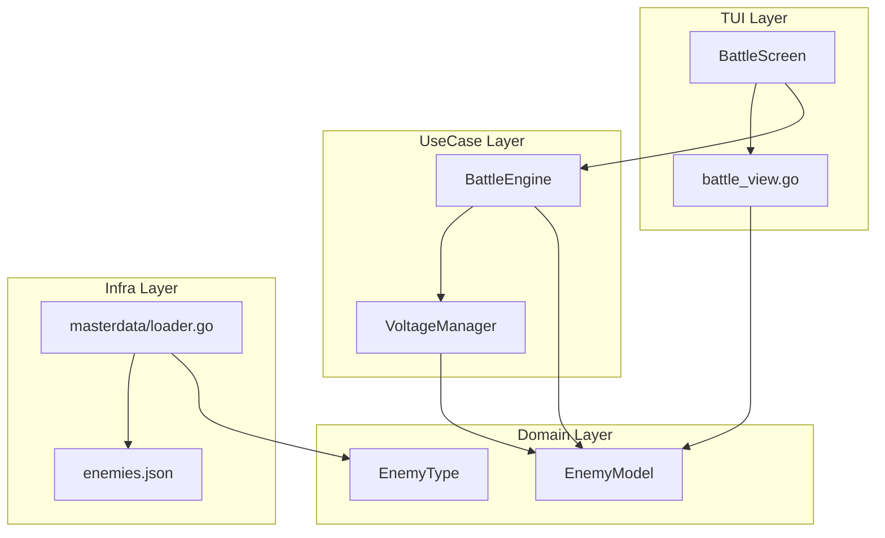
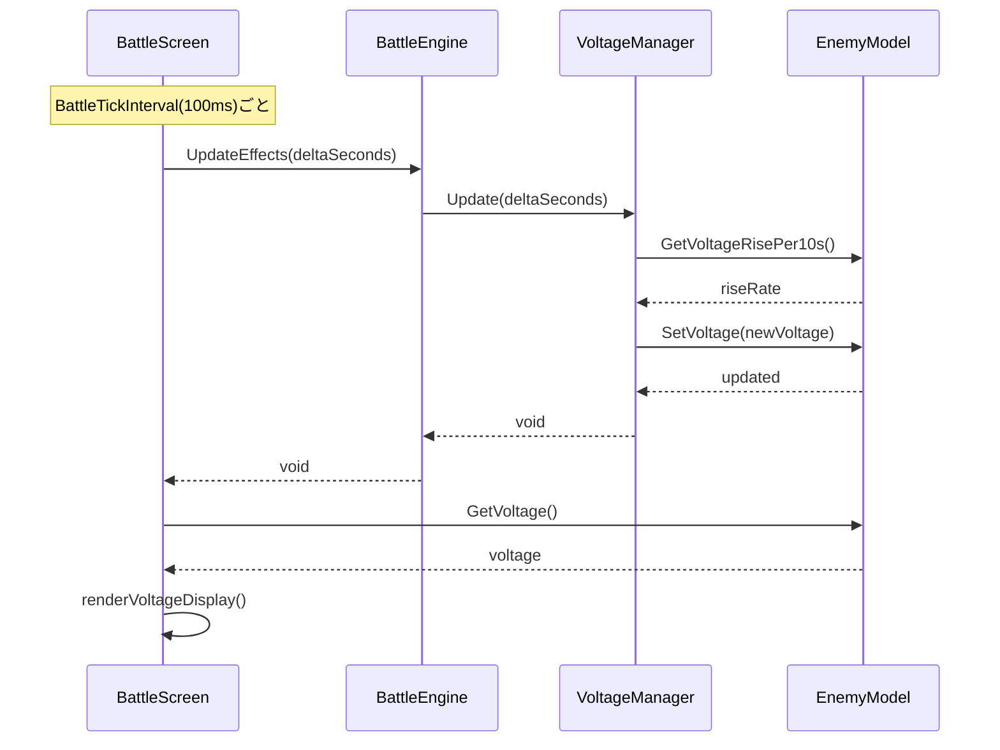
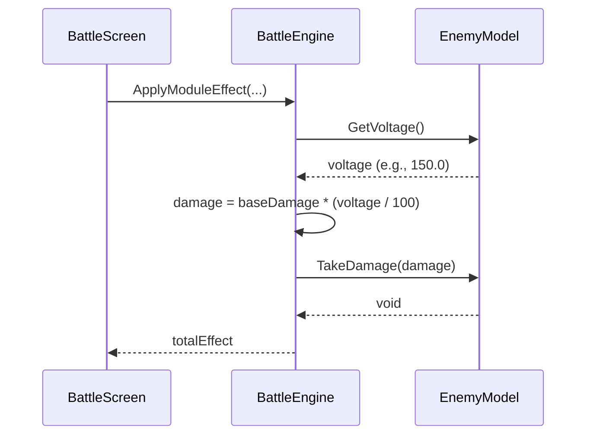

# Technical Design: ボルテージシステム

## Overview

**Purpose**: ボルテージシステムは、バトルに時間的プレッシャーを与える仕組みを提供します。敵のボルテージが時間経過で上昇し、プレイヤーの与ダメージがボルテージ割合で乗算されることで、素早い敵撃破を促進します。

**Users**: プレイヤーはボルテージを活用して戦略的にダメージを最大化し、ゲームデザイナーは敵ごとのボルテージ上昇量を調整してバトルバランスを制御します。

**Impact**: 既存のバトルシステム（`BattleEngine`）、敵データモデル（`EnemyModel`/`EnemyType`）、マスターデータ（`enemies.json`）、バトル画面UI（`BattleScreen`）に変更を加えます。

### Goals

- バトル開始時にボルテージを100%で初期化し、時間経過で上昇させる
- プレイヤーダメージにボルテージ乗算を適用する
- ボルテージをリアルタイムでUI表示し、危険度に応じた色分けを行う
- 敵ごとのボルテージ上昇量をマスターデータで設定可能にする

### Non-Goals

- ボルテージによる敵への効果（ダメージ乗算以外の影響）
- ボルテージの減少メカニズム
- ボルテージに関連する実績・統計システム

## Architecture

### Existing Architecture Analysis

**現行アーキテクチャパターン**:
- 5層レイヤードアーキテクチャ（app → tui → usecase → infra → domain）
- Elm Architecture（Bubbletea）によるイベント駆動型UI
- EffectTableパターンによる効果管理
- Managerパターン（`RecastManager`, `ChainEffectManager`）

**統合ポイント**:
- `domain.EnemyModel`: ボルテージ状態フィールドを追加
- `domain.EnemyType`: ボルテージ上昇率設定を追加
- `usecase/combat.BattleEngine`: ダメージ計算にボルテージ乗算を統合
- `tui/screens.BattleScreen`: ボルテージUI表示を追加
- `infra/masterdata`: `enemies.json`にボルテージ設定フィールドを追加

**既存パターンの活用**:
- HPバーと同様のリアルタイム更新パターン
- カラーパレット（`ColorWarning`, `ColorDamage`, `ColorSecondary`）の再利用
- `BattleTickInterval`による定期更新

### Architecture Pattern & Boundary Map



**Architecture Integration**:
- Selected pattern: 既存のManagerパターンを踏襲し、`VoltageManager`を`usecase/combat`に配置
- Domain/feature boundaries: ボルテージ状態はEnemyModelに追加、計算ロジックはVoltageManagerに分離
- Existing patterns preserved: EffectTableパターン、BattleTickによる更新、カラーパレット
- New components rationale: VoltageManagerは時間ベースのボルテージ更新を担当し、BattleEngineとの責務分離を実現
- Steering compliance: 5層アーキテクチャ、型安全性、定数の一元管理を維持

### Technology Stack

| Layer | Choice / Version | Role in Feature | Notes |
|-------|------------------|-----------------|-------|
| Domain | Go 1.25+ | EnemyModel/EnemyTypeにボルテージフィールド追加 | 既存構造体の拡張 |
| UseCase | Go 1.25+ | VoltageManager、BattleEngineダメージ計算統合 | Managerパターン適用 |
| TUI | Bubbletea + Lipgloss | ボルテージUI表示、色分け | 既存カラーパレット活用 |
| Data | JSON (enemies.json) | voltage_rise_per_10sフィールド追加 | 後方互換性維持 |

## System Flows

### ボルテージ更新フロー



**Key Decisions**:
- `BattleTickInterval`(100ms)ごとにボルテージを更新（既存の効果更新と同タイミング）
- ボルテージ上昇量は「10秒あたりX%」形式で設定し、deltaSecondsで按分計算

### ダメージ計算フロー



**Key Decisions**:
- ボルテージ乗算は最終ダメージ計算の最終段階で適用
- 100% = 等倍（x1.0）、150% = 1.5倍

## Requirements Traceability

| Requirement | Summary | Components | Interfaces | Flows |
|-------------|---------|------------|------------|-------|
| 1.1 | バトル開始時100%初期化 | EnemyModel, BattleEngine | InitializeBattle | - |
| 1.2 | 敵ごとにボルテージ管理 | EnemyModel | GetVoltage, SetVoltage | - |
| 1.3 | リトライ時100%リセット | BattleEngine | InitializeBattle | - |
| 2.1 | 10秒間で設定ポイント上昇 | VoltageManager | Update | ボルテージ更新フロー |
| 2.2 | enemies.jsonで設定可能 | EnemyTypeData, EnemyType | ToDomain | - |
| 2.3 | 小数点以下精度で管理 | EnemyModel | GetVoltage (float64) | - |
| 2.4 | 上限999.9% | VoltageManager | Update | - |
| 3.1, 3.2, 3.3 | ダメージ乗算計算 | BattleEngine | ApplyModuleEffect | ダメージ計算フロー |
| 4.1, 4.2, 4.3, 4.4 | UI表示 | BattleScreen, battle_view | renderVoltageDisplay | - |
| 5.1, 5.2, 5.3, 5.4 | マスターデータ設定 | EnemyTypeData, loader | LoadEnemyTypes, ToDomain | - |
| 6.1, 6.2, 6.3 | フェーズ連携 | VoltageManager | Update | - |
| 7.1, 7.2, 7.3 | ビジュアルフィードバック | battle_view | getVoltageColor | - |

## Components and Interfaces

| Component | Domain/Layer | Intent | Req Coverage | Key Dependencies (P0/P1) | Contracts |
|-----------|--------------|--------|--------------|--------------------------|-----------|
| EnemyModel | domain | ボルテージ状態を保持 | 1.1, 1.2, 2.3 | EnemyType (P0) | State |
| EnemyType | domain | ボルテージ上昇率設定を保持 | 5.1, 5.2 | - | State |
| VoltageManager | usecase/combat | ボルテージ更新ロジック | 2.1, 2.4, 6.1, 6.2, 6.3 | EnemyModel (P0) | Service |
| BattleEngine | usecase/combat | ダメージ計算にボルテージ乗算統合 | 1.3, 3.1, 3.2, 3.3 | VoltageManager (P0), EnemyModel (P0) | Service |
| EnemyTypeData | infra/masterdata | JSONからボルテージ設定読込 | 5.1, 5.2, 5.3, 5.4 | - | API |
| BattleScreen | tui/screens | ボルテージUI表示 | 4.1, 4.2, 4.3, 4.4, 7.1, 7.2, 7.3 | EnemyModel (P0), styles (P1) | State |

### Domain Layer

#### EnemyModel

| Field | Detail |
|-------|--------|
| Intent | ボルテージ状態をバトル中の敵インスタンスで保持 |
| Requirements | 1.1, 1.2, 2.3 |

**Responsibilities & Constraints**
- ボルテージ値（float64）を保持し、100.0%から開始
- ボルテージの取得・設定メソッドを提供
- 既存のフェーズ遷移ロジックとは独立して管理

**Dependencies**
- Inbound: BattleEngine — ボルテージ取得・設定 (P0)
- Inbound: VoltageManager — ボルテージ更新 (P0)

**Contracts**: State [x]

##### State Management

```go
// 追加フィールド
type EnemyModel struct {
    // ... existing fields ...

    // Voltage は現在のボルテージ値です（100.0 = 100%）。
    Voltage float64
}

// GetVoltage は現在のボルテージを返します。
func (e *EnemyModel) GetVoltage() float64

// SetVoltage はボルテージを設定します。
func (e *EnemyModel) SetVoltage(voltage float64)

// GetVoltageMultiplier はダメージ乗算用の倍率を返します（voltage / 100）。
func (e *EnemyModel) GetVoltageMultiplier() float64
```

- State model: Voltage float64（初期値100.0、上限999.9）
- Persistence: バトル中のみ（セーブ対象外）
- Concurrency: シングルスレッド（Bubbletea UIスレッド内）

**Implementation Notes**
- Integration: `NewEnemy()`でVoltage=100.0に初期化
- Validation: Voltage < 0の場合は0.0にクランプ（通常発生しない）
- Risks: なし

#### EnemyType

| Field | Detail |
|-------|--------|
| Intent | ボルテージ上昇率設定を敵タイプ定義で保持 |
| Requirements | 5.1, 5.2 |

**Responsibilities & Constraints**
- VoltageRisePer10s（10秒あたりの上昇ポイント）を保持
- 既存のEnemyTypeフィールドと並列で管理

**Dependencies**
- Inbound: masterdata.EnemyTypeData — データ変換 (P0)
- Outbound: EnemyModel — タイプ情報提供 (P0)

**Contracts**: State [x]

##### State Management

```go
// 追加フィールド
type EnemyType struct {
    // ... existing fields ...

    // VoltageRisePer10s は10秒間でのボルテージ上昇量です。
    // 0の場合はボルテージが上昇しません。デフォルト値は10。
    VoltageRisePer10s float64
}
```

**Implementation Notes**
- Integration: `ToDomain()`で変換時にVoltageRisePer10sを設定
- Validation: 負の値の場合は0として扱う
- Risks: なし

### UseCase Layer

#### VoltageManager

| Field | Detail |
|-------|--------|
| Intent | 時間経過に基づくボルテージ更新ロジックを担当 |
| Requirements | 2.1, 2.4, 6.1, 6.2, 6.3 |

**Responsibilities & Constraints**
- deltaSecondsに基づいてボルテージを計算・更新
- フェーズ遷移時もボルテージをリセットせず継続
- ボルテージ上限は999.9%

**Dependencies**
- Inbound: BattleEngine — Update呼び出し (P0)
- Outbound: EnemyModel — GetVoltage, SetVoltage (P0)

**Contracts**: Service [x]

##### Service Interface

```go
// VoltageManager はボルテージ更新を管理します。
type VoltageManager struct{}

// NewVoltageManager は新しいVoltageManagerを作成します。
func NewVoltageManager() *VoltageManager

// Update はボルテージを時間経過で更新します。
// deltaSeconds: 前回更新からの経過秒数
func (m *VoltageManager) Update(enemy *domain.EnemyModel, deltaSeconds float64)

// Reset はボルテージを100%にリセットします。
func (m *VoltageManager) Reset(enemy *domain.EnemyModel)
```

- Preconditions: enemy != nil
- Postconditions: enemy.Voltage が更新される
- Invariants: Voltage >= 100.0（下がることはない）

**Implementation Notes**
- Integration: `BattleEngine.UpdateEffects()`内で呼び出し
- Validation: deltaSeconds <= 0の場合は更新しない
- Risks: なし

#### BattleEngine（拡張）

| Field | Detail |
|-------|--------|
| Intent | ダメージ計算にボルテージ乗算を統合 |
| Requirements | 1.3, 3.1, 3.2, 3.3 |

**Responsibilities & Constraints**
- `InitializeBattle()`でボルテージを100%に初期化
- `ApplyModuleEffect()`でボルテージ乗算を適用
- 既存のダメージ計算フローを維持しつつ拡張

**Dependencies**
- Inbound: BattleScreen — バトル処理 (P0)
- Outbound: VoltageManager — ボルテージ更新 (P0)
- Outbound: EnemyModel — ボルテージ取得 (P0)

**Contracts**: Service [x]

##### Service Interface（変更点）

```go
// BattleEngine（追加フィールド）
type BattleEngine struct {
    // ... existing fields ...
    voltageManager *VoltageManager
}

// InitializeBattle（変更）
// ボルテージを100%に初期化する処理を追加
func (e *BattleEngine) InitializeBattle(level int, agents []*domain.AgentModel) (*BattleState, error)

// UpdateEffects（変更）
// VoltageManager.Update()の呼び出しを追加
func (e *BattleEngine) UpdateEffects(state *BattleState, deltaSeconds float64)

// applyVoltageDamageMultiplier はダメージにボルテージ乗算を適用します。
func (e *BattleEngine) applyVoltageDamageMultiplier(state *BattleState, baseDamage int) int
```

**Implementation Notes**
- Integration: 既存の`ApplyModuleEffect()`内でボルテージ乗算を適用
- Validation: ボルテージが100未満の場合も計算は正常に動作（理論上発生しない）
- Risks: 既存のダメージ計算テストへの影響（テスト更新が必要）

### Infra Layer

#### EnemyTypeData（拡張）

| Field | Detail |
|-------|--------|
| Intent | enemies.jsonからボルテージ設定を読み込み |
| Requirements | 5.1, 5.2, 5.3, 5.4 |

**Responsibilities & Constraints**
- `voltage_rise_per_10s`フィールドを追加
- 未設定時はデフォルト値10を適用
- 0設定時はボルテージが上昇しない

**Dependencies**
- Inbound: DataLoader — LoadEnemyTypes (P0)
- Outbound: domain.EnemyType — ToDomain変換 (P0)

**Contracts**: API [x]

##### API Contract

| Field | Type | Required | Default | Description |
|-------|------|----------|---------|-------------|
| voltage_rise_per_10s | number | No | 10 | 10秒間のボルテージ上昇量 |

**enemies.json フィールド追加例**:
```json
{
  "enemy_types": [
    {
      "id": "slime",
      "name": "スライム",
      "voltage_rise_per_10s": 10,
      ...
    }
  ]
}
```

**Implementation Notes**
- Integration: `ToDomain()`で`VoltageRisePer10s`を設定
- Validation: `voltage_rise_per_10s`が未設定またはnullの場合はデフォルト値10を適用
- Risks: 既存のenemies.jsonとの後方互換性を維持

### TUI Layer

#### BattleScreen / battle_view（拡張）

| Field | Detail |
|-------|--------|
| Intent | ボルテージをリアルタイムでUI表示し、危険度に応じた色分けを行う |
| Requirements | 4.1, 4.2, 4.3, 4.4, 7.1, 7.2, 7.3 |

**Summary only (Presentation component)**

**Implementation Notes**
- Integration: `renderEnemyArea()`内でボルテージ表示を追加（画面右上配置）
- 色分けロジック:
  - 100%〜149%: `ColorSecondary`（白）
  - 150%〜199%: `ColorWarning`（黄色）
  - 200%以上: `ColorDamage`（赤）
- 表示形式: 整数パーセント（小数点以下切り捨て）例: `VOLTAGE: 150%`
- Risks: なし

## Data Models

### Domain Model

**Voltage Value Object**（EnemyModel内に組み込み）:
- 値: float64（100.0 = 100%）
- 不変条件: 100.0 <= Voltage <= 999.9
- ビジネスルール: 時間経過でのみ上昇、下限100.0、上限999.9

**VoltageRisePer10s設定**（EnemyType内に組み込み）:
- 値: float64（デフォルト10.0）
- 不変条件: 0以上
- ビジネスルール: 0の場合はボルテージ上昇なし

### Logical Data Model

**EnemyModel拡張**:
```
EnemyModel
├── ID: string
├── ... (existing fields)
└── Voltage: float64 [NEW] -- 現在のボルテージ値
```

**EnemyType拡張**:
```
EnemyType
├── ID: string
├── ... (existing fields)
└── VoltageRisePer10s: float64 [NEW] -- 10秒あたりの上昇量
```

### Data Contracts & Integration

**enemies.json Schema拡張**:
```json
{
  "enemy_types": [
    {
      "id": "string",
      "name": "string",
      "voltage_rise_per_10s": "number (optional, default: 10)"
    }
  ]
}
```

## Error Handling

### Error Strategy

ボルテージシステムはバトル中のリアルタイム処理であり、エラー発生時はサイレントフォールバックを採用します。

### Error Categories and Responses

**データエラー**:
- `voltage_rise_per_10s`が負の値 → 0として扱う（ボルテージ上昇なし）
- `voltage_rise_per_10s`が未設定 → デフォルト値10を適用

**計算エラー**:
- deltaSecondsが負の値 → 更新をスキップ
- Voltageがオーバーフロー → float64の範囲内で発生しない（実用的なバトル時間では問題なし）

### Monitoring

- ログ出力: なし（パフォーマンス優先）
- デバッグ用: ボルテージ値はUI上でリアルタイム確認可能

## Testing Strategy

### Unit Tests

1. **EnemyModel.GetVoltage/SetVoltage**: 初期値100.0、設定・取得の正確性
2. **EnemyModel.GetVoltageMultiplier**: 100.0→1.0、150.0→1.5の変換
3. **VoltageManager.Update**: 10秒で設定値分の上昇、0設定時は上昇なし
4. **VoltageManager.Reset**: 100.0へのリセット
5. **BattleEngine.applyVoltageDamageMultiplier**: ボルテージ乗算の正確性

### Integration Tests

1. **バトル初期化〜ボルテージ上昇**: InitializeBattle後、時間経過でボルテージが正しく上昇
2. **ダメージ計算統合**: モジュール使用時にボルテージ乗算が適用される
3. **フェーズ遷移時の継続**: 強化フェーズ移行時にボルテージがリセットされない
4. **マスターデータ読込**: enemies.jsonから`voltage_rise_per_10s`が正しく読み込まれる

### E2E/UI Tests

1. **ボルテージ表示**: バトル画面でボルテージがリアルタイム更新される
2. **色分け表示**: 100%〜149%は白、150%〜199%は黄、200%以上は赤で表示
3. **ダメージ表示**: ボルテージ乗算後のダメージがフローティングテキストに反映
