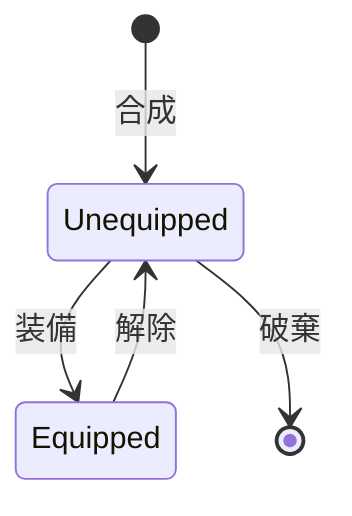

# Agent System

## 概要

エージェントシステムはプレイヤーの戦闘ユニットを管理するドメインです。
コアとモジュールの組み合わせによるエージェント合成、装備管理、ステータス計算を担当します。

**実装**: `/internal/domain/agent.go`, `/internal/agent/agent.go`

## 要件

### REQ-AGENT-1: エージェント構成
**種別**: Ubiquitous

The agent system shall construct agents from:
- 1つのコア（Core）
- 4つのモジュール（Module）

**受け入れ基準**:
1. エージェントレベル = コアレベル（固定、成長なし）
2. 基礎ステータス = コアステータス
3. モジュールスロット数 = 4（固定）

### REQ-AGENT-2: コアシステム
**種別**: Ubiquitous

The agent system shall manage cores with:
- 特性（CoreType）: ステータス重み、許可タグ、パッシブスキル
- レベル: ドロップ時に固定、変更不可
- ステータス計算: 基礎値(10) x レベル x 重み

**受け入れ基準**:
1. STR/MAG/SPD/LUKの4ステータス
2. 特性ごとに異なるステータス重み
3. 許可タグでモジュール互換性を制限

### REQ-AGENT-3: モジュールシステム
**種別**: Ubiquitous

The agent system shall manage modules with:
- カテゴリ: 物理攻撃/魔法攻撃/回復/バフ/デバフ
- レベル: 種類ごとに固定
- 基礎効果値: 同じ種類は同じ効果

**受け入れ基準**:
1. カテゴリごとに参照ステータスが異なる
2. タグでコア特性との互換性を判定
3. レベルで難易度が変化（low/mid/high）

### REQ-AGENT-4: 装備管理
**種別**: Event-Driven

When プレイヤーがエージェントを装備する, the agent system shall:
- 最大3スロットまで装備可能
- 装備順序を維持
- プレイヤーHPを再計算

**受け入れ基準**:
1. 同一エージェントの重複装備不可
2. 装備解除でスロットを空ける
3. バトル時に装備エージェントを参照

### REQ-AGENT-5: 互換性チェック
**種別**: Ubiquitous

The agent system shall validate module-core compatibility:
- モジュールのタグがコアの許可タグに含まれるか判定

**受け入れ基準**:
1. 1つでも許可タグに一致すれば装備可能
2. 非互換モジュールは装備不可
3. UI上で互換性を視覚的に表示

## 仕様

### AgentModel

**責務**: 合成されたエージェントエンティティを表現

**インターフェース**:
- 入力: Core, Modules (4個)
- 出力: Level, BaseStats, ModuleList

**ルール**:
1. IDはUUIDで自動生成
2. モジュールリストはコピーして保持
3. コアからレベルとステータスを導出

### CoreModel

**責務**: エージェントの核となるコアエンティティを表現

**ルール**:
1. ステータス計算式: BaseStatValue(10) x Level x StatWeight
2. AllowedTagsはCoreTypeからコピー
3. PassiveSkillは特性ごとに1つ

### ModuleModel

**責務**: エージェントに装備可能なスキルエンティティを表現

**カテゴリと参照ステータス**:
| カテゴリ | 参照ステータス | 効果 |
|---------|---------------|------|
| physical_attack | STR | 敵にダメージ |
| magic_attack | MAG | 敵にダメージ |
| heal | MAG | HP回復 |
| buff | SPD | 自己強化 |
| debuff | SPD | 敵弱体化 |

### AgentManager

**責務**: エージェントの作成、装備管理を担当

**状態遷移**:

## 関連ドメイン

- **Battle**: 装備エージェントのモジュールでスキル発動
- **Game Loop**: 装備状態の永続化
- **Collection**: 合成時の図鑑更新

---
_updated_at: 2025-12-01_
