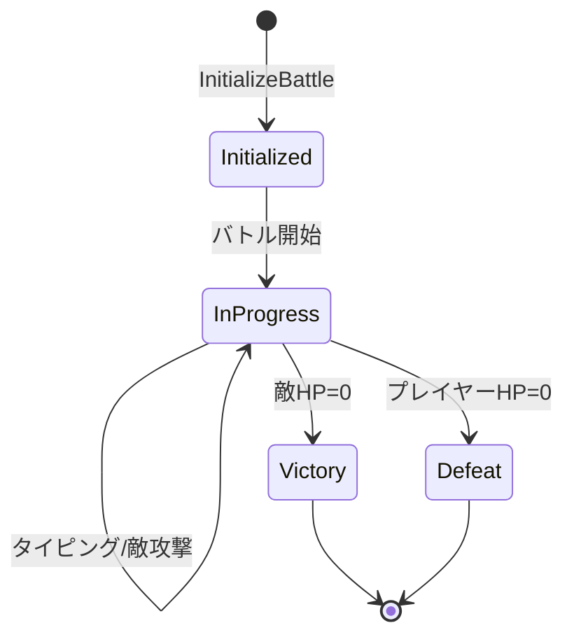

# Battle System

## 概要

バトルシステムはリアルタイム戦闘を管理するドメインです。
タイピング入力に基づくモジュール効果計算、敵の自動攻撃処理、勝敗判定を担当します。

**実装**: `/internal/battle/battle.go`

## 要件

### REQ-BATTLE-1: バトル初期化
**種別**: Event-Driven

When プレイヤーがバトルを開始する, the battle system shall:
- 指定レベルの敵を生成
- プレイヤーHPを最大値まで回復
- バトル統計を初期化

**受け入れ基準**:
1. 敵レベルはプレイヤー選択値と一致
2. プレイヤーHPは装備エージェントから計算された最大値
3. 攻撃タイマーが開始される

### REQ-BATTLE-2: モジュール効果計算
**種別**: Ubiquitous

The battle system shall calculate module effects using:
- 基礎効果値 x ステータス値 x スケール係数(0.1)
- 速度係数（制限時間/完了時間、上限2.0）
- 正確性係数（正確性がそのまま乗算）

**受け入れ基準**:
1. 正確性50%未満で効果半減
2. ダメージは最低1保証
3. カテゴリに応じた対象（攻撃→敵、回復→自分）

### REQ-BATTLE-3: 敵攻撃システム
**種別**: State-Driven

While バトル進行中, the battle system shall:
- 敵の攻撃間隔に基づいて自動攻撃を実行
- 次回攻撃の予測ダメージと属性を表示
- 防御バフによるダメージ軽減を適用

**受け入れ基準**:
1. 攻撃ダメージ = 攻撃力 x (1 - ダメージ軽減率)
2. 最低ダメージ1保証
3. 残り時間をリアルタイム表示

### REQ-BATTLE-4: フェーズ変化
**種別**: Event-Driven

When 敵HPが50%以下になる, the battle system shall:
- 強化フェーズに移行
- 特殊攻撃（自己バフ/プレイヤーデバフ）を解禁

**受け入れ基準**:
1. 30%確率で特殊行動を選択
2. 自己バフ: 攻撃力UP/物理防御UP/魔法防御UP
3. デバフ: タイピング時間短縮/テキストシャッフル/難易度上昇/CD延長

### REQ-BATTLE-5: 勝敗判定
**種別**: Event-Driven

When プレイヤーHP=0, the battle system shall end with defeat.
When 敵HP=0, the battle system shall end with victory.

**受け入れ基準**:
1. 勝利時は報酬画面へ遷移
2. 敗北時はホーム画面へ直接遷移
3. バトル統計を記録

## 仕様

### BattleEngine

**責務**: バトルロジックの中核。初期化、攻撃処理、効果計算、勝敗判定を担当。

**インターフェース**:
- 入力: 敵タイプリスト、エージェント、タイピング結果
- 出力: BattleState、BattleResult

**ルール**:
1. 乱数生成器は初期化時にシード設定
2. 効果スケール係数は0.1固定
3. 正確性ペナルティ閾値は0.5固定

### BattleState

**責務**: 進行中バトルの状態保持。敵、プレイヤー、装備エージェント、統計を含む。

**状態遷移**:

### 敵特殊行動

**責務**: 強化フェーズでの敵の特殊行動（自己バフ/プレイヤーデバフ）

**ルール**:
1. 自己バフ持続時間: 10秒
2. プレイヤーデバフ持続時間: 8秒
3. 行動予告を事前表示

## 関連ドメイン

- **Typing**: WPM/正確性に基づくダメージ計算
- **Agent**: 装備エージェントのモジュールとステータス参照
- **Enemy**: 敵パラメータ（HP、攻撃力、間隔）参照
- **Game Loop**: 報酬画面/ホームへのシーン遷移

---
_updated_at: 2025-12-01_
