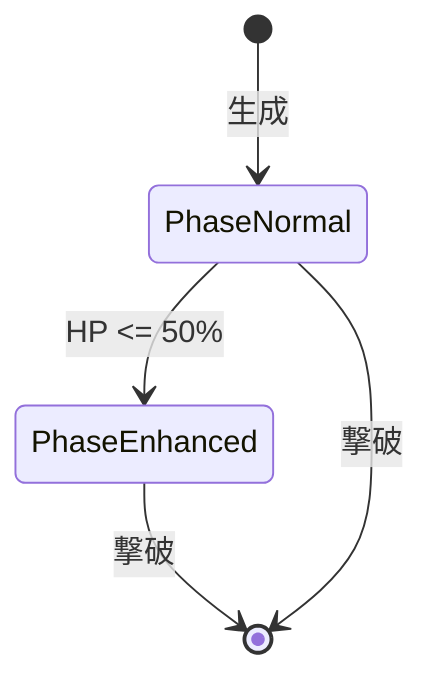
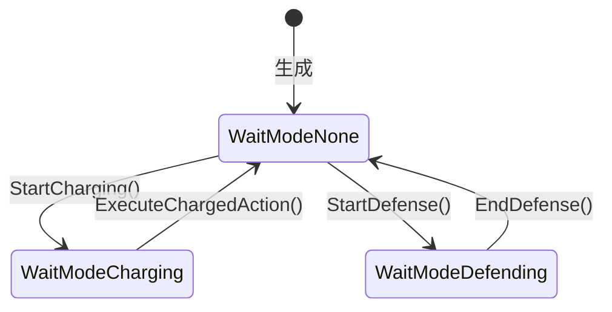

# Enemy System

## 概要

敵システムはバトルにおける敵キャラクターを管理するドメインです。
敵の生成、ステータス計算、行動パターン実行、フェーズ管理、報酬ドロップを担当します。

**実装**: `/internal/domain/enemy.go`, `/internal/usecase/combat/battle.go`, `/internal/usecase/rewarding/reward.go`

## 要件

### REQ-ENEMY-1: 敵タイプ定義
**種別**: Ubiquitous

The enemy system shall define enemy types with:
- 基礎HP、攻撃力、攻撃間隔
- 攻撃属性（physical/magic）
- ASCIIアート（外観）
- デフォルトレベル（1〜100）
- 行動パターン（通常/強化）
- パッシブスキル（通常/強化）
- ドロップアイテム設定

**受け入れ基準**:
1. 外部JSONファイルで定義（enemies.json, enemy_actions.json）
2. 同じレベルでも複数バリエーション
3. 各タイプに固有の名前と外観

### REQ-ENEMY-2: レベルスケーリング
**種別**: Ubiquitous

The enemy system shall scale enemy stats by level:
- HP = 基礎HP x レベル
- 攻撃力 = 基礎攻撃力 + (レベル x 2)
- 攻撃間隔 = 基礎間隔 - (レベル x 50ms)、最低500ms

**受け入れ基準**:
1. 高レベルほど強い敵
2. 攻撃間隔は最低値でキャップ
3. 表示名に「Lv.X」を含む

### REQ-ENEMY-3: フェーズ変化
**種別**: Event-Driven

When 敵HPが50%以下になる, the enemy system shall:
- 通常フェーズから強化フェーズに移行
- 強化行動パターンに切り替え（設定されている場合）
- 強化パッシブスキルに切り替え

**受け入れ基準**:
1. 閾値: EnhanceThreshold = 0.5
2. 一度移行したら戻らない
3. フェーズ文字列: 「通常」「強化」
4. 行動インデックスをリセット

### REQ-ENEMY-4: 確定報酬ドロップ
**種別**: Event-Driven

When 敵を撃破する, the enemy system shall:
- 確定で1つのアイテムをドロップ
- 敵タイプのDropItemCategory（core/module）に基づいて決定
- 敵タイプのDropItemTypeIDで指定されたタイプを生成

**受け入れ基準**:
1. コア: レベルは敵レベル以下でランダム（高レベル寄りの重み付け）
2. モジュール: 敵レベルに応じたチェイン効果を付与
3. ドロップ設定がない場合は既存確率ドロップにフォールバック

### REQ-ENEMY-5: EffectTable管理
**種別**: Ubiquitous

The enemy system shall maintain EffectTable for:
- 自己バフ（行動パターンによる）
- プレイヤーへのデバフ
- パッシブスキル効果

**受け入れ基準**:
1. 時間経過で効果を更新
2. 期限切れの効果を自動削除
3. ステータス計算時に効果を適用

### REQ-ENEMY-6: 行動パターンシステム
**種別**: Ubiquitous

The enemy system shall execute actions based on predefined patterns:
- 攻撃（物理/魔法）、バフ、デバフ、ディフェンスの4タイプ
- 各行動にチャージタイム（実行までの待機時間）を設定
- 攻撃ダメージ計算: damage = a + Lv × b

**受け入れ基準**:
1. 行動パターンは順番に実行しループ
2. フェーズ遷移時は行動インデックスをリセット
3. 強化パターンが空の場合は通常パターンを継続

### REQ-ENEMY-7: チャージシステム
**種別**: State-Driven

The enemy system shall manage charging state:
- 行動決定後、チャージタイム経過で実行
- チャージ中はUI上で進捗バーを表示
- チャージ完了で行動を実行し次の行動へ

**受け入れ基準**:
1. WaitMode = WaitModeCharging でチャージ中を表現
2. GetChargeProgress() で0.0〜1.0の進捗を取得
3. IsChargeComplete() で完了判定

### REQ-ENEMY-8: ディフェンスシステム
**種別**: State-Driven

The enemy system shall provide defense actions:
- 物理ダメージ軽減（physical_cut）
- 魔法ダメージ軽減（magic_cut）
- デバフ回避（debuff_evade）

**受け入れ基準**:
1. ディフェンスはチャージタイム0で即時発動
2. 持続時間中はWaitMode = WaitModeDefending
3. 終了後に行動インデックスを進める

### REQ-ENEMY-9: 敵パッシブスキル
**種別**: Ubiquitous

The enemy system shall apply passive skills:
- 通常パッシブ: バトル開始時に適用
- 強化パッシブ: フェーズ遷移時に切り替え

**受け入れ基準**:
1. EffectTableに永続効果として登録
2. フェーズ遷移時に旧パッシブを削除し新パッシブを追加
3. パッシブ未設定の場合はスキップ

## 仕様

### EnemyType

**責務**: 敵の種類（テンプレート）を定義

**フィールド**:
- ID: 一意識別子
- Name: 表示名
- BaseHP: 基礎HP
- BaseAttackPower: 基礎攻撃力
- BaseAttackInterval: 基礎攻撃間隔
- AttackType: 攻撃属性
- ASCIIArt: 外観
- DefaultLevel: デフォルトレベル（1〜100）
- NormalActionPatternIDs: 通常行動パターンID配列
- EnhancedActionPatternIDs: 強化行動パターンID配列
- ResolvedNormalActions: 解決済み通常行動パターン
- ResolvedEnhancedActions: 解決済み強化行動パターン
- NormalPassive: 通常パッシブスキル
- EnhancedPassive: 強化パッシブスキル
- DropItemCategory: ドロップカテゴリ（"core" / "module"）
- DropItemTypeID: ドロップアイテムTypeID

### EnemyModel

**責務**: バトル中の敵インスタンスを表現

**インターフェース**:
- 入力: EnemyType, Level
- 出力: HP, AttackPower, Phase, EffectTable, WaitMode

**フィールド（行動管理）**:
- ActionIndex: 現在の行動パターンインデックス
- ActivePassiveID: 適用中パッシブスキルID

**フィールド（待機状態管理）**:
- WaitMode: 待機状態（None/Charging/Defending）
- ChargeStartTime: チャージ開始時刻
- CurrentChargeTime: 現在行動のチャージタイム
- PendingAction: チャージ後実行行動
- DefenseStartTime: ディフェンス開始時刻
- DefenseDuration: ディフェンス持続時間
- ActiveDefenseType: 発動中ディフェンス種別
- DefenseValue: 軽減率/回避率

**ルール**:
1. TakeDamageでHP減少（最低0）
2. IsAliveでHP > 0を判定
3. CheckAndTransitionPhaseでフェーズ移行
4. GetCurrentAction()で現在実行すべき行動を取得
5. AdvanceActionIndex()で行動インデックスを進める（ループ対応）

### EnemyPhase

**責務**: 敵のフェーズ状態を定義

**状態遷移**:


### EnemyWaitMode

**責務**: 敵の待機状態を定義

**状態**:
- WaitModeNone: 行動実行中（待機状態ではない）
- WaitModeCharging: チャージ中（行動実行待ち）
- WaitModeDefending: ディフェンス中（防御状態）

**状態遷移**:


### EnemyAction

**責務**: 敵の個別行動を定義する値オブジェクト

**行動タイプ**:
- EnemyActionAttack: 攻撃行動
- EnemyActionBuff: 自己バフ行動
- EnemyActionDebuff: プレイヤーへのデバフ行動
- EnemyActionDefense: ディフェンス行動

**フィールド（共通）**:
- ID: 行動識別子
- Name: 表示名
- ActionType: 行動タイプ
- ChargeTime: チャージタイム

**フィールド（攻撃用）**:
- AttackType: 攻撃属性（physical/magic）
- DamageBase: 基礎ダメージ (a)
- DamagePerLevel: レベル係数 (b)
- Element: 攻撃属性（fire, water, dark等）

**フィールド（バフ/デバフ用）**:
- EffectType: 効果種別
- EffectValue: 効果値
- Duration: 持続時間

**フィールド（ディフェンス用）**:
- DefenseType: ディフェンス種類
- ReductionRate: 軽減率
- EvadeRate: 回避率

**ダメージ計算**:
```
damage = DamageBase + Level × DamagePerLevel
```

### EnemyDefenseType

**責務**: ディフェンス行動の種類を定義

**種類**:
- DefensePhysicalCut: 物理ダメージ軽減
- DefenseMagicCut: 魔法ダメージ軽減
- DefenseDebuffEvade: デバフ回避

### EnemyPassiveSkill

**責務**: 敵用パッシブスキルを定義

**フィールド**:
- ID: パッシブスキル識別子
- Name: 表示名
- Description: 説明文
- Effects: 効果値マップ（EffectColumn → float64）

**メソッド**:
- ToEntry(): EffectTableに登録可能なEffectEntryに変換

### RewardCalculator

**責務**: 敵撃破時の報酬を計算

**確定ドロップ**:
1. 敵タイプのDropItemCategoryとDropItemTypeIDに基づいて決定
2. コア: レベルは敵レベル以下（高レベル寄り重み付け）
3. モジュール: 敵レベルに応じたチェイン効果を付与

**フォールバック**:
- ドロップ設定がない場合は既存の確率ドロップを使用

## 関連ドメイン

- **Battle**: 敵パラメータの参照、ダメージ処理、行動実行
- **Game Loop**: エンカウント敵リストの更新
- **Collection**: 敵図鑑への登録
- **EffectTable**: バフ/デバフ/パッシブ効果の管理

---
_updated_at: 2026-01-04_
