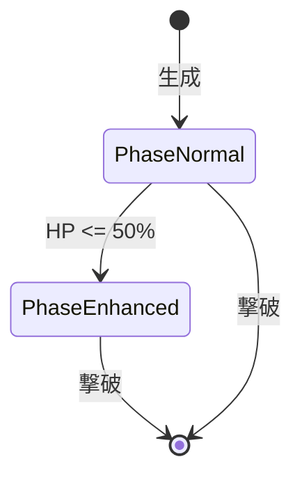

# Enemy System

## 概要

敵システムはバトルにおける敵キャラクターを管理するドメインです。
敵の生成、ステータス計算、フェーズ管理、報酬ドロップを担当します。

**実装**: `/internal/domain/enemy.go`, `/internal/enemy/enemy.go`, `/internal/reward/reward.go`

## 要件

### REQ-ENEMY-1: 敵タイプ定義
**種別**: Ubiquitous

The enemy system shall define enemy types with:
- 基礎HP、攻撃力、攻撃間隔
- 攻撃属性（physical/magic）
- ASCIIアート（外観）

**受け入れ基準**:
1. 外部JSONファイルで定義
2. 同じレベルでも複数バリエーション
3. 各タイプに固有の名前と外観

### REQ-ENEMY-2: レベルスケーリング
**種別**: Ubiquitous

The enemy system shall scale enemy stats by level:
- HP = 基礎HP x レベル
- 攻撃力 = 基礎攻撃力 + (レベル x 2)
- 攻撃間隔 = 基礎間隔 - (レベル x 50ms)、最低500ms

**受け入れ基準**:
1. 高レベルほど強い敵
2. 攻撃間隔は最低値でキャップ
3. 表示名に「Lv.X」を含む

### REQ-ENEMY-3: フェーズ変化
**種別**: Event-Driven

When 敵HPが50%以下になる, the enemy system shall:
- 通常フェーズから強化フェーズに移行
- 特殊攻撃を解禁

**受け入れ基準**:
1. 閾値: EnhanceThreshold = 0.5
2. 一度移行したら戻らない
3. フェーズ文字列: 「通常」「強化」

### REQ-ENEMY-4: 報酬ドロップ
**種別**: Event-Driven

When 敵を撃破する, the enemy system shall:
- 70%確率でコアをドロップ
- 各モジュールスロット70%確率でドロップ（最大2個）

**受け入れ基準**:
1. コアレベル = 敵レベル ± 2
2. ドロップ可能アイテムは敵レベルで制限
3. 高レベルモジュールは高レベル敵からのみ

### REQ-ENEMY-5: EffectTable管理
**種別**: Ubiquitous

The enemy system shall maintain EffectTable for:
- 自己バフ（強化フェーズ時）
- プレイヤーからのデバフ

**受け入れ基準**:
1. 時間経過で効果を更新
2. 期限切れの効果を自動削除
3. ステータス計算時に効果を適用

## 仕様

### EnemyType

**責務**: 敵の種類（テンプレート）を定義

**フィールド**:
- ID: 一意識別子
- Name: 表示名
- BaseHP: 基礎HP
- BaseAttackPower: 基礎攻撃力
- BaseAttackInterval: 基礎攻撃間隔
- AttackType: 攻撃属性
- ASCIIArt: 外観

### EnemyModel

**責務**: バトル中の敵インスタンスを表現

**インターフェース**:
- 入力: EnemyType, Level
- 出力: HP, AttackPower, Phase, EffectTable

**ルール**:
1. TakeDamageでHP減少（最低0）
2. IsAliveでHP > 0を判定
3. CheckAndTransitionPhaseでフェーズ移行

### EnemyPhase

**責務**: 敵のフェーズ状態を定義

**状態遷移**:

### RewardCalculator

**責務**: 敵撃破時の報酬を計算

**ルール**:
1. ドロップ判定は各アイテムごとに独立
2. コアはレベル範囲内でランダム決定
3. モジュールはマスタデータIDを使用

**ドロップ制限**:
- コア特性ごとに最低ドロップレベル設定
- モジュールごとに最低ドロップレベル設定
- 敵レベル未満のアイテムはドロップ候補から除外

## 関連ドメイン

- **Battle**: 敵パラメータの参照、ダメージ処理
- **Game Loop**: エンカウント敵リストの更新
- **Collection**: 敵図鑑への登録

---
_updated_at: 2025-12-01_
