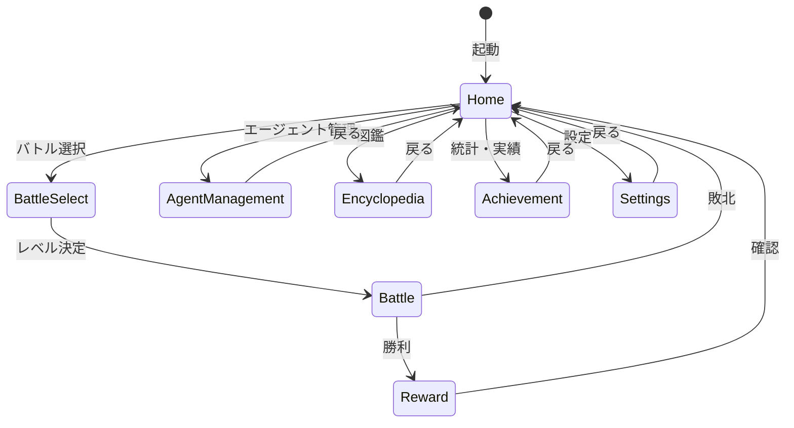

# Game Loop

## 概要

ゲームループはアプリケーション全体の状態管理とシーン遷移を担当するドメインです。
ゲーム状態の永続化（セーブ/ロード）、各画面間のルーティングを管理します。

**実装**: `/internal/app/`

## 要件

### REQ-GAMELOOP-1: シーン管理
**種別**: Ubiquitous

The game loop shall manage scene transitions between:
- Home（メインメニュー）
- BattleSelect（レベル選択）
- Battle（バトル画面）
- Reward（報酬画面）
- AgentManagement（エージェント管理）
- Encyclopedia（図鑑）
- Achievement（統計・実績）
- Settings（設定）

**受け入れ基準**:
1. 各シーンはtea.Modelインターフェースを実装
2. ChangeSceneMsgでシーン遷移を要求
3. RootModelがルーティングを一元管理

### REQ-GAMELOOP-2: ゲーム状態管理
**種別**: Ubiquitous

The game loop shall maintain GameState including:
- プレイヤー情報（HP、装備エージェント）
- インベントリ（コア、モジュール）
- 統計情報（バトル/タイピング統計）
- 実績状態
- 設定

**受け入れ基準**:
1. 各サブシステムはマネージャーを通じてアクセス
2. 外部データ（JSON）の読み込みをサポート
3. エンカウント済み敵リストを追跡

### REQ-GAMELOOP-3: セーブ/ロード
**種別**: Event-Driven

When ゲームを終了する or 特定のタイミング, the game loop shall:
- ゲーム状態をJSON形式で永続化
- ID化最適化によりファイルサイズを削減

**受け入れ基準**:
1. コアはID+レベル+特性IDで保存
2. モジュールはID+カウントで保存
3. エージェントはコア情報埋め込み+モジュールIDリストで保存
4. 装備はスロット番号順にエージェントIDを保存

### REQ-GAMELOOP-4: バトル結果処理
**種別**: Event-Driven

When バトルが終了する, the game loop shall:
- 勝利: 統計更新、最高レベル更新、実績チェック、報酬画面へ遷移
- 敗北: 統計更新、ホーム画面へ直接遷移

**受け入れ基準**:
1. 勝利時に到達最高レベルを更新（必要に応じて）
2. タイピング結果を統計に反映
3. 実績達成条件を自動チェック

## 仕様

### Scene

**責務**: ゲーム内各画面の識別子を定義

**定義**:
```go
const (
    SceneHome Scene = iota
    SceneBattle
    SceneBattleSelect
    SceneAgentManagement
    SceneEncyclopedia
    SceneAchievement
    SceneSettings
    SceneReward
)
```

### GameState

**責務**: ゲーム全体の状態を保持する中核構造体

**インターフェース**:
- 入力: バトル結果、タイピング結果、外部データ
- 出力: SaveData（永続化用）

**ルール**:
1. 初期MaxLevelReached = 0（レベル1から開始）
2. 挑戦可能最大レベル = MaxLevelReached + 1
3. 各マネージャーへのアクセサを提供

### RootModel

**責務**: Bubbleteaアプリケーションのルートモデル。シーンルーティングを担当。

**状態遷移**:


## 関連ドメイン

- **Battle**: バトル結果の受け取りと統計更新
- **Agent**: 装備エージェントの取得
- **Collection**: 実績チェックのトリガー
- **All Domains**: 各シーンへのルーティング

---
_updated_at: 2025-12-01_
