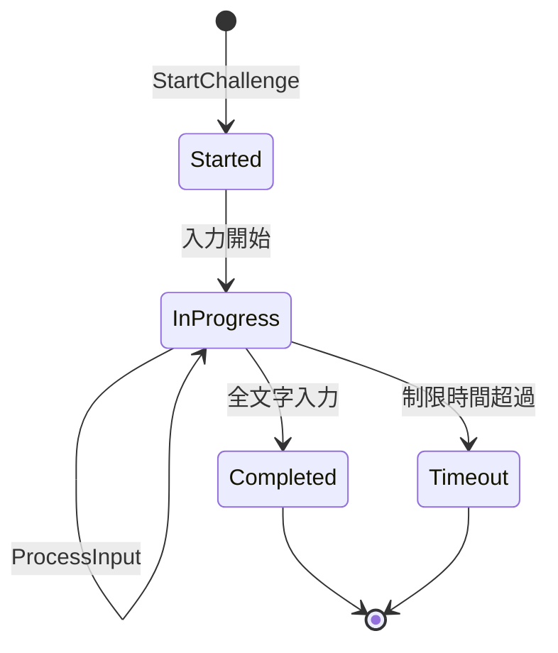

# Typing System

## 概要

タイピングシステムはプレイヤーの入力評価を担当するドメインです。
チャレンジテキストの生成、入力の正誤判定、WPM/正確性の計算を管理します。

**実装**: `/internal/typing/typing.go`

## 要件

### REQ-TYPING-1: チャレンジ生成
**種別**: Ubiquitous

The typing system shall generate challenges with:
- 難易度に応じたテキスト長
- 英数字のみのテキスト
- 連続同一テキスト回避

**受け入れ基準**:
1. Easy: 3-6文字
2. Medium: 7-11文字
3. Hard: 12-20文字
4. 同じテキストが連続しない

### REQ-TYPING-2: 入力評価
**種別**: State-Driven

While タイピングチャレンジ進行中, the typing system shall:
- 各入力文字の正誤判定
- 正解で進捗更新、誤りで誤字記録
- リアルタイム進捗表示

**受け入れ基準**:
1. 正しい入力で次の文字へ進む
2. 誤った入力は誤字としてカウント
3. 進捗率を0.0〜1.0で計算

### REQ-TYPING-3: WPM計算
**種別**: Ubiquitous

The typing system shall calculate WPM as:
- WPM = (正しい文字数 / 完了時間(秒) x 60) / 5

**受け入れ基準**:
1. 標準的なWPM計算式に準拠
2. 完了時間0の場合は0を返す

### REQ-TYPING-4: 正確性計算
**種別**: Ubiquitous

The typing system shall calculate accuracy as:
- 正確性 = 正しい入力数 / 総入力数

**受け入れ基準**:
1. 0.0〜1.0の範囲で表現
2. 入力なしの場合は1.0（ペナルティなし）

### REQ-TYPING-5: 速度係数計算
**種別**: Ubiquitous

The typing system shall calculate speed factor as:
- 速度係数 = 基準時間 / 実際完了時間
- 上限: 2.0

**受け入れ基準**:
1. 速くクリアするほど高い係数
2. 上限2.0でキャップ
3. モジュール効果の乗算に使用

### REQ-TYPING-6: 制限時間
**種別**: State-Driven

While タイピングチャレンジ進行中, the typing system shall:
- 残り時間をリアルタイム表示
- タイムアウト時にチャレンジをキャンセル

**受け入れ基準**:
1. 難易度ごとのデフォルト制限時間
2. Easy: 5秒, Medium: 8秒, Hard: 12秒
3. タイムアウト時は効果なし

## 仕様

### ChallengeGenerator

**責務**: 難易度に応じたタイピングチャレンジを生成

**インターフェース**:
- 入力: Difficulty, TimeLimit
- 出力: Challenge

**ルール**:
1. 辞書から難易度に応じた単語を選択
2. 最大10回のリトライで重複回避
3. 辞書は外部から注入可能

### Evaluator

**責務**: タイピング入力の評価とスコア計算

**インターフェース**:
- 入力: Challenge, 入力文字
- 出力: TypingResult

**ルール**:
1. StartChallengeで状態初期化
2. ProcessInputで1文字ずつ評価
3. CompleteChallengeで結果計算

### ChallengeState

**責務**: 進行中チャレンジの状態保持

**状態遷移**:

### TypingResult

**責務**: タイピング評価結果を保持

**フィールド**:
- Completed: チャレンジ完了フラグ
- WPM: Words Per Minute
- Accuracy: 正確性（0.0〜1.0）
- SpeedFactor: 速度係数（上限2.0）
- AccuracyFactor: 正確性係数
- CompletionTime: 完了時間
- Timeout: タイムアウトフラグ

## 関連ドメイン

- **Battle**: タイピング結果に基づくモジュール効果計算
- **Game Loop**: タイピング統計の記録
- **Collection**: WPM/正確性に基づく実績解除

---
_updated_at: 2025-12-01_
